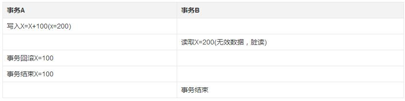
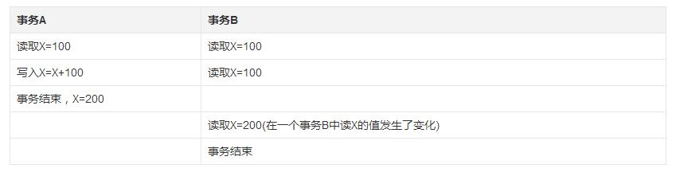
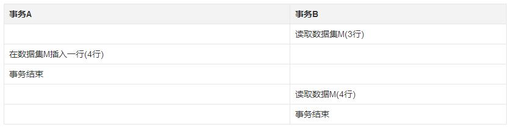
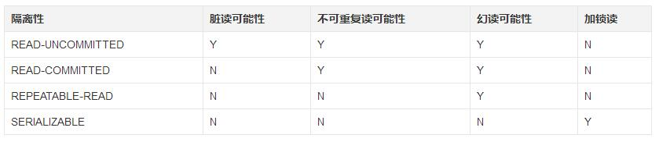

## 事务
事务(Transaction)，一般是指要做的或所做的事情。在计算机术语中是指访问并可能更新数据库中各种数据项的一个**程序执行单元unit**。在计算机术语中，事务通常就是指数据库事务。

当一个事务被提交给了DBMS（数据库管理系统），则DBMS需要确保该事务中的所有操作都成功完成且其结果被永久保存在数据库中，如果事务中有的操作没有成功完成，则事务中的所有操作都需要被回滚，回到事务执行前的状态（要么全执行，要么全都不执行）;同时，该事务对数据库或者其他事务的执行无影响，所有的事务都好像在独立的运行。

但在现实情况下，失败的风险很高。在一个数据库事务的执行过程中，有可能会遇上事务操作失败、数据库系统/操作系统失败，甚至是存储介质失败等情况。这便需要DBMS对一个执行失败的事务执行恢复操作，将其数据库状态恢复到一致状态（数据的一致性得到保证的状态）。为了实现将数据库状态恢复到一致状态的功能，DBMS通常需要维护事务日志以追踪事务中所有影响数据库数据的操作。

### 事务的ACID特性
对于事务来说，最重要的就是其满足ACID的特性。

并非任意的对数据库的操作序列都是数据库事务。事务应该具有4个属性：**原子性、一致性、隔离性、持久性**。这四个属性通常称为ACID特性。

 - **原子性（Atomicity）**：事务作为一个整体被执行，包含在其中的对数据库的操作**要么全部被执行，要么都不执行**，出现失败要执行**回滚**操作。

 - **一致性（Consistency）**：事务应确保数据库的状态从一个一致状态转变为另一个一致状态。一致状态的含义是数据库中的数据应**满足完整性约束**。比如a转账给b，不能a扣钱，b没加钱，两边必须保持一致性

 - **隔离性（Isolation）**：多个事务并发执行时，一个事务的执行**不应影响其他事务的执行**。

 - **持久性（Durability）**：一个事务一旦提交，他对数据库的修改应该**永久保存在数据库中**。

总结一下便是，**原子性是基础，隔离性是手段，持久性是目的，真正最重要的是一致性**。

### 事务的隔离级别
在数据库操作中，为了有效保证**并发读取数据**的正确性，提出的事务隔离级别。

说白了就4个级别

 - READ_UNCOMMITTEED
 - READ_COMMITTEED
 - REPEATABLE_READ
 - SERIALIZABLE

从上往下，级别越来越高，并发性越来越差，安全性越来越高。

隔离性可谓是ACID特性中最难理解的了，高并发问题下不能出一点差池。

那么就不得不说一下高并发下，产生的问题。

#### 脏读Dirty Read
脏读是指在一个事务处理过程里读取了另一个未提交的事务中的数据。

当一个事务正在多次修改某个数据，而在这个事务中这**多次的修改都还未提交**，这时一个并发的事务来访问该数据，就会造成两个事务**得到的数据不一致**。例如：用户A向用户B转账100元

如上图，一个事务执行到一半，另一个事务去读取数据，最后事务A却回滚了，这样事务B就读到了无效数据，脏读。

#### 不可重复读(Unrepeatable Read)
不可重复读是指在一个事务范围中2次或者多次查询同一数据M返回了不同的数据

如上图所示，事务A完成了事务之后，事务B反复读取(可能是为了校验)，结果最后读出来的数据不同了。

这种现象基本上是可以理解的，但在某些“变态”场景下不允许。

#### 虚读(幻读)Phantom Read
当用户读取某一个范围的数据行时，另一个事务又在该范围内查询了新行，当用户再读取该范围的数据行时，会发现会有新的“幻影行”

第二次查询的结果包含了第一次查询中未出现的数据或者缺少了第一次查询中出现的数据（**这里并不要求两次查询的SQL语句相同**）。这是因为在两次查询过程中有另外一个事务插入数据造成的。

#### 幻读和不可重复读的区别
两者区别在于，不可重复读是指重复读取同一行的数据，每次结果都不同。幻读是查询一个范围，然后多次查询后，发现那个范围新增了数据或者减少了数据。

#### 隔离级别
显然，**脏读是坚决抵制的，不可重复读和幻读都是在很多情况下可以放松考虑**。

隔离级别就像一面墙，隔离不同的事务。对应表如下

##### 未授权读取READ_UNCOMMITTEED
也称为读未提交（Read Uncommitted）：允许脏读取，但不允许更新丢失。如果一个事务已经开始写数据，则另外一个事务则不允许同时进行写操作，但允许其他事务读此行数据。该隔离级别可以通过“**排他写锁**”实现。

##### 授权读取READ_COMMITTED
也称为读提交（Read Committed）：允许不可重复读取，但不允许脏读取。这可以通过“**瞬间共享读锁**”和“**排他写锁**”实现。读取数据的事务允许其他事务继续访问该行数据，但是未提交的写事务将会禁止其他事务访问该行。

##### 可重复读取REPEATABLE_READ
可重复读取（Repeatable Read）：禁止不可重复读取和脏读取，但是有时可能出现幻读数据。这可以通过“**共享读锁**”和“**排他写锁**”实现。读取数据的事务将会禁止写事务（但允许读事务），写事务则禁止任何其他事务。

##### 序列化Serializable
序列化（Serializable）：提供严格的事务隔离。它要求事务序列化执行，事务只能一个接着一个地执行，不能并发执行。仅仅通过“行级锁”是无法实现事务序列化的，必须通过其他机制保证新插入的数据不会被刚执行查询操作的事务访问到。
