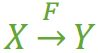
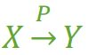

## 数据库范式详解
数据库的设计范式是数据库设计所需要满足的规范，满足这些规范的数据库是简洁的、结构明晰的，同时，不会发生插入（insert）、删除（delete）和更新（update）操作异常。

### 基础概念
在考虑范式之前，最好先复习一下一些基础概念。

#### 完全函数依赖
在一张表中，若 X → Y，且对于 X 的任何一个真子集（假如属性组 X 包含超过一个属性的话），X' → Y 不成立，那么我们称 Y 对于 X 完全函数依赖

比如 学号 → 分数 是完全依赖，但是(学号,姓名)->分数,就不是完全依赖了。因为X的真子集，姓名并不能决定分数，因为可能会有同名人物。

#### 部分函数依赖
接上面，假如 Y 函数依赖于 X，但同时 Y 并不完全函数依赖于 X，那么我们就称 Y 部分函数依赖于 X

p就是partial的意思

#### 传递函数依赖
假如 Z 函数依赖于 Y，且 Y 函数依赖于 X (有『Y 不包含于 X，且 X 不函数依赖于 Y』这个前提)，那么我们就称 Z 传递函数依赖于 X

比如 staff_id -> dept_id -> dept_info

#### 码(候选码)
设 K 为某表中的一个属性或属性组，若除 K 之外的所有属性都 **完全函数依赖于** K（这个“完全”不要漏了），那么我们称 K 为 **候选码**，简称为 **码**。在实际中我们通常可以理解为：假如当 K 确定的情况下，该表除 K 之外的所有属性的值也就随之确定，那么 K 就是码。一张表中可以有超过一个码。（实际应用中为了方便，通常选择其中的一个码作为 **主码**）

这里要注意码是不具备冗余属性的。

#### 主属性/非主属性
包含在 **任何一个码中** 的属性为 **主属性**。其余的自然就是 **非主属性**

### 第一范式1NF 无重复的列
所谓第一范式（1NF）是指数据库表的每一列都是不可分割的基本数据项，同一列中不能有多个值，即实体中的某个属性不能有多个值或者不能有重复的属性。

说明：在任何一个关系数据库中，第一范式（1NF）是对关系模式的基本要求，不满足第一范式（1NF）的数据库就不是关系数据库。

以下的数据库表是不符合第一范式的：

###  第二范式（2NF）属性完全依赖于主键 [ 消除部分子函数依赖 ]

如果关系模式R为第一范式，并且R中每一个 **非主属性完全函数依赖于R的某个候选码**， 则称为第二范式模式。

第二范式（2NF）是在第一范式（1NF）的基础上建立起来的，即满足第二范式（2NF）必须先满足第一范式（1NF）。第二范式（2NF）要求数据库表中的每个实例或行必须可以被惟一地区分。为实现区分通常需要为表加上一个列，以存储各个实例的惟一标识。**这个惟一属性列被称为主关键字或主键、主码**。

** 简而言之,2NF:一是表必须有一个主键；二是没有包含在主键中的列必须完全依赖于主键，而不能只依赖于主键的一部分。 **

考虑一个订单明细表：【OrderDetail】（OrderID，ProductID，UnitPrice，Discount，Quantity，ProductName）。

因为我们知道在一个订单中可以订购多种产品，所以单单一个 OrderID 是不足以成为主键的，主键应该是（OrderID，ProductID）。显而易见 Discount（折扣），Quantity（数量）完全依赖（取决）于主键（OderID，ProductID），而 UnitPrice，ProductName 只依赖于 ProductID。所以 OrderDetail 表不符合 2NF。**不符合 2NF 的设计容易产生冗余数据。**

**第二范式就是在第一范式的基础上属性完全依赖于主键。**,这个完全依赖很重要，不能存在某些字段依赖于主键的某个子部分。

所以查看是否第二范式，就是找出所有码，然后根据码找出所有主属性，然后除去主属性就是非主属性，看看非主属性对码存不存在部分函数依赖。

### 第三范式（3NF）属性不依赖于其它非主属性 [ 消除传递依赖 ]

满足第三范式（3NF）必须先满足第二范式（2NF）。第三范式（3NF）要求一个数据库表中的非主关键信息，不应该出现在另一张表，这会造成数据冗余。

例如，存在一个部门信息表，其中每个部门有部门编号（dept_id）、部门名称、部门简介等信息。那么在的员工信息表中列出部门编号后就不能再将部门名称、部门简介等与部门有关的信息再加入员工信息表中。**如果不存在部门信息表，则根据第三范式（3NF）也应该构建它，否则就会有大量的数据冗余。**

简而言之，**第三范式就是属性不依赖于其它非主属性**。比如如果我有一行记录 staff_id,dept_id,dept_info.显然后两个部门id和部门信息id都依赖于主键(码)，staff_id.但是dept_info其实是依赖于非主键的dept_id的，这是一个非主属性。所以此时理应拆开这个部分，变成两个表 (staff_id,dept_id)和(dept_id,dept_info)

zwlj：第三范式就是要消除传递函数依赖。

### BC范式(BCNF)
**先放结论，在第三范式的基础上，主属性对码不存在部分函数依赖和传递函数依赖，则满足BC范式。**

BC范式的理解要稍微复杂一点点，但是只要按照步骤来就没问题

好比有一个仓库的数据库，其必须满足：

1. 某公司有若干个仓库；
2. 每个仓库只能有一名管理员，一名管理员只能在一个仓库中工作；
3. 一个仓库中可以存放多种物品，一种物品也可以存放在不同的仓库中。每种物品在每个仓库中都有对应的数量。

如上图，则根据这个条件可以写出码，主属性，和非主属性

 - 函数依赖集：仓库名 → 管理员，管理员 → 仓库名，（仓库名，物品名）→ 数量
 - 码：（管理员，物品名），（仓库名，物品名）
 - 主属性：仓库名、管理员、物品名
 - 非主属性：数量

根据这个数据库表，显然必须要根据物品名和另外一个条件才能确定数量。所以这个表也存在两个码，（管理员，物品名）和（仓库名，物品名）。

这个表是满足第三范式的，因为只有数量一个非主属性，这个数量也没有部分依赖于某个码。但是这个范式，还是有不方便的地方：
 - 比如新建一个仓库以后，不放物品就没办法分配管理员。因为码要求必须有物品名。
 - 仓库物品清空之后，信息出问题。管理员信息也要被删除，因为码被破坏了。
 - 更换管理员，则要修改许多条记录。

因此，为了更好的设计，那就要消除主属性，对于码的传递函数依赖以及部分函数依赖。上述例子，主属性管理员，就部分函数依赖于码(仓库名,物品名)

最后应该这样设计：拆分成两个表

 - 仓库（仓库名，管理员）
 - 库存（仓库名，物品名，数量）

核心就是，**主属性对于码不存在部分函数依赖以及传递函数依赖**
