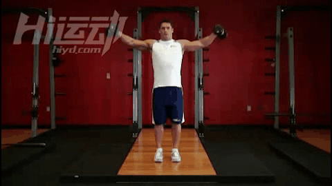
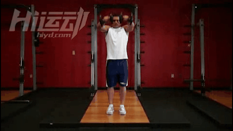
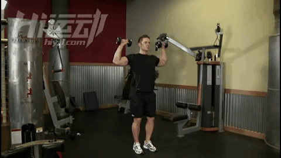
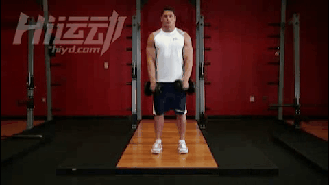
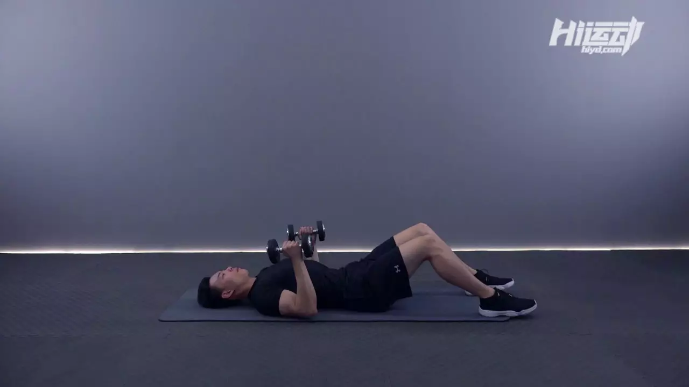
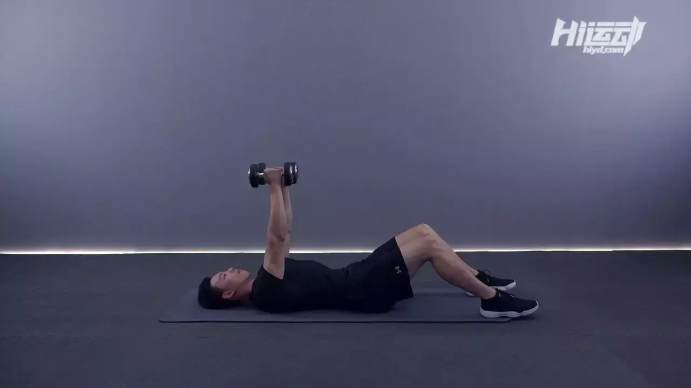
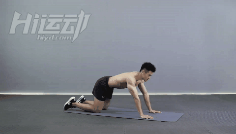
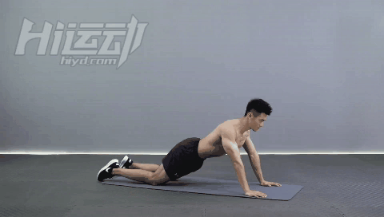
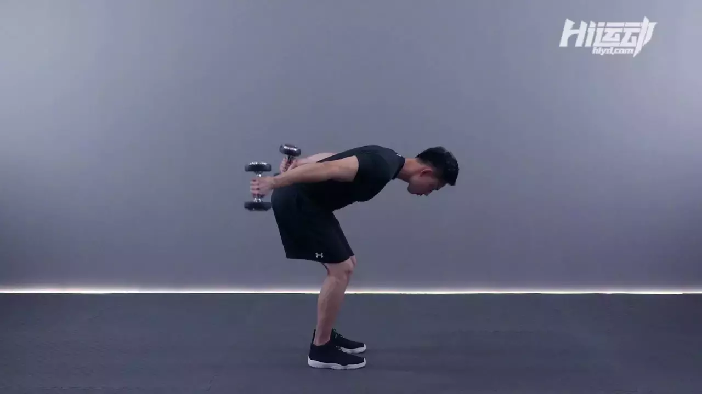

## 无器械健身
这里总结一些训练肌肉群的无器械健身动作。

https://www.hiyd.com/dongzuo/?equipment=8&muscle=17

### 肩部

#### 哑铃侧平举

1. 躯干挺直站立，双手各持一只哑铃垂于两侧。手肘应贴近身体。

2. 掌心朝向你的躯干，双脚应该打开与肩同宽，这是你的初始位置。

3. 保持手臂挺直，躯干稳定不动，将哑铃向身体两侧提起，直到举到肩膀高度，做的时候同时呼气。

4. 感受到收缩感后停留片刻，将哑铃降回初始位置，同时吸气。 提示： 保持掌心朝下，举起和下落时让小指略微抬高一些，这样可以集中让肩膀受力。

#### 哑铃前平举

1. 双手各持一只哑铃站立，躯干挺直，将哑铃放在大腿前侧，掌心朝向你的大腿，手臂伸直。

2. 保持躯干稳定（不要晃动），将哑铃提起至身体前方，肘部略微弯曲，掌心一直朝下。继续提起直到手臂与地面几乎平行。做这个步骤时同时呼气，到达顶点时停留片刻。

3. 在你吸气时，将哑铃降回到初始位置。

#### 站立哑铃推举

1. 使用双脚与肩同宽的站姿，双手各持一只哑铃。将哑铃举到头部位置，肘部弯曲大约90度。

2. 一定要严格执行该动作，不要掺杂腿部力量也不要后仰，伸直手肘将双手的哑铃一起举过头顶。

3. 暂停，然后缓慢的让哑铃回到初始位置。

#### 站姿哑铃直立划船

1. 两手各握一只哑铃，正握（掌心向前），握距略小于肩宽。哑铃应悬于大腿上方。手臂应该伸直，肘部略弯，保持背部挺直。

2. 吐气，肩膀侧向拉起绳索杠杆。在拉动哑铃时应让哑铃贴紧身体。让手肘带动整个运动。继续上拉直至哑铃快要碰到要下巴。提示：应该用手肘来带动这个动作。在拉起哑铃时，手肘应该高于前臂。另外，身体应保持固定，在动作顶点停顿一秒。

3. 慢慢放下哑铃还原至起始位置，在做这部分动作时吸气。

### 肱三头肌

#### 哑铃地板卧推(Dumbbell Floor Press)

#### 四足臂屈伸

1. 挺胸收腹，腰背平直
2. 双肘夹住向后，手掌固定不动

#### 跪姿臂屈伸

1. 挺胸收腹，腰背挺直
2. 躯干与大腿始终保持在同一平面
3. 屈肘过程中大臂尽可能贴住身体两侧

#### 站姿俯身双臂哑铃肱三头肌屈伸(Standing Bent-Over Two-Arm Dumbbell Triceps Extension)

