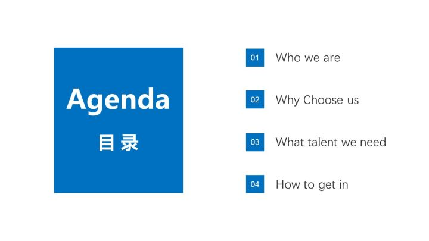
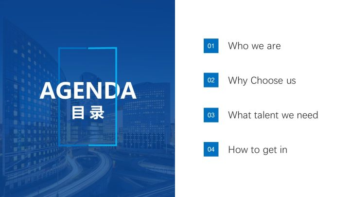
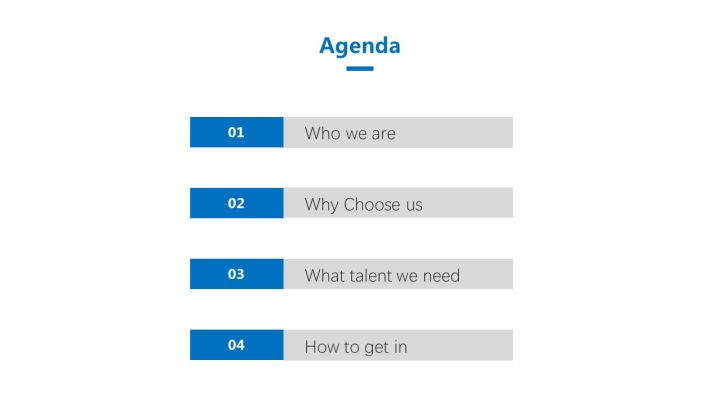
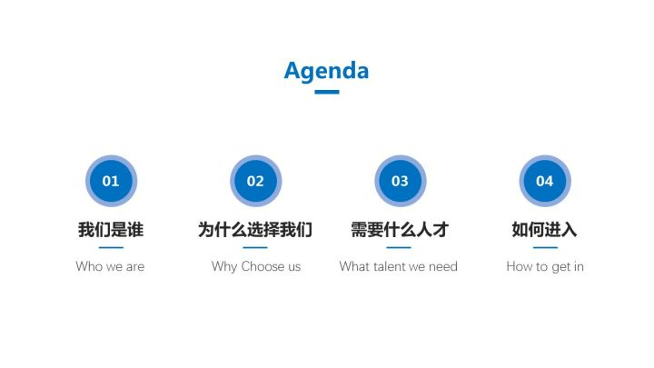
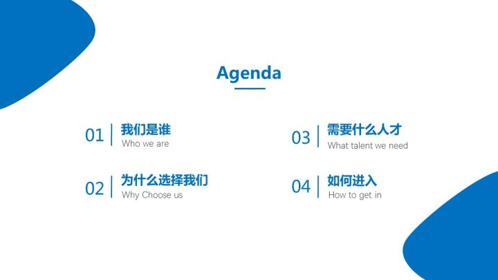
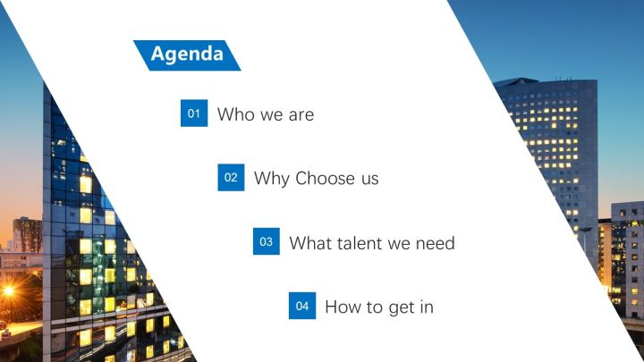

## ppt目录制作
目录页是PPT中必不可少的一部分，作为PPT的逻辑框架，观众可以通过它快速了解整个PPT的结构。

知乎总结了五种常见的设计方法

### 左右布局型目录
通常这类目录都是 **左右布局，左侧放图片、色块或者目录二字，右侧放置具体的文字内容，这是最常见的一种目录形式**。

当然，左侧的色块可以有多种形式。(左半边蓝色的Agenda目录就是所谓色块)

左侧还可以放置图片，给图片添加一层蒙版，然后输入目录二字，效果也是非常赞的。

### 上下布局型目录
所谓上下布局的目录，其实就是上方放置色块或者目录二字，下方放置具体的文本的一种版式，这也是PPT种最常用的一种目录形式。

两侧加一些不规则的色块作为修饰，也让整个版面显得更加充实，不至于太空。

### 卡片型目录
除了上面常规的两种布局方式，还有其它的目录，比如卡片型。

将图片铺满屏幕，然后在图片上添加色块作为文字的载体，承载文字内容。

色块可以分成几个部分，比如下图，添加了四个色块。

### 斜切式目录
斜切式指的是图片或者色块被斜切成几个部分的一种结构，这种斜切式排列的目录看上去更有动感，更有活力。

我具体制作了几个例子，大家可以感受一下。

直接在图片上添加平行四边形的形状，斜切整个图片，然后在图片上输入文字，注意文字的摆放也必须倾斜，角度也要一致。

### 其它创意类型
我们还可以将目录制作成时间轴的样子，这种结构，引导性强，逻辑关系明确。

### 总结
多在网上积累一些模板，方便使用。
