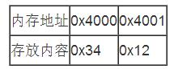
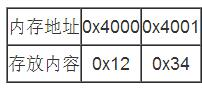

## 大端(Big Endian)与小端(Little Endian)详解
Byte Endian是指字节在内存中的组织，所以也称它为Byte Ordering，或Byte Order。

 - 所谓的大端模式，是指数据的低位保存在内存的高地址中，而数据的高位，保存在内存的低地址中；(**数据高位放在前面，也就是内存地址低处**)
 - 所谓的小端模式，是指数据的低位保存在内存的低地址中，而数据的高位保存在内存的高地址中。(**数据低位放在前面，也就是放在内存地址低处**)

如有16bit宽的数`0x1234`，0x12为高位(可以理解为千位万位)，0x34(可以理解为百位十位)为低位则：

小端存放：

大端存放：

为什么要说这两种字节序呢，因为**不同的CPU平台之间，字节序的规定是不同的**。所以不同平台之间cpu传递字节数据，一定要非常注意。

**TCP中就规定，网络中所有数据都必须采用大端字节序。**

**c++中linux下，使用endian.h头文件来转换字节序，这个头文件里封装了一些函数，可以转换当前host cpu的字节序为大端字(be--Big endian)节序或者小端(le -- Little endian)字节序**
