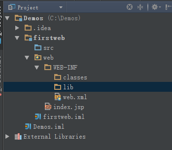

## Java web项目结构的一些概念



如若用itelliJ创建java web项目，那么简单结构便是如下所示。

src目录用来放java源码，那么WEB-INF目录呢？

### WEB-INF
WEB-INF是Java的WEB应用的**安全目录**。所谓安全就是**客户端无法访问，只有服务端可以访问的目录**。

如果想在页面中直接访问其中的文件， **必须通过web.xml文件**对要访问的文件进行相应映射才能访问。

**web.xml的作用：Web应用程序配置文件，描述了 servlet 和其他的应用组件配置及命名规则。**

Web-Inf文件夹中除了有**classes文件夹和一个web.xml文件**外、还有lib文件夹（用于存放需要的jar包）（用于配置，比如说用来配置过滤器等。）。classes文件夹用于存放编译后输出的class文件。

### web.xml
一般的web工程中都会用到web.xml，web.xml主要用来配置，可以方便的开发web工程。web.xml主要用来配置Filter、Listener、Servlet等。但是要说明的是web.xml并不是必须的，一个web工程可以没有web.xml文件。

而web.xml这个文件，则具有一些相应的元素,以下介绍几个:

#### schema
web.xml的模式文件是由Sun公司定义的，每个web.xml文件的根元素\<web-app\>中，都必须标明这个 web.xml使用的是哪个模式文件。其它的元素都放在\<web-app\>\</web-app\>之中。

``` xml
<?xml version="1.0" encoding="UTF-8"?>
<web-app version="2.4"
    xmlns="http://java.sun.com/xml/ns/j2ee"
    xmlns:xsi="http://www.w3.org/2001/XMLSchema-instance"
    xsi:schemaLocation="http://java.sun.com/xml/ns/j2ee
        http://java.sun.com/xml/ns/j2ee/web-app_2_4.xsd">
</web-app>
```

以上这种模板一般ide里都有内置。

下面是servlet 3.0框架的
``` xml
<?xml version="1.0" encoding="UTF-8"?>
<web-app xmlns="http://java.sun.com/xml/ns/javaee"
         xmlns:xsi="http://www.w3.org/2001/XMLSchema-instance"
         xsi:schemaLocation="http://java.sun.com/xml/ns/javaee
		  http://java.sun.com/xml/ns/javaee/web-app_3_0.xsd"
         version="3.0">

</web-app>
```

#### \<context-param\>上下文参数
声明应用范围内的初始化参数。它用于向 ServletContext提供键值对，即应用程序上下文信息。我们的listener, filter等在初始化时会用到这些上下文中的信息。在servlet里面可以通过getServletContext().getInitParameter("context/param")得到。

``` xml
<context-param>
    <param-name>ContextParameter</para-name>
    <param-value>test</param-value>
    <description>It is a test parameter.</description>
</context-param>
```

####

### Mapping规则
