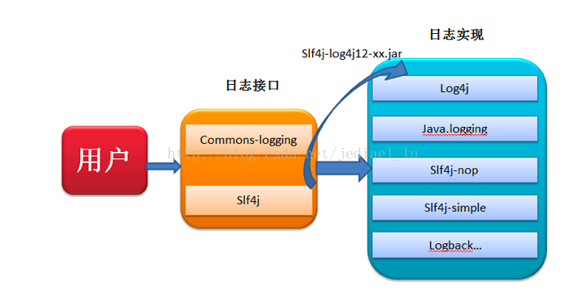

### SLF4J
SLF4J，即简单日志门面（Simple Logging Facade for Java），不是具体的日志解决方案，**它只服务于各种各样的日志系统**。

SLF4J不同于其他日志类库，与其它有很大的不同。SLF4J(Simple logging Facade for Java)不是一个真正的日志实现，而是一个抽象层（ abstraction layer），它允许你在后台使用任意一个日志类库。

如果一个项目已经使用了log4j，而你加载了一个类库，比方说 Apache Active MQ——它依赖于于另外一个日志类库logback，那么你就需要把它也加载进去。但如果Apache Active MQ使用了SLF4J，你可以继续使用你的日志类库而无语忍受加载和维护一个新的日志框架的痛苦。

所以slf4j只是一个门面（facet），它不包含具体的实现，而是**将一些log4j，java.logging等实现包装成统一的接口**。借用下图展示了常用日志文件的关系



当我们调用接口时，接口的工厂会自动寻找恰当的实现，返回一个实现的实例给我服务。这些过程都是透明化的，用户不需要进行任何操作！

### slf4j与log4j联合使用(范例)
使用slf4j，先要找到它和具体log框架之间连接转换的jar包。

弄到slf4j与log4j的关联jar包，通过这个东西，将对slf4j接口的调用转换为对log4j的调用，不同的日志实现框架，这个转换工具不同

比如，再maven的pom文件里添加
``` xml
<dependency>
    <groupId>org.slf4j</groupId>
    <artifactId>slf4j-log4j12</artifactId>
    <version>1.7.21</version>
</dependency>
```

当然了，slf4j-log4j12这个包肯定依赖了slf4j和log4j，所以使用slf4j+log4j的组合只要配置上面这一个依赖就够了

最后，代码里声明logger要改一下，原来使用log4j是这样的

``` java
import org.apache.log4j.Logger;
class Test {
    final Logger log = Logger.getLogger(Test.class);
    public void test() {
        log.info("hello this is log4j info log");
    }
}
```

现在要改成这样

``` java
import org.slf4j.Logger;
import org.slf4j.LoggerFactory;
class Test {
    Logger log = LoggerFactory.getLogger(Test.class);
    public void test() {
        log.info("hello, my name is {}", "Rock");
    }
}
```

依赖的Logger变了，而且，slf4j的api还能使用占位符，很方便
