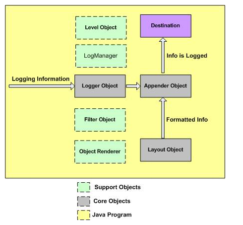

## Log4J
日志是应用软件中不可缺少的部分，Apache的开源项目log4j是一个功能强大的日志组件,提供方便的日志记录。

Log4j 是高度可配置的，在**运行期使用外部的配置文件对其进行配置**。它按照优先级别记录日志，并**可将日志信息定向输出到各种介质**，比如数据库、文件、控制台、Unix Syslog等。

Log4j 主要由三部分组成：

 - loggers：负责采集日志信息。
 - appenders：负责将日志信息发布到不同地方。
 - layouts：负责以各种风格格式化日志信息。

### 记录日志
记录日志是软件开发中的重要一环。编写良好的日志代码能为运行应用提供快速的诊断信息和良好的存储结构，方便维护。

记录日志也有其缺点，它会让应用变慢。假如输出太详细，可能会导致屏幕闪动。为了减轻这些影响，Log4j 被设计为可靠的，更快的和可扩展的。

由于日志很少是应用程序关注的焦点，所以 Log4j API 力争做到简单并易于理解和使用。

### Log4J架构
了解一下Log4J的架构利于理解对其的使用。

之前说过Log4J主要分成三个部分，loggers，appenders，layouts。

#### Loggers
最上一层是 Logger 对象，该对象负责获取日志信息，并存储于一个分层的命名空间之中。

#### Appenders
该对象位于分层架构中的较低一层，Appender 对象负责将日志信息发布到不同目的地，比如数据库、文件、控制台、Unix Syslog 等。

#### Layout
Layout 层提供了用于以各种风格格式化日志信息的对象，在发布日志信息之前，它为 appender 对象提供支持。

Layout 对象对于发布日志信息非常重要，它使日志变得可读、可复用。

下图展示了 Log4j 框架中的组件：



log信息传递给Logger，logger再传递给Appender进行处理，layout对象负责格式化输出，appender输出到指定的地点。

其余的一些组件(Suppoer Objects)，最好也做一下了解，方便后续理解配置文件的书写。

#### Level 对象

Level 对象定义了日志信息的粒度和优先级。API 定义了七种级别：OFF、DEBUG、INFO、ERROR、WARN、FATAL、ALL。

#### Filter 对象
Filter 对象用来分析日志信息，进而决定该条日志是否被记录。

一个 Appender 对象可对应多个 Filter 对象，当日志信息传给 Appender 对象时，与其关联的所有 Filter 对象需要判断是否将日志信息发布到目的地。

#### ObjectRenderer
ObjectRenderer 对象负责为传入日志框架的不同对象提供字符串形式的表示，Layout 对象使用该对象来准备最终的日志信息。

#### LogManager
LogManager 对象管理日志框架，它负责从系统级的配置文件或类中读取初始配置参数。

### log4j配置文件
log4使用外部文件**log4j.properties**来进行配置。

先介绍下log4j日志等级的概念，日志等级就是日志的重要程度，log4j日志分为7个等级：ALL、DEBUG、INFO、WARN、ERROR、FATAL、OFF，从左到右等级由低到高，分等级是为了设置日志输出的门槛，只有等级等于或高于这个门槛的日志**才有机会**输出 **(输不输出还要看设置)**

配置都将写在log4j.properties中，以下分部分介绍配置。

#### 配置logger
日志实例，就是代码里实例化的Logger对象

``` java
log4j.rootLogger=LEVEL,appenderName1,appenderName2,...
log4j.additivity.org.apache=false
//表示不会在父logger的appender里输出，默认true
```

这是全局logger的配置，LEVEL用来设定日志等级，appenderName定义日志输出器的名字(自定义)

#### 配置appender
日志输出器，指定logger的输出位置

``` java
log4j.appender.appenderName=className

//　appender有5种选择
org.apache.log4j.ConsoleAppender（控制台）
org.apache.log4j.FileAppender（文件）
org.apache.log4j.DailyRollingFileAppender（每天产生一个日志文件）
org.apache.log4j.RollingFileAppender（文件大小到达指定尺寸的时候产生一个新的文件）
org.apache.log4j.WriterAppender（将日志信息以流格式发送到任意指定的地方）
```

每种appender都有若干配置项，下面逐一介绍

ConsoleAppender（常用）:
```
Threshold=WARN：指定日志信息的最低输出级别，默认DEBUG
ImmediateFlush=true：表示所有消息都会被立即输出，设为false则不输出，默认值是true
Target=System.err：默认值是System.out
```

FileAppender：

```
Threshold=WARN：指定日志信息的最低输出级别，默认DEBUG
ImmediateFlush=true：表示所有消息都会被立即输出，设为false则不输出，默认true
Append=false：true表示消息增加到指定文件中，false则将消息覆盖指定的文件内容，默认true
File=D:/logs/logging.log4j：指定消息输出到logging.log4j文件
```

DailyRollingFileAppender（常用）:
```
Threshold=WARN：指定日志信息的最低输出级别，默认DEBUG
ImmediateFlush=true：表示所有消息都会被立即输出，设为false则不输出，默认true
Append=false：true表示消息增加到指定文件中，false则将消息覆盖指定的文件内容，默认true
File=D:/logs/logging.log4j：指定当前消息输出到logging.log4j文件
DatePattern='.'yyyy-MM：每月滚动一次日志文件，即每月产生一个新的日志文件。当前月的日志文件名为logging.log4j，前一个月的日志文件名为logging.log4j.yyyy-MM
另外，也可以指定按周、天、时、分等来滚动日志文件，对应的格式如下：
1)'.'yyyy-MM：每月
2)'.'yyyy-ww：每周
3)'.'yyyy-MM-dd：每天
4)'.'yyyy-MM-dd-a：每天两次
5)'.'yyyy-MM-dd-HH：每小时
6)'.'yyyy-MM-dd-HH-mm：每分钟
```

RollingFileAppender:
```
Threshold=WARN：指定日志信息的最低输出级别，默认DEBUG
ImmediateFlush=true：表示所有消息都会被立即输出，设为false则不输出，默认true
Append=false：true表示消息增加到指定文件中，false则将消息覆盖指定的文件内容，默认true
File=D:/logs/logging.log4j：指定消息输出到logging.log4j文件
MaxFileSize=100KB：后缀可以是KB,MB或者GB。在日志文件到达该大小时，将会自动滚动，即将原来的内容移到logging.log4j.1文件
MaxBackupIndex=2：指定可以产生的滚动文件的最大数，例如，设为2则可以产生logging.log4j.1，logging.log4j.2两个滚动文件和一个logging.log4j文件
```

#### 配置layout
指定logger输出内容及格式

``` java
log4j.appender.appenderName.layout=className

//layout有4种选择
org.apache.log4j.HTMLLayout（以HTML表格形式布局）
org.apache.log4j.PatternLayout（可以灵活地指定布局模式）
org.apache.log4j.SimpleLayout（包含日志信息的级别和信息字符串）
org.apache.log4j.TTCCLayout（包含日志产生的时间、线程、类别等信息）
```

PatternLayout（最常用的配置）:

``` java
ConversionPattern=%m%n：设定以怎样的格式显示消息

//　设置格式的参数说明如下
%p：输出日志信息的优先级，即DEBUG，INFO，WARN，ERROR，FATAL
%d：输出日志时间点的日期或时间，默认格式为ISO8601，可以指定格式如：%d{yyyy/MM/dd HH:mm:ss,SSS}
%r：输出自应用程序启动到输出该log信息耗费的毫秒数
%t：输出产生该日志事件的线程名
%l：输出日志事件的发生位置，相当于%c.%M(%F:%L)的组合，包括类全名、方法、文件名以及在代码中的行数
%c：输出日志信息所属的类目，通常就是类全名
%M：输出产生日志信息的方法名
%F：输出日志消息产生时所在的文件名
%L：输出代码中的行号
%m：输出代码中指定的具体日志信息
%n：输出一个回车换行符，Windows平台为"rn"，Unix平台为"n"
%x：输出和当前线程相关联的NDC(嵌套诊断环境)
%%：输出一个"%"字符
```

#### 局部配置
以上介绍的配置都是全局的，整个工程的代码使用同一套配置，意味着所有的日志都输出在了相同的地方，你无法直接了当的去看数据库访问日志、用户登录日志、操作日志，它们都混在一起，因此，**需要为包甚至是类配置单独的日志输出**，下面给出一个例子，为“com.demo.test”包指定日志输出器“test”，“com.demo.test”包下所有类的日志都将输出到/log/test.log文件

``` java
log4j.logger.com.demo.test=DEBUG,test
log4j.appender.test=org.apache.log4j.FileAppender
log4j.appender.test.File=/log/test.log
log4j.appender.test.layout=org.apache.log4j.PatternLayout
log4j.appender.test.layout.ConversionPattern=%d{yyyy-MM-dd HH:mm:ss} [%p] %m%n
```


#### 配置示例

以下是一个名为console的自定义logger的配置范例，配置书写在log4j.properties文件中。
``` java
log4j.rootLogger=DEBUG,console

# 控制台(console)
log4j.appender.console=org.apache.log4j.ConsoleAppender
log4j.appender.console.Threshold=DEBUG
log4j.appender.console.ImmediateFlush=true
log4j.appender.console.Target=System.err
log4j.appender.console.layout=org.apache.log4j.PatternLayout
log4j.appender.console.layout.ConversionPattern=%d{yyyy-MM-dd HH:mm:ss} [%p] %m%n
```
