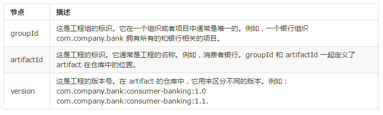

## Maven基础
Maven 是一个项目管理和整合工具。Maven 为开发者提供了一套完整的构建生命周期框架。开发团队几乎不用花多少时间就能够自动完成工程的基础构建配置，因为 Maven 使用了一个标准的目录结构和一个默认的构建生命周期。

Maven可以帮助管理jar包，这些jar包会暂且存放在本地仓库(本地缓存)中。

项目先从本地仓库中取jar包，没有的话就去Maven服务器下载。

### 下载和使用
去官网下载到一个zip包，解压后得到maven的文件夹，然后设置环境变量即可。

3个环境变量(比如我把maven文件夹放到和java一起)：

 - M2_HOME = C:\\Program Files\\Java\\maven
 - MAVEN_OPTS = -Xms256m -Xmx512m
 - M2=%M2_HOME%\\bin

MAVEN_OPTS设置合理的话可以使Maven运行得更快。

### POM
Maven 工程结构和内容被定义在一个 xml 文件中 － pom.xml，是 Project Object Model (POM) 的简称，此文件是整个 Maven 系统的基础组件。

POM 包含了关于工程和各种配置细节的信息，Maven 使用这些信息构建工程。

POM 也包含了目标和插件。当执行一个任务或者目标时，Maven 会查找当前目录下的 POM，从其中读取所需要的配置信息，然后执行目标。

**需要说明的是每个工程应该只有一个 POM 文件。**

注意：

 - 所有的 POM 文件需要 project 元素和三个必须的字段：groupId, artifactId,version。
 - 在仓库中的工程标识为 groupId:artifactId:version
 - POM.xml 的根元素是 project，它有三个主要的子节点：

