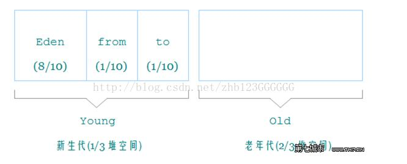

## 判断对象已死

### 引用计数器算法

比较典型的教科书算法是引用计数算法，每当一个类有地方引用则计数器加一，没有地方引用则计数器减一，清0则这块区域被gc回收。

然而实际上并不采用这种方法回收，虽然COM技术，Python这些是用这个方法。但是jvm并没有采用，他很难解决对象之间相互引用的问题。


比如上图这个链表，head是对这整个链表的头结点的引用(头结点变量)，所以理论上，我们将head变量重置为null以后，整个链表(整块内存已经没用了)所占用的内存理应被回收掉。然后由于采用引用计数器算法，头节点被最后一个节点引用，导致引用这个节点区域的引用计数器不为0，所以这块链表的内存无法被回收。


``` java
public class ref{
  Object instance = null;
}

```

好比上面定义的类，如果实例化A和B，A.instance指向B，B的指向A，则最后无法被垃圾回收。所以jvm不采用这种方法


### 可达性算法
类似JAVA C#的主流实现都是采用可达性分析。算法基本思路即是通过一系列“GC ROOTs”对象做为起点搜索，当一个对象到GC Roots没有任何引用链相连时证明此对象不可用。

#### GC Roots
在 Java 语言里，可作为 GC Roots 的包括下面几种：
- 虚拟机栈（栈帧中的本地变量表）中引用的对象。
- 方法区中的类静态属性引用的对象。
- 方法区中的常量引用的对象。
- 本地方法栈中 JNI（Native 方法）的引用对象。


一个对象要真正被宣告死亡，至少经过两次标记。第一次标记后进行筛选，看**是否有必要执行finalize()方法**，对象未覆盖此方法或者已经被调用过则视为没有必要执行，没有必要执行finalize方法的对象将会被直接干掉，否则执行finalize方法(finalize方法就相当于是救星了)。如果被判定为有必要执行，那么这个对象将会被放置在一个名为 F-Queue 队列中，并在稍后由一条由虚拟机自动建立的、低优先级的 Finalizer 线程去执行 finalize()方法。finalize()方法是对象逃脱死亡命运的最后一次机会（因为一个对象的 finalize()方法最多只会被系统自动调用一次），稍后 GC 将对 F-Queue 中的对象进行第二次小规模的标记，如果要在 finalize()方法中成功拯救自己，只要在 finalize()方法中让该对象重引用链上的任何一个对象建立关联即可。而如果对象这时还没有关联到任何链上的引用，那它就会被回收掉。

需要注意，垃圾收集器会先执行对象的finalize方法，但**不保证会执行完毕**（死循环或执行很缓慢的情况会被强行终止）

其实不建议在任何情况下使用finalize方法

## 垃圾回收算法

### 标记-清除算法
标记出回收对象，标记完成后统一回收。有两个主要不足，一是标记和清除效率都不高，二是容易产生大量不连续内存的碎片。

### 复制算法
将内存分为等大小两块，一块用完了，复制存活对象到另外一块上，清除原来的内存块。但是代价是内存缩小一半

现代虚拟机基本采用这种算法回收新生代，新生代对象朝生夕死，因此可以将内存分为较大的Eden空间和两个较小的Survivor空间，每次使用Eden和其中一块Survivor，讲Eden和Survivor中还存活的对象一次性复制到另外一块Survivor空间上。默认Eden:Survivor为8:1，虽然每次只有10%的内存被浪费，但是缺点是如果每次的存活对象超过十分之一就不行了。因此Survivor空间不够是要其他内存(老年代)进行分配担保

复制收集算法在对象存活率高时要经常复制，效率会变低

### 标记整理算法
老年代一般采用这种算法，标记完对象后不直接清除，让存活对象向一端移动，然后直接清除边界以外的内存。

#### 总结
商业虚拟机都是分代收集，一般是把java堆分成新生代和老年代，这样可以根据各年代特点采用适合的收集算法，每次有大批对象死去的选用复制，存活率高且无额外空间的使用标记清理或者标记整理。

### 内存模型
在 Java 中，堆被划分成两个不同的区域：新生代 ( Young )、老年代 ( Old )。新生代 ( Young ) 又被划分为

三个区域：Eden、From Survivor、To Survivor。



1.6默认值：新生代 ( Young ) = 1/3 的堆空间大小。老年代 ( Old ) = 2/3 的堆空间大小。其中，新生代 ( Young ) 被细分为 Eden 和 两个 Survivor 区域，这两个 Survivor 区域分别被命名为 from 和 to，以示区分。

默认的，Edem : from : to = 8 :1 : 1 ( 可以通过参数–XX:SurvivorRatio 来设定 )，即： Eden = 8/10 的
新生代空间大小，from = to = 1/10 的新生代空间大小。

### (后续)内存分配策略
- 对象优先在 Eden 分配。
- 大对象直接进入老年代。
- 长期存活的对象将进入老年代。
- **当Minor GC时，新生代存活的对象大于Survivor的大小时，这时一个Survivor装不下它们，那么它们就会进入老年代**。

GC方法定义：
 - Minor GC，从年轻代空间（包括 Eden 和 Survivor 区域）回收内存被称为 Minor GC。
 - Major GC 是清理老年代。
 - Full GC 是清理整个堆空间—包括年轻代和老年代。


回收策略
- 新生代 GC（Minor GC）：发生在新生代的垃圾收集动作，因为 Java 对象大多都具有朝生夕灭的特性，因此Minor GC 非常频繁，一般回收速度也比较快。(复制算法)

- 老年代 GC（Major GC/Full GC）：发生在老年代的 GC，出现了 Major GC，经常会伴随至少一次 Minor GC。由于老年代中的对象生命周期比较长，因此 Major GC 并不频繁，一般都是等待老年代满了后才进行 Full GC，而且其速度一般会比 Minor GC 慢 10 倍以上。另外，如果分配了 Direct Memory，在老年代中进行 Full GC时，会顺便清理掉 Direct Memory 中的废弃对象。(标记清除或者整理)

### 触发回收
Minor GC触发条件：当**Eden区满时**，触发Minor GC。

Full GC触发条件：

（1）调用System.gc时，**系统建议执行Full GC，但是不必然执行**

（2）老年代空间不足

（3）方法区空间不足

（4）空间分配担保失败。使用复制算法的 Minor GC 需要老年代的内存空间作担保，如果出现了 HandlePromotionFailure 担保失败，则会触发 Full GC。

（5）由Eden区、From Space区向To Space区复制时，对象大小大于To Space可用内存，则把该对象转存到老年代，且老年代的可用内存小于该对象大小(**转移失败**)
