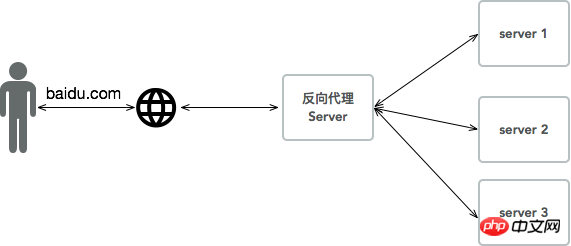

## Nginix与php-fpm

### 正向代理与反向代理
正向代理，就是能被用户感知的代理，代理服务器在用户这一方，比如VPN，我们可以感知VPN服务器，所有数据通过VPN服务器再去到达请求服务器。

正向代理：vpn访问google

反向代理，代理服务器在请求服务器测，用户不能感知这个代理服务器，所有请求经过这个反向代理服务器时，这个服务器可以做负载均衡。

反向代理：负载均衡

因此可知，对于人来说，可以感知到的就是正向代理，感知不到的就是反向代理。

### Nginx
Nginx (“engine x”) 是一个高性能的HTTP和反向代理服务器，也是一个IMAP/POP3/SMTP服务器。

### cgi历史
参见计算机网络笔记中的CGI笔记。

fast-cgi是cgi的改良版本，fast-cgi每次处理完请求后，不会kill掉这个进程，而是保留这个进程，使这个进程可以一次处理多个请求。这样每次就不用重新fork一个进程了，大大提高了效率。

Fastcgi先fork一个master，解析配置文件，初始化执行环境，然后再fork多个worker。当请求过来时，master会传递给一个worker，然后立即可以接受下一个请求。这样就避免了重复的劳动，效率自然是高。而且当worker不够用时，master可以根据配置预先启动几个worker等着；当然空闲worker太多时，也会停掉一些，这样就提高了性能，也节约了资源。这就是Fastcgi的对进程的管理。大多数Fastcgi实现都会维护一个进程池。注：swoole作为httpserver，实际上也是类似这样的工作方式。

FastCGI是一套标准，理论上讲只要能进行标准输出（stdout）的语言都可以作为FastCGI标准的Web后端。

### php-fpm
php-fpm即php-Fastcgi Process Manager.
php-fpm是 FastCGI 的实现，并提供了进程管理的功能。
进程包含 master 进程和 worker 进程两种进程。
master 进程只有一个，负责监听端口，接收来自 Web Server 的请求，而 worker 进程则一般有多个(具体数量根据实际需要配置)，每个进程内部都嵌入了一个 PHP 解释器，是 PHP 代码真正执行的地方。
