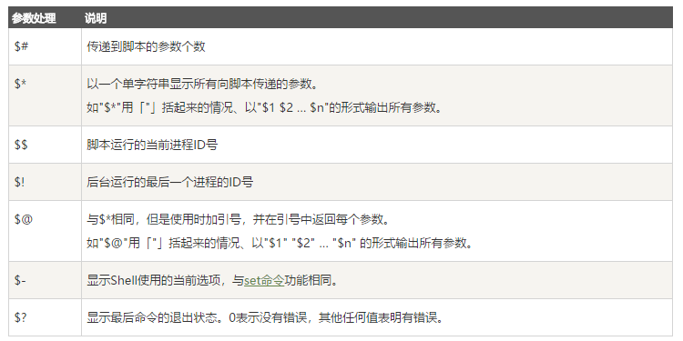
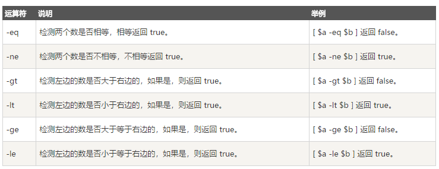
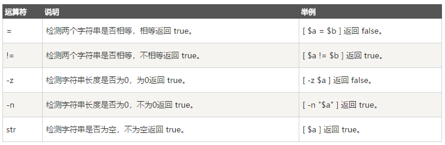
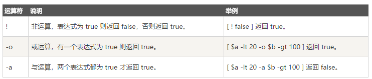
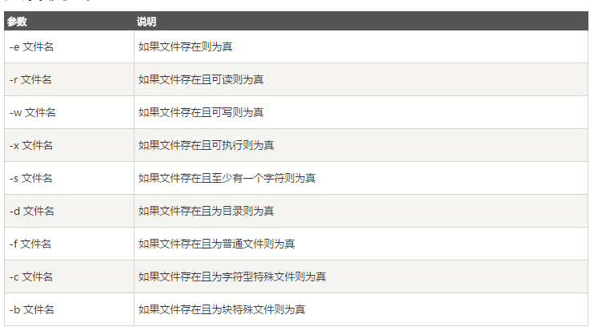

## shell 编程基础
Shell 是一个用 C 语言编写的程序，它是用户使用 Linux 的桥梁。Shell 既是一种命令语言，又是一种程序设计语言。
Shell 是指一种应用程序，这个应用程序提供了一个界面，用户通过这个界面访问操作系统内核的服务。

大多数linux默认的shell的bash，所以重点了解bash脚本的写法。

在一般情况下，人们并不区分 Bourne Shell 和 Bourne Again Shell，所以，像 \#!/bin/sh，它同样也可以改为 \#!/bin/bash。

脚本第一行开头的 \#! 告诉系统其后路径所指定的程序即是解释此脚本文件的 Shell 程序。

``` bash
#!/bin/bash
echo "Hello World !"
```

### 变量
定义变量的时候直接定义，使用的使用加$符号即可。

``` bash
your_name="qinjx"
echo $your_name
echo ${your_name}
```

字符串用双引号，里面可以有变量，不过要记得加转义字符

``` bash
your_name='qinjx'
str="Hello, I know you are \"$your_name\"! \n"
```

\#用来获取字符串长度，:用来提取子字符串

``` bash
string="abcd"
echo ${#string} #输出 4

string="runoob is a great site"
echo ${string:1:4} # 输出 unoo
```

### 传递参数
我们可以在执行 Shell 脚本时，向脚本传递参数，脚本内获取参数的格式为：$n。n 代表一个数字，1 为执行脚本的第一个参数，2 为执行脚本的第二个参数，以此类推

**$0 为执行的文件名**

``` bash
#!/bin/bash

echo "Shell 传递参数实例！";
echo "执行的文件名：$0";
echo "第一个参数为：$1";
echo "第二个参数为：$2";
echo "第三个参数为：$3";
```

执行

```
$ chmod +x test.sh
$ ./test.sh 1 2 3
Shell 传递参数实例！
执行的文件名：./test.sh
第一个参数为：1
第二个参数为：2
第三个参数为：3
```

除此之外，还有一些特殊字符用来处理参数。



#### getopts
如果你的脚本参数非常多，那使用上面的这种方式就非常不合适，你无法清楚地记得每个位置对应的是什么参数。所以，我们可以使用bash内置的getopts

``` bash
while getopts 'h:j:m:u' OPT; do
    case $OPT in
        j) JAVA_DIR="$OPTARG";;
        m) MAVEN_DIR="$OPTARG";;
        u) upload="true";;
        h) usage;;
        ?) usage;;
    esac
done
```

上述脚本假如是test.sh,在调用时如下

```
test.sh [-j JAVA_DIR] [-m MAVEN_DIR]
```

getopts后面跟的字符串就是参数列表，每个字母代表一个选项，如果字母后面跟一个：就表示这个选项还会有一个值，比如上面例子中对应的-j /home/soft/java 和-m /home/soft/maven 。而getopts字符串中没有跟随:的字母就是开关型选项，不需要指定值，等同于true/false,只要带上了这个参数就是true。

getopts识别出各个选项之后，就可以配合case进行操作。操作中，有两个"常量"，一个是OPTARG，用来获取当前选项的值；另外一个就是OPTIND，表示当前选项在参数列表中的位移。case的最后一项是?，用来识别非法的选项，进行相应的操作，我们的脚本中输出了帮助信息。

**OPTIND的初始值为1，当选项参数处理结束后，其指向剩余参数的第一个。**

``` bash
while getopts 'j:m:u' OPT; do
    case $OPT in
        j) JAVA_DIR="$OPTARG";;
        m) MAVEN_DIR="$OPTARG";;
        u) upload="true";;
        h) usage;;
        ?) usage;;
    esac
done

echo $OPTIND
shift $(($OPTIND - 1))
echo $1

---------------
$ sh test.sh -j /home/soft/java -m /home/soft/maven otherargs
1
5
otherargs
```

### 数组
Bash Shell 只支持一维数组（不支持多维数组），初始化时不需要定义数组大小

``` bash
#!/bin/bash

my_array=(A B "C" D)
```

使用@ 或 * 可以获取数组中的所有元素，例如：

``` bash
my_array[0]=A
my_array[1]=B
my_array[2]=C
my_array[3]=D

echo "数组的元素为: ${my_array[*]}"
echo "数组的元素为: ${my_array[@]}"
```

### 运算
原生bash不支持简单的数学运算，但是可以通过其他命令来实现，例如 awk 和 expr，expr 最常用。

``` bash
#!/bin/bash

val=`expr 2 + 2`
echo "两数之和为 : $val"
```

两个数相加(注意使用的是反引号 \` 而不是单引号 ')：

下表列出了常用的关系运算符，假定变量 a 为 10，变量 b 为 20：



**重要原则：条件表达式要放在方括号之间，并且要有空格，例如: [$a==$b] 是错误的，必须写成 [ $a == $b ]。**

除此之外还有字符串运算符

下表列出了常用的字符串运算符，假定变量 a 为 "abc"，变量 b 为 "efg"：



还有布尔逻辑运算符：



还要知道&&和||也是能用的。

### test命令
Shell中的 test 命令用于检查某个条件是否成立，**它可以进行数值、字符和文件三个方面的测试。**



``` bash
cd /bin
if test -e ./bash
then
    echo '文件已存在!'
else
    echo '文件不存在!'
fi
```

### 重定向
重定向一般通过在命令间插入特定的符号来实现。特别的，这些符号的语法如下所示:

```
$ echo "菜鸟教程：www.runoob.com" > users
$ cat users
菜鸟教程：www.runoob.com
$
```

\>是重定向覆盖，\>\>是追加到文件末尾。

在重定向中，012三个数字分别代表标准输入输出和标准错误。

```
$ command > file 2>&1
$ command >> file 2>&1
```

注意上面命令，&没有固定的意思。放在>后面的&，表示重定向的目标不是一个文件，而是一个文件描述符，文件描述符的012就是对应标准输入输出和标准错误。

**换言之 2>1 代表将stderr重定向到当前路径下文件名为1的regular file中，而2>&1代表将stderr重定向到文件描述符为1的文件(即/dev/stdout)中，这个文件就是stdout在file system中的映射**

上面的文字务必理解。

#### /dev/null
/dev/null 是一个特殊的文件，写入到它的内容都会被丢弃；如果尝试从该文件读取内容，那么什么也读不到。但是 /dev/null 文件非常有用，**将命令的输出重定向到它，会起到"禁止输出"的效果。**

如果希望屏蔽 stdout 和 stderr，可以这样写：

``` bash
$ command > /dev/null 2>&1
```

### source命令
包含外部代码，用source命令。
