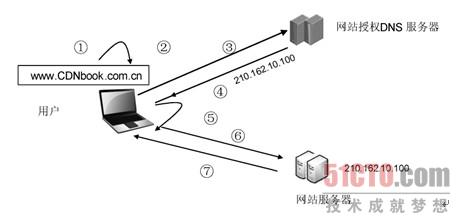
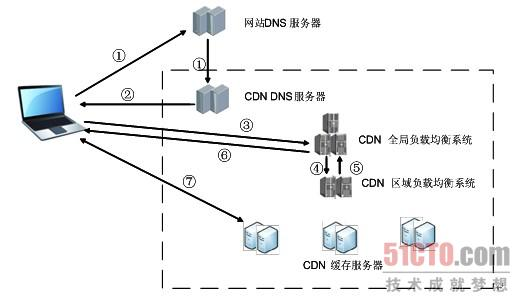
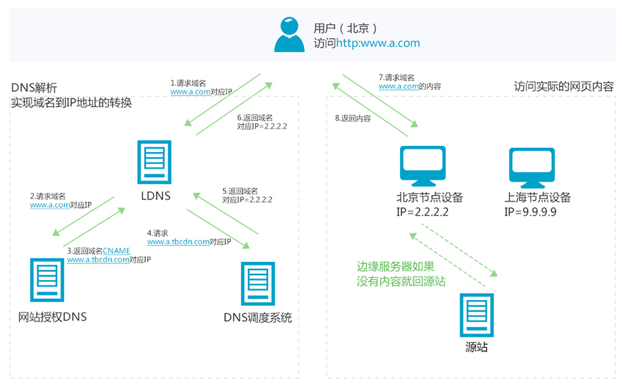
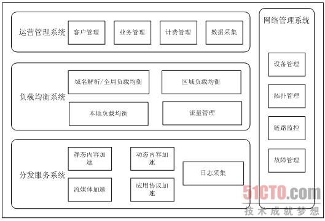
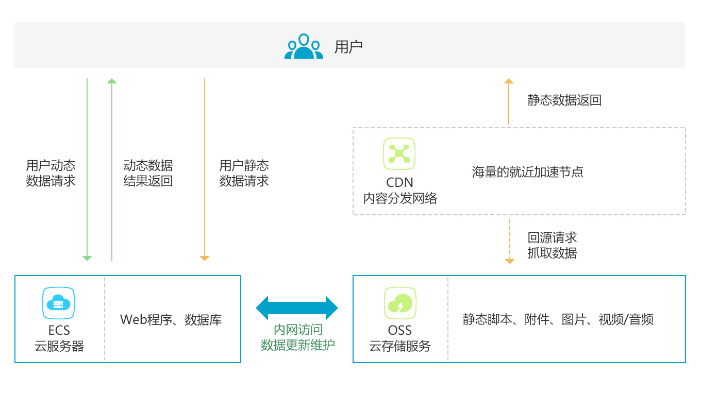
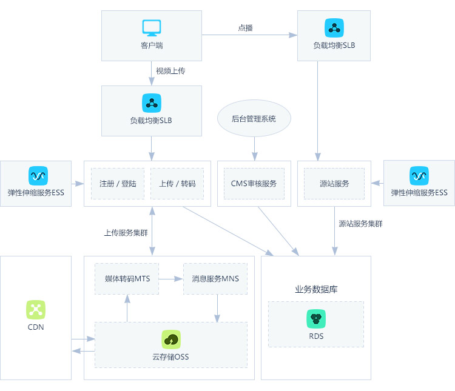
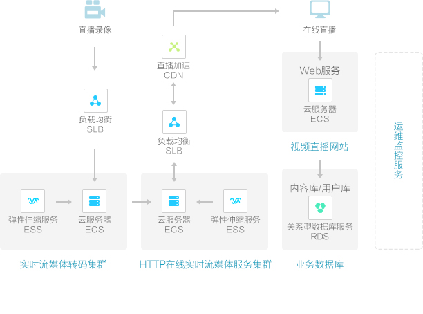
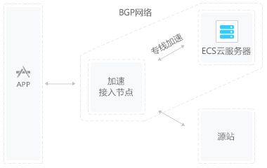

## CDN
CDN（内容分发网络）全称是 Content Delivery Network，建立并覆盖在承载网之上、由分布在不同区域的边缘节点服务器群组成的分布式网络，**替代** 传统以 WEB Server 为中心的数据传输模式。

**作用是将源内容发布到边缘节点，配合精准的调度系统；将用户的请求分配至最适合他的节点，使用户可以以最快的速度取得他所需的内容，有效解决Internet网络拥塞状况，提高用户访问的响应速度。**

### 基本工作过程
在没有CDN的情况下，客户端浏览器获取数据的流程如下：

1. 用户在自己的浏览器中输入要访问的网站域名。

2. 浏览器向 本地DNS服务器 请求对该域名的解析。

3. 本地DNS服务器中如果缓存有这个域名的解析结果，则直接响应用户的解析请求。

4. 本地DNS服务器中如果没有关于这个域名的解析结果的缓存，则以递归方式向整个DNS系统请求解析，获得应答后将结果反馈给浏览器。

5. 浏览器得到域名解析结果，就是该域名相应的服务设备的 IP地址 。

6. 浏览器向服务器请求内容。服务器将用户请求内容传送给浏览器

在网站和用户之间 **加入 CDN 以后**，用户不会有任何与原来不同的感觉。最简单的 CDN 网络有一个 DNS 服务器和几台缓存服务器就可以运行了。一个典型的 CDN 用户访问调度流程如图所示:

1. 当用户点击网站页面上的内容URL，经过本地DNS系统解析，DNS 系统会最终将域名的解析权交给 **CNAME 指向的 CDN 专用 DNS 服务器** (CNAME是一条dns记录,这里直接指向cdn dns服务器做分发，而不是查到真实地址再返回给用户)。

2. CDN 的 DNS 服务器将 CDN 的全局负载均衡设备 IP 地址返回用户。

3. 然后用户会向 CDN 的全局负载均衡设备发起内容 URL 访问请求。

4. CDN 全局负载均衡设备根据用户 IP 地址，以及用户请求的内容URL，选择一台用户所属区域的区域负载均衡设备，告诉用户向这台设备发起请求。

5. 基于以下这些条件的综合分析之后，区域负载均衡设备会向全局负载均衡设备返回一台缓存服务器的IP地址：
 - 根据用户 IP 地址，判断哪一台服务器距用户最近；
 - 根据用户所请求的 URL 中携带的内容名称，判断哪一台服务器上有用户所需内容；
 - 查询各个服务器当前的负载情况，判断哪一台服务器尚有服务能力。

6. 全局负载均衡设备把服务器的 IP 地址(其实是CDN缓存服务器地址)返回给用户。

7. 用户向缓存服务器发起请求，缓存服务器响应用户请求，将用户所需内容传送到用户终端。如果这台缓存服务器上并没有用户想要的内容，而区域均衡设备依然将它分配给了用户，那么这台服务器就要向它的上一级缓存服务器请求内容，直至追溯到网站的源服务器将内容拉到本地。

上述就是CDN运作的基本流程，可见就是 用户->DNS Server->CDN Server -> 用户得到CDN全局负载均衡系统地址 -> CDN 全局负载均衡系统 -> CDN区域系统回复CDN缓存服务器地址给全局系统 -> 全局系统回缓存服务器地址给用户 -> 用户找到缓存服务器 -> 缓存服务器逐级获取内容 -> 返回给用户

使用 CDN 服务的网站，**只需将其域名解析权交给 CDN 的全局负载均衡（GSLB）设备，将需要分发的内容注入 CDN，就可以实现内容加速了**。 zwlj：也就是说CDN网络会把真实内容缓存到自己的分布式缓存服务器里，然后根据用户的距离远近，从缓存服务器分发内容。

使用CDN后的http请求处理流程如下图，其中左边为DNS解析过程，右边为内容访问过程：

如上图，LDNS就是本地域名服务器，用户根据某网站域名先获取到cdn的cname，再获取到cdn dns服务器的具体ip。得到以后进入右边内容分发网络，由cdn负责选择缓存节点返回数据，缓存服务器没有数据就从源站点拉。

### CDN功能架构
CDN 公司在整个互联网上部署数以百计的CDN服务器（Cache），这些服务器通常在运营商的 IDC (互联网数据中心Internet Data Center）中，尽量靠近接入网络和用户

从功能上划分，典型的 CDN 系统架构由 **分发服务系统、负载均衡系统和运营管理系统** 三大部分组成，如图所示：

#### 分发服务系统
该系统的主要作用是实现将内容从内容源中心向边缘的推送和存储

分发服务系统最基本的工作单元就是**许许多多的 Cache设备（缓存服务器）** ，Cache 负责直接响应最终用户的访问请求，把缓存在本地的内容快速地提供给用户。同时 Cache 还负责与源站点进行内容同步，把更新的内容以及本地没有的内容从源站点获取并保存在本地。

一般来说，根据承载内容类型和服务种类的不同，分发服务系统会分为多个子服务系统，如 **网页加速子系统、流媒体加速子系统、应用加速子系统等**。

每个子服务系统都是一个分布式服务集群，由一群功能近似的、在地理位置上分布部署的 Cache 或 Cache 集群组成，彼此间相互独立。每个子服务系统设备集群的数量根据业务发展和市场需要的不同，少则几十台，多则可达上万台，对外形成一个整体，共同承担分发服务工作。**Cache 设备的数量、规模、总服务能力是衡量一个 CDN 系统服务能力的最基本的指标。**

分发服务系统在承担内容的更新、同步和响应用户需求的同时，还需要向上层的调度控制系统提供每个Cache设备的健康状况信息、响应情况，有时还需要提供内容分布信息，以便调度控制系统根据设定的策略决定由哪个Cache（组）来响应用户的请求最优。

#### 负载均衡系统
负载均衡系统是一个 CDN 系统的神经中枢，主要功能是负责对所有发起服务请求的用户进行访问调度，确定提供给用户的最终实际访问地址。

大多数 CDN 系统的负载均衡系统是分级实现的，这里以最基本的两级调度体系进行简要说明。一般而言，两级调度体系分为 **全局负载均衡（GSLB）和本地负载均衡（SLB）**。

其中，全局负载均衡（GSLB）主要根据 用户就近性原则，通过对每个服务节点进行"最优"判断，确定向用户提供服务的 Cache 的物理位置。最通用的 GSLB 实现方法是基于DNS解析的方式实现，也有一些系统采用了应用层重定向等方式来解决。本地负载均衡（SLB）主要负责节点内部的设备负载均衡，当用户请求从 GSLB 调度到 SLB 时，SLB 会根据节点内各 Cache 设备的实际能力或内容分布等因素对用户进行重定向，常用的本地负载均衡方法有基于4层调度、基于7层调度、链路负载调度等。

#### 运营管理系统
CDN的运营管理系统与一般的电信运营管理系统类似，分为运营管理和网络管理两个子系统。

运营管理子系统是CDN系统的业务管理功能实体，负责处理业务层面的与外界系统交互所必需的一些收集、整理、交付工作，包含客户管理、产品管理、计费管理、统计分析等功能。

网络管理子系统实现对CDN系统的网络设备管理、拓扑管理、链路监控和故障管理，为管理员提供对全网资源进行集中化管理操作的界面，通常是基于Web方式实现的。

#### 需要CDN的原因
当下的互联网应用都包含大量的静态内容，但静态内容以及一些准动态内容又是最耗费带宽的。如果这些请求都指向主站的服务器的话，不仅是主站服务器受不了，单端口500M左右的带宽也扛不住，所以大多数网站都需要CDN服务。所以 **使用CDN可以加速网站的访问！**

除了加速访问之外还有：

 - **为了实现跨运营商、跨地域的全网覆盖**。互联不互通、区域ISP地域局限、出口带宽受限制等种种因素都造成了网站的区域性无法访问。CDN加速可以覆盖全球的线路，通过和运营商合作，部署IDC资源，在全国骨干节点商，合理部署CDN边缘分发存储节点，充分利用带宽资源，平衡源站流量。阿里云在国内有500+节点，海外300+节点，覆盖主流国家和地区不是问题，可以确保CDN服务的稳定和快速。

 - **保障网站安全**。CDN的负载均衡和分布式存储技术，可以加强网站的可靠性，相当无无形中给你的网站添加了一把保护伞，应对绝大部分的互联网攻击事件。防攻击系统也能避免网站遭到恶意攻击。

 - **异地备援**，当某个服务器发生意外故障时，系统将会调用其他临近的健康服务器节点进行服务，进而提供接近100%的可靠性，这就让你的网站可以做到 **永不宕机**。

 - **节约成本**，投入使用CDN加速可以实现网站的全国铺设，你根据不用考虑购买服务器与后续的托管运维，服务器之间镜像同步，也不用为了管理维护技术人员而烦恼，节省了人力、精力和财力。

 - 让你更专注业务本身。CDN加速厂商一般都会提供一站式服务，业务不仅限于CDN，还有配套的云存储、大数据服务、视频云服务等，而且一般会提供7x24运维监控支持，保证网络随时畅通，你可以放心使用。并且将更多的精力投入到发展自身的核心业务之上。

### 适用场景

#### 网站站点/应用加速
站点或者应用中大量静态资源的加速分发，建议将站点内容进行动静分离，动态文件可以结合云服务器ECS，静态资源如各类型图片、html、css、js文件等，建议结合 对象存储OSS 存储海量静态资源，可以有效加速内容加载速度，轻松搞定网站图片、短视频等内容分发。

#### 视音频点播/大文件下载分发加速
支持各类文件的下载、分发，支持在线点播加速业务，如mp4、flv视频文件或者平均单个文件大小在20M以上，主要的业务场景是视音频点播、大文件下载（如安装包下载）等，建议搭配对象存储OSS使用，可提升回源速度，节约近2/3回源带宽成本。

#### 视频直播加速
视频流媒体直播服务，支持媒资存储、切片转码、访问鉴权、内容分发加速一体化解决方案。结合弹性伸缩服务，及时调整服务器带宽，应对突发访问流量；结合媒体转码服务，享受高速稳定的并行转码，且任务规模无缝扩展。

#### 移动应用加速
移动APP更新文件（apk文件）分发，移动APP内图片、页面、短视频、UGC等内容的优化加速分发。提供httpDNS服务，避免DNS劫持并获得实时精确的DNS解析结果，有效缩短用户访问时间，提升用户体验。

#### 流量劫持
其实，CDN本身就是一种DNS劫持，只不过是良性的。 不同于黑客强制DNS把域名解析到自己的钓鱼IP上，CDN则是让DNS主动配合，把域名解析到临近的服务器上。

通常由电信运营商中某些员工等勾结犯罪分子，在公网中进行数据支持，插入，此类情况极隐蔽，不会改变用户域名解析IP，而是直接数据流经运营商宽带时在网页中挺入内容，此类情况，建议网页启用HTTPS加密，可以解决这一问题（通信是加密的，运营商无法插入恶意内容）

如果使用CDN服务时，当源站向CDN返回被劫持的内容时，此时CDN将获取到的并不是正确的网页内容（而是经运营商篡改强制植入广告的页面），此时可能导致该内容在CDN中长时间缓存，发现这种问题，可以清理CDN缓存后，一般即可恢复正常。

遇到劫持现象，可以向工信部投诉：http://www.chinatcc.gov.cn:80...

### CDN缓存
CDN边缘节点缓存策略因服务商不同而不同，但一般都会遵循http标准协议，通过http响应头中的 Cache-control: max-age的字段来设置CDN边缘节点数据缓存时间。

当客户端向CDN节点请求数据时，CDN节点会判断缓存数据是否过期，若缓存数据并没有过期，则直接将缓存数据返回给客户端；否则，CDN节点就会向源站发出回源请求（back to the source request），从源站拉取最新数据，更新本地缓存，并将最新数据返回给客户端。

CDN服务商一般会提供基于文件后缀、目录多个维度来指定CDN缓存时间，为用户提供更精细化的缓存管理。

CDN缓存时间会对回源率产生直接的影响。若CDN缓存时间较短，CDN边缘节点上的数据会经常失效，导致频繁回源，增加了源站的负载，同时也增大的访问延时；若CDN缓存时间太长，会带来数据更新时间慢的问题。开发者需要增对特定的业务，来做特定的数据缓存时间管理。

CDN边缘节点对开发者是透明的，相比于浏览器 Ctrl+F5 的强制刷新来使浏览器本地缓存失效，开发者可以通过CDN服务商提供的“刷新缓存”接口来达到清理CDN边缘节点缓存的目的。这样开发者在更新数据后，可以使用 刷新缓存 功能来强制CDN节点上的数据缓存过期，保证客户端在访问时，拉取到最新的数据。

### 参考
[CDN详解](https://segmentfault.com/a/1190000010631404)
