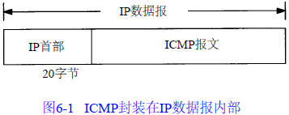
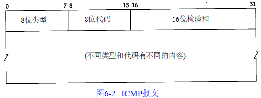
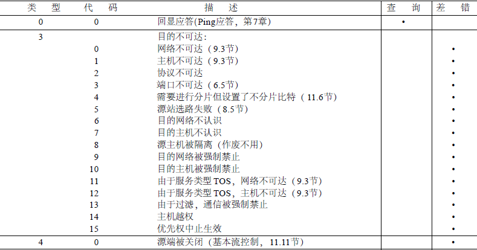
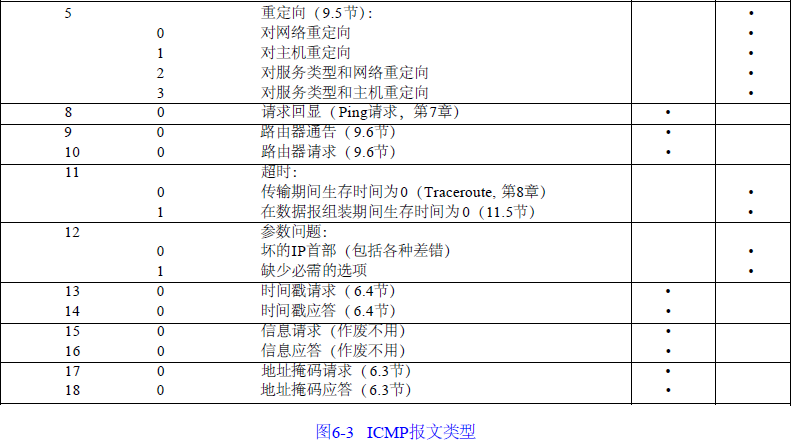

## ICMP
ICMP是（Internet Control Message Protocol）Internet控制报文协议。它是TCP/IP协议族的一个子协议，用于在IP主机、路由器之间传递控制消息。控制消息是指网络通不通、主机是否可达、路由是否可用等网络本身的消息。这些控制消息虽然并不传输用户数据，但是对于用户数据的传递起着重要的作用。

ICMP报文包含在IP数据报中，属于IP的一个用户，IP头部就在ICMP报文的前面，所以一个ICMP报文包括IP头部、ICMP头部和ICMP报文，IP头部的Protocol值为1就说明这是一个ICMP报文

### 报文格式简述

 - 所有报文的前4个字节都是一样的，剩下的其他字节则互不相同。

 - 类型字段可以有15个不同的值，以描述特定类型的ICMP报文。某些ICMP报文还使用代码字段的值来进一步描述不同的条件。

 - 检验和字段覆盖整个ICMP报文。使用的算法与IP首部检验和算法相同。ICMP的检验和是必需的。

对应的类型和代码如下图

### ICMP应用Ping
ping可以说是ICMP的最著名的应用，当我们某一个网站上不去的时候。通常会ping一下这个网站。

它利用ICMP协议包来侦测另一个主机是否可达。原理是用类型码为0的ICMP发请 求，受到请求的主机则用类型码为8的ICMP回应。ping程序来计算间隔时间，并计算有多少个包被送达。用户就可以判断网络大致的情况。

### ICMP的应用--Traceroute
Traceroute是用来侦测主机到目的主机之间所经路由情况的重要工具，也是最便利的工具。前面说到，尽管ping工具也可以进行侦测，但是，因为ip头的限制，**ping不能完全的记录下所经过的路由器**。所以Traceroute正好就填补了这个缺憾。

Traceroute的原理是非常非常的有意思，它受到目的主机的IP后，首先给目的主机发送一个TTL=1（还记得TTL是什么吗？）的UDP(后面就 知道UDP是什么了)数据包，而经过的第一个路由器收到这个数据包以后，就自动把TTL减1，而TTL变为0以后，路由器就把这个包给抛弃了，并同时产生 一个主机不可达的ICMP数据报给主机。主机收到这个数据报以后再发一个TTL=2的UDP数据报给目的主机，然后刺激第二个路由器给主机发ICMP数据 报。如此往复直到到达目的主机。这样，traceroute就拿到了所有的路由器ip。从而避开了ip头只能记录有限路由IP的问题。

有人要问，我怎么知道UDP到没到达目的主机呢？这就涉及一个技巧的问题，TCP和UDP协议有一个端口号定义，而普通的网络程序只监控少数的几个号码较 小的端口，比如说80,比如说23,等等。而traceroute发送的是端口号>30000(真变态)的UDP报，所以到达目的主机的时候，目的 主机只能发送一个端口不可达的ICMP数据报给主机。主机接到这个报告以后就知道，主机到了，所以，说Traceroute是一个骗子一点也不为过:)

#### windows下的tracert
Linux下，tracert是利用了udp来实现的，并不是说tracert基于UDP，而是每一次，host都向目标主机发送一个ttl逐渐递增的udp包，从而触发每一个节点主机都回送一个TTL exceed的ICMP包，从而记录下ip地址，知道路程。

然后windows下，并不是通过发送udp包，而是通过发送ICMP的ping包发向目标主机，ttl也是从1开始递增。
