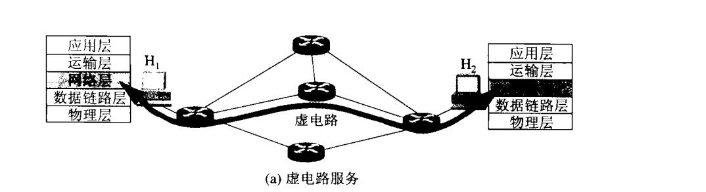
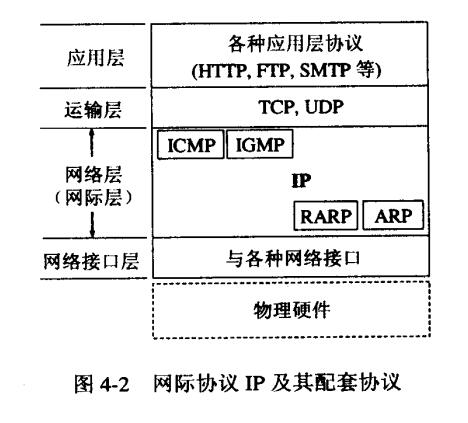
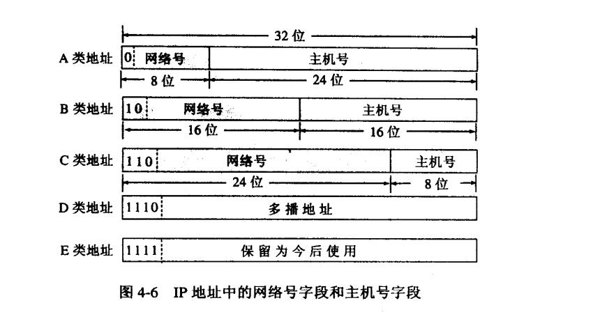
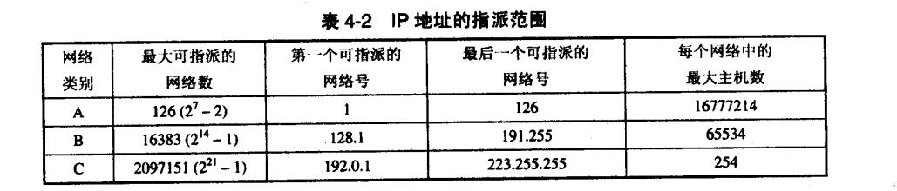
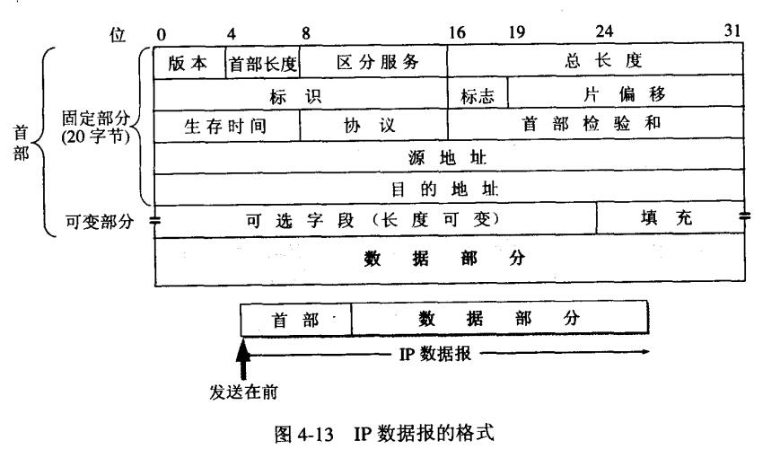
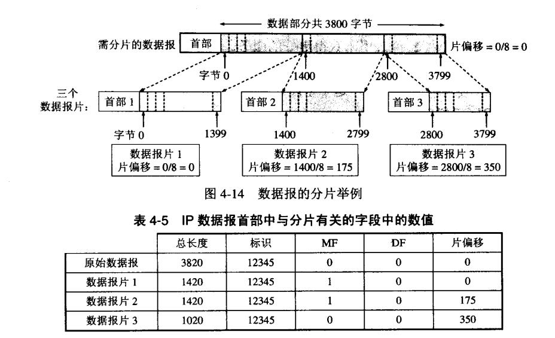
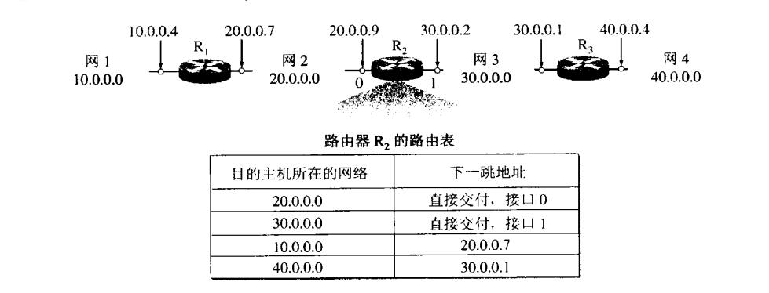
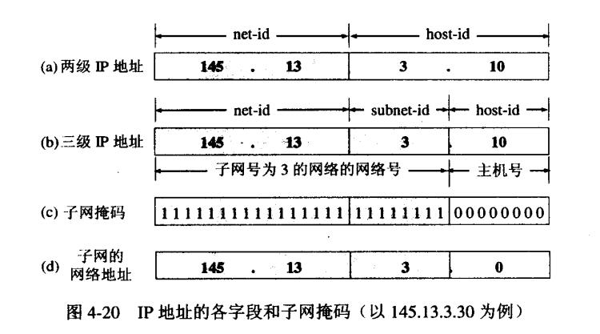

## 网络层
网络层**并没有**采用电信网络一样的虚连接模式，所谓的虚连接模式，就是先在电路中分配一条虚电路virtual circuit，然后数据都基于此电路传输

因特网**实际采用**的设计思路是：网络向上只提供**简单灵活的，无连接的，尽最大努力交互的数据报服务**。

所谓的尽力而为的服务，其实就是无服务的委婉说法。说明网络层不提供确保交付，有序交付，安全交付等机制

### IP协议
网络层的核心协议，与IP协议配套使用的还有如下4个协议

 - 地址解析协议ARP(address resolution protocol)
 - 逆地址解析协议RARP(reverse address resolution protocol)
 - 网际控制报文协议ICMP(Internet Control Message protocol)
 - 网际组管理协议IGMP(Internet Group Management Protocol)

如上图所示，ICMP和IGMP在上面因为他们是基于IP协议，RARP和ARP在IP下面是因为IP经常要使用他们。

### IP地址
ip地址中所周知分为网络号,主机号。

如图所示划分ip地址为5类。

A类，0-128, B类是前缀128-192，C类是192-224，D类是多播地址224-240.E类则是保留使用，位置在240往后。

A类网络中，有特殊的网络号，**全0表示本网络**，**127网络号为环回测试(本机进程之间通信)**。

特殊的主机号也有2个，全0和全1，**全0代表这是本网络，全1代表本网络上的全部主机**。

对于B类网络，128.0.0.0也是不予分配使用的。C类的192.0.0.0网络也是不指配使用。

路由器只根据**网络号**，来转发分组。

### IP数据报的格式

首部前一部分固定长度20字节，后面是可选字节。

1. 版本　占4位，指IP协议的版本。通信双方使用的IP协议版本必须一致。目前广泛使用的IP协议版本号为4（即IPv4）。关于IPv6，目前还处于草案阶段。

2. 首部长度　占4位，可表示的最大十进制数值是15。跟TCP报文一样，也是**以4字节为单位**，所以最大首部长度就达到15*4=60字节。当IP分组的首部长度不是4字节的整数倍时，必须利用最后的填充字段加以填充。因此数据部分永远在4字节的整数倍开始。首部长度限制为60字节的缺点是有时可能不够用。但这样做是希望用户尽量减少开销。最常用的首部长度就是20字节（即首部长度为0101），这时不使用任何选项。

3. 区分服务　占8位，用来获得更好的服务。这个字段在旧标准中叫做服务类型，但实际上**一直没有被使用过**。1998年IETF把这个字段改名为区分服务DS(Differentiated Services)。只有在使用区分服务时，这个字段才起作用。

4. 总长度指首部和数据之和的长度，单位为**1字节**。总长度字段为**16位**，因此数据报的最大长度为2^16-1=65535字节。

5. 标识(identification)占16位。IP软件在存储器中维持一个计数器，每产生一个数据报，计数器就加1，并将此值赋给标识字段。但这个“标识”并不是序号，因为IP是无连接服务，数据报不存在按序接收的问题。**当数据报由于长度超过网络的MTU而必须分片时，这个标识字段的值就被复制到所有的数据报的标识字段中**。相同的标识字段的值使分片后的各数据报片最后能正确地重装成为原来的数据报。

6. 标志(flag)　占3位，但目前只有2位有意义。
 - 标志字段中的最低位记为MF(More Fragment)。MF=1即表示后面“还有分片”的数据报。MF=0表示这已是若干数据报片中的最后一个。
 - 标志字段中间的一位记为DF(Don’t Fragment)，意思是“不能分片”。只有当DF=0时才允许分片。

7. 片偏移　占13位。片偏移指出：较长的分组在分片后，某片在**原分组中的相对位置**。也就是说，**相对用户数据字段的起点，该片从何处开始**。片偏移以**8个字节为偏移单位**。这就是说，除了最后一个分片，每个分片的长度一定是**8字节（64位）的整数倍**。

有耐心的话可以看上面的解释图，一个3800字节的data packet分片为不超过1400字节的分组，需要切成3块。

8. 生存时间　占8位，生存时间字段常用的的英文缩写是TTL(Time To Live)，表明是数据报在网络中的寿命。由发出数据报的源点设置这个字段。其目的是防止无法交付的数据报无限制地在因特网中兜圈子。TTL字段的功能实为“**跳数限制**”。路由器在转发数据报之前就把TTL值减1.若TTL值减少到零，就丢弃这个数据报，不再转发。**TTL的意义是指明数据报在网络中至多可经过多少个路由器**。显然，数据报在网络上经过的路由器的最大数值是255.**若把TTL的初始值设为1，就表示这个数据报只能在本局域网中传送**。

9. 协议　占8位，协议字段指出此数据报携带的数据是使用何种协议，以便使目的主机的IP层知道应将数据部分上交给哪个处理过程。

10. 首部检验和　占16位。这个字段只检验数据报的首部，但不包括数据部分。这是因为数据报每经过一个路由器，路由器都要重新计算一下首部检验和（一些字段，如生存时间、标志、片偏移等都可能发生变化）。不检验数据部分可减少计算的工作量。

11. 源地址　占32位。
12. 目的地址　占32位。

#### 头部可选部分
IP首部的可变部分就是一个可选字段。选项字段用来支持排错、测量以及安全等措施，内容很丰富。此字段的长度可变，从1个字节到40个字节不等，取决于所选择的项目。

实际上这些选项很少被使用。**新的IP版本IPv6就将IP数据报的首部长度做成固定的**。

### 分组转发
IP数据包到达路由器或者三层以上主机时，通过路由表查表匹配IP前缀的方式转发分组。

而为了减轻路由器负担，路由表中每一条记录最重要的就是记录两个信息：(**目的网络地址，下一跳**)

除此之外，路由器还可以采用默认路由减少条目，默认路由被记为0.0.0.0。

当IP数据报到达转发接口的时候，网络接口软件会负责把下一跳的路由器IP地址转换成MAC地址(**使用ARP**)，然后**再根据这个MAC地址才找到下一个路由器的-数据链路层相关**。

### 划分子网
IPv4，地址太少不够，且不够灵活，所以我们有了划分子网的需求。

子网划分就是把IP地址划分成了，{<网络号>,<子网号>,<主机号>},实际上就是在原来二级IP的基础上，借用了主机位来作为网络位。

为了让路由器正确识别IP地址并转发给正确的子网，就有了**子网掩码**。

因此路由器只要用子网掩码与IP地址进行AND运算，就能得到网络号。

子网掩码不会跟随数据包传输，是只在三层设备上设定用来进行路由查表操作的。如果不指定子网掩码，就会使用A-E5类的默认掩码。

### 无分类编址CIDR构造超网
很早开始我们便采用了CIDR的无分类编址来解决IP地址不足的问题。

CIDR(Classless Inter-domain routing),取消了ABC类地址和划分子网的概念，仅仅使用网络前缀和主机号，即现在我们看到的:192.168.100.1/24

子网掩码使用斜线后缀。

路由器现在都用CIDR来找到目的网络，这样相当于把地址聚合了，叫路由聚合(route aggregation)，也叫构成超网(supernetting)

使用路由聚合时候，只从匹配结果中选择最长前缀匹配。
