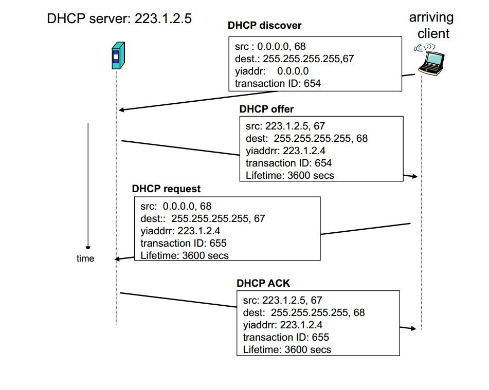

## dhcp
DHCP（Dynamic Host Configuration Protocol，动态主机配置协议）是一个局域网的网络协议，**使用UDP协议工作**

通常被应用在大型的局域网络环境中，主要作用是集中的管理、分配IP地址，使网络环境中的主机动态的获得IP地址、Gateway地址、DNS服务器地址等信息，并能够提升地址的使用率。

### 原理

DHCP的实现分为4步，分别是：

第一步：Client端在局域网内发起一个DHCP　Discover包，目的是想发现能够给它提供IP的DHCP Server。

第二步：可用的DHCP Server接收到Discover包之后，通过发送DHCP Offer包给予Client端应答，意在告诉Client端它可以提供IP地址。

第三步：Client端接收到Offer包之后，发送DHCP Request包请求分配IP。

第四步：DHCP Server发送ACK数据包，确认信息

上4步简称DORA

