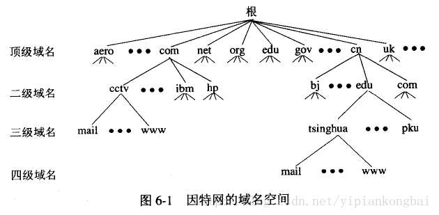
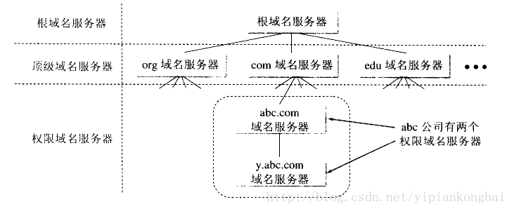

## dns协议

域名系统DNS(Domain Name System)是因特网使用的命名系统，用来把便于人们使用的机器名字转换成为IP地址。

**DNS协议运行在UDP协议之上，使用53号端口。**

### 因特网的域名结构
 从语法上讲，每一个域名都是有标号(label)序列组成，而各标号之间用点(小数点)隔开。

 如下例子所示：

 

 这是中央电视台用于手法电子邮件的计算机的域名，它由三个标号组成，其中标号com是顶级域名，标号cctv是二级域名，标号mail是三级域名。

DNS既不规定一个域名需要包含多少个下级域名，也不规定每一级域名代表什么意思。**各级域名由其上一级的域名管理机构管理**，而**最高的顶级域名则由ICANN进行管理**。

 

 ### dns服务器
 根据上面的域名空间划分也可以知道。

 DNS服务器也是按照层次安排的。每一个域名服务器只对域名体系中的一部分进行管辖。根据域名服务器所起的作用，可以把域名服务器划分为下面**四种不同的类型**。

 #### 根域名服务器

 最高层次的域名服务器，也是最重要的域名服务器。所有的根域名服务器都知道**所有的顶级域名服务器的域名和IP地址**。不管是哪一个**本地域名服务器**，若要对因特网上任何一个域名进行解析，只要自己无法解析，就**首先求助根域名服务器**。需要注意的是，在很多情况下，根域名服务器并不直接把待查询的域名直接解析出IP地址，而是**告诉本地域名服务器下一步应当找哪一个顶级域名服务器进行查询**。

 #### 顶级域名服务器
 负责管理在该顶级域名服务器注册的二级域名。

 #### 权限域名服务器
 负责一个“区”的域名服务器。

 #### 本地域名服务器
 本地服务器不属于下图的域名服务器的层次结构，但是它对域名系统非常重要。当一个主机**发出DNS查询请求时，这个查询请求报文就发送给本地域名服务器**。

  

### dns记录
dns服务器存储了资源记录，用来做域名和ip的映射。

这些映射记录的标准格式是一个4元组。

(Name,Value,Type,TTL)

首先要注意TTL指的是生存时间，它决定了**资源记录应当从缓存中删除的时间**。

资源记录根据Type的不同分为4种(主要4种，其实不止四种)，根据type不同，name和value也有不同的含义。

#### A记录
Type=A的就是A记录。A （Address）记录是用来指定**主机名（或域名）对应的IP地址记录**。简单来说就是简单的域名和IP的绑定,此时name是域名，value是对应ip。

#### NS记录
NS（Name Server）记录是域名服务器记录，用来指定该域名由哪个DNS服务器来进行解析。

注册域名时，总有默认的DNS服务器，每个注册的域名都是由一个DNS域名服务器来进行解析的，DNS服务器NS记录地址一般以以下的形式出现:ns1.domain.com、ns2.domain.com等。 **简单的说，NS记录是指定由哪个DNS服务器解析你的域名**。

此时Name是你自己的域名，Value是需要指定来解析的域名服务器域名。

#### MX记录
MX（Mail Exchanger）记录是邮件交换记录。它指向一个邮件服务器，用于电子邮件系统发邮件时根据收信人的地址后缀来定位邮件服务器。例如，当Internet上的某用户要发一封信给 user@mydomain.com 时，该用户的邮件系统通过DNS查找mydomain.com这个域名的MX记录，如果MX记录存在， 用户计算机就将邮件发送到MX记录所指定的邮件服务器上。

此时Name是你自己的域名，Value是需要发送到的邮件服务器。

####  CNAME记录
通常称**别名解析**。可以将注册的不同域名都转到一个域名记录上，由这个域名记录统一解析管理，与A记录不同的是，**CNAME别名记录设置的可以是一个域名的描述而不一定是IP地址**

此时Name是你自己的域名，Value是别名。

### 域名的解析过程

#### 递归查询
主机向本地域名服务器的查询**一般都是采用递归查询**。所谓递归查询就是：如果主机所询问的**本地域名服务器**不知道被查询的域名的IP地址，那么本地域名服务器就以**DNS客户的身份**，向**其它根域名服务器**继续发出查询请求报文(即替主机继续查询)，而**不是让主机自己进行下一步查询**。因此，递归查询返回的**查询结果或者是所要查询的IP地址，或者是报错**，表示无法查询到所需的IP地址。

#### 迭代查询
**本地域名服务器向根域名服务器的查询** 是迭代查询。

迭代查询的特点：当根域名服务器收到本地域名服务器发出的迭代查询请求报文时，**要么给出所要查询的IP地址，要么告诉本地服务器：“你下一步应当向哪一个域名服务器进行查询”**。然后让本地服务器进行后续的查询。根域名服务器通常是把自己知道的顶级域名服务器的IP地址告诉本地域名服务器，让本地域名服务器再向顶级域名服务器查询。顶级域名服务器在收到本地域名服务器的查询请求后，要么给出所要查询的IP地址，要么告诉本地服务器下一步应当向哪一个权限域名服务器进行查询。最后，知道了所要解析的IP地址或报错，然后把这个结果返回给发起查询的主机。

**简而言之就是客户查询本地dns用递归，本地dns服务器向根域名服务器查询用迭代**

### DNS的负载均衡方案Round-robin
Round Robin（中文翻译为轮询调度）是一种**以轮询的方式--即不分权重按顺序依次分配服务器**将一个域名解析到多个IP地址的调度不同服务器的计算方法。

循环DNS（Round-robin DNS）技术是负载平衡(**load balancing**)最常用的方法之一。最早的负载均衡技术是通过DNS服务中的随机名字解析来实现的。在DNS服务器中，**可以为多个不同的地址ip address配置同一个名字domain name**，这个数据被发送给其他名字服务器，而最终查询这个名字的客户机将在解析这个名字时随机使用其中一个地址。

因此，**对于同一个名字，不同的客户机会得到不同的地址，因此不同的客户访问的也就是不同地址的Web服务器，从而达到负载均衡的目的**。

一般dns服务器返回的列表，client一般都会使用第一个ip地址，有些机器会使用subnet判断出最近的ip地址来使用，有些则会随机。
