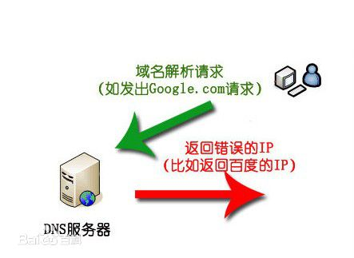

## DNS污染
DNS污染，又称为**域名服务器缓存污染DNS cache pollution**或者域名**服务器快照侵害DNS cache poisoning**。

一般来说，网站在互联网上一般都有可信赖的域名服务器，但为减免网络上的交通，一般的域名都会把外间的域名服务器数据暂存起来，待下次有其他机器要求解析域名时，可以立即提供服务。一旦有相关网域的局域域名服务器的缓存受到污染，就会把网域内的电脑导引往错误的服务器或服务器的网址。

某些网络运营商为了某些目的，对DNS进行了某些操作，导致使用ISP的正常上网设置无法通过域名取得正确的IP地址。
某些国家或地区出于某些目的为了防止某网站被访问，而且其又掌握部分国际DNS根目录服务器或镜像，也会利用此方法进行屏蔽。
常用的手段有：DNS劫持和DNS污染。

### 流程原理
对于运营商，网络管理员等人，尤其是在办公室等地方，管理员希望网络使用者无法浏览某些与工作无关的网站，通常采用**DNS抢答机制**。机器查询DNS时，采用的是UDP协议进行通讯，队列的每个查询有一个id进行标识。

我们假设A为用户端，B为DNS服务器，C为A到B链路的一个节点的网络设备（路由器，交换机，网关等等）。然后我们来模拟一次被污染的DNS请求过程。
A向B构建UDP连接，然后，A向B发送查询请求，查询请求内容通常是：“A baidu.com”，这一个数据包经过节点设备C继续前往DNS服务器B；然而在这个过程中，C通过对数据包进行**特征分析**（远程通讯端口为DNS服务器端口，激发内容关键字检查，检查特定的域名如上述的“baidu.com",以及查询的记录类型"A记录"），从而立刻返回一个错误的解析结果（如返回了"A 123.123.123.123"），众所周知，作为链路上的一个节点，**C机器的这个结果必定会先于真正的域名服务器的返回结果到达用户机器A**，而目前我们的DNS解析机制有一个重要的原则，就是**只认第一**，因此C节点所返回的查询结果就被A机器当作了最终返回结果，用于构建链接。
