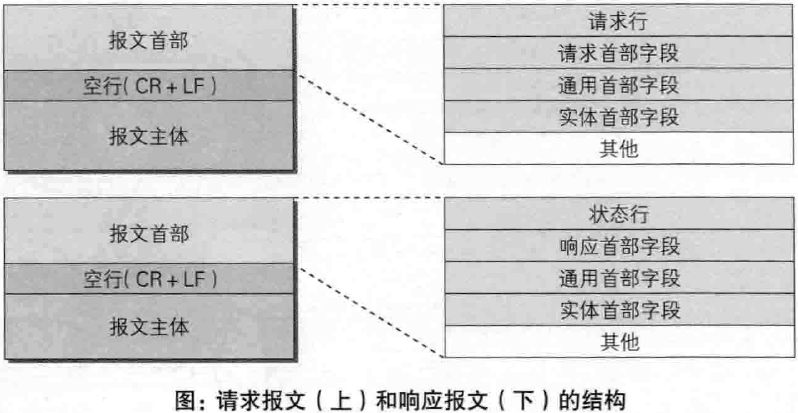
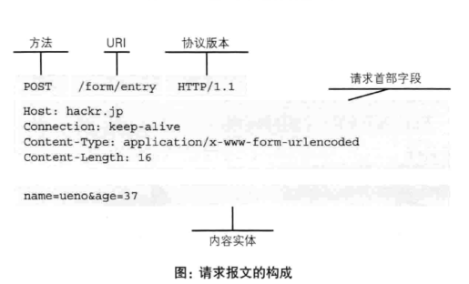
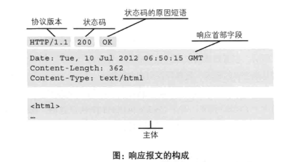
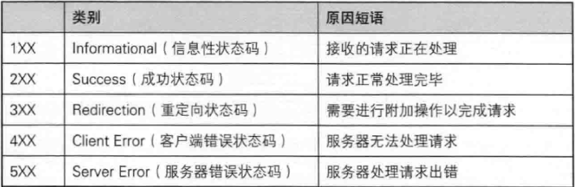

## http报文
用于HTTP协议交互的信息被称为HTTP报文，请求端的HTTP报文是请求报文，响应端的HTTP报文是响应报文。
HTTP报文本身是由多行（用CR+LF作换行符）数据构成的字符串文本。

CR是回车符，LF是换行符(也就是\n)




### 请求报文

请求报文是由请求方法、请求URI、协议版本、可选的请求首部字段和内容实体构成的。



### 响应报文
响应报文基本上是由协议版本、状态码、用以解释状态码的原因短语、可选的响应首部字段以及实体主体构成。




### HTTP请求方法
根据HTTP标准，HTTP请求可以使用多种请求方法。
HTTP1.0定义了**三种**请求方法： GET, POST 和 HEAD方法。
**HTTP1.1新增了五种请求方法**：OPTIONS, PUT, DELETE, TRACE 和 CONNECT 方法。

 - GET     请求指定的页面信息，并返回实体主体。
 - HEAD     类似于get请求，只不过返回的响应中没有具体的内容，用于获取报头
 - POST     向指定资源提交数据进行处理请求（例如提交表单或者上传文件）。数据被包含在请求体中。POST请求可能会导致新的资源的建立和/或已有资源的修改。
 - PUT     从客户端向服务器传送的数据取代指定的文档的内容。
 - DELETE      请求服务器删除指定的页面。
 - CONNECT     HTTP/1.1协议中预留给能够将连接改为管道方式的代理服务器。
 - OPTIONS     允许客户端查看服务器的性能。
 - TRACE     回显服务器收到的请求，主要用于测试或诊断。


### HTTP首部字段
HTTP首部字段根据实际用途被分为**通用首部字段**、**请求首部字段**、**响应首部字段** 和 **实体首部字段**。

除此之外，根据功能，首部字段还可以分为End-to-end 首部和Hop-by-hop 首部

 - **端到端首部（End-to-end Header）**分在此类别中的首部会转发给请求 / 响应对应的最终接收目标，且必须保存在由缓存生成的响应中，另外规 定它必须被转发。
 - **逐跳首部（Hop-by-hop Header）**分在此类别中的首部只对单次转发有效，会因通过缓存或代理而不再转发。HTTP/1.1 和之后版本中，如果要使用 hop-by-hop 首部，需提供 Connection 首部字段。

#### 逐跳首部

下面列举了 HTTP/1.1 中的逐跳首部字段。除这 8 个首部字段之外，其他所有字段都属于端到端首部。
 - Connection
 - Keep-Alive
 - Proxy-Authenticate
 - Proxy-Authorization
 - Trailer
 - TE
 - Transfer-Encoding
 - Upgrade

#### 通用首部字段
请求报文和响应报文两方都会使用的首部。

 - Cache-Control 控制缓存的行为
 - Connection 逐跳首部、连接的管理
 - Date 创建报文的日期时间
 - Pragma 报文指令
 - Trailer 报文末端的首部一览
 - **Transfer-Encoding** 指定报文主体的传输编码方式
 - Upgrade 升级为其他协议
 - Via 代理服务器的相关信息
 - Warning 错误通知

##### 有关TransferEncoding

对于非持久连接，浏览器可以通过连接是否关闭来界定请求或响应实体的边界；而对于持久连接，这种方法显然不奏效。

要解决上面这个问题，最容易想到的办法就是计算实体长度，并通过头部告诉对方。这就要用到 Content-Length 了。由于 Content-Length 字段必须真实反映实体长度，但实际应用中，**有些时候实体长度并没那么好获得**，例如实体来自于网络文件，或者由动态语言生成。这时候要想准确获取长度，**只能开一个足够大的 buffer，等内容全部生成好再计算。但这样做一方面需要更大的内存开销，另一方面也会让客户端等更久**。

Transfer-Encoding 正是用来解决上面这个问题的。历史上 Transfer-Encoding 可以有多种取值，为此还引入了一个名为 TE 的头部用来协商采用何种传输编码。**但是最新的 HTTP 规范里，只定义了一种传输编码：分块编码（chunked）**。

在头部加入 Transfer-Encoding: chunked 之后，就代表这个报文采用了分块编码。这时，报文中的实体需要改为用一系列分块来传输。每个分块包含十六进制的长度值和数据，**长度值独占一行，长度不包括它结尾的 CRLF（\\r\\n），也不包括分块数据结尾的 CRLF**。**最后一个分块长度值必须为 0**，对应的分块数据没有内容，表示实体结束。

比如服务端中发送数据时：

``` js
sock.write('HTTP/1.1 200 OK\r\n');
sock.write('Transfer-Encoding: chunked\r\n');
sock.write('\r\n');

sock.write('b\r\n');
sock.write('01234567890\r\n');

sock.write('5\r\n');
sock.write('12345\r\n');

sock.write('0\r\n');
sock.write('\r\n');
```

上面代码是发送一个包的过程，先发送了一个b，也就是十六进制11个字节的chunk，然后发了一个5字节的chunk，最后再发一个0长度包。

**这样就可以一边产生数据，一边发送chunk到客户端，而不需要一口气产生数据算好长度再发送。**

#### 请求首部字段（Request Header Fields）

从客户端向服务器发送请求报文时使用的首部。补充了请求的附加内容、客户端信息、响应内容相关优先级等信息。

 - Accept 用户代理能够处理的媒体类型以及媒体类型的优先级
 - Accept-Charset 用户代理支持的字符集以及字符集的优先级
 - Accept-Encoding 用户代理支持的内容编码及内容编码的优先级
 - Accept-Language 用户代理能够处理的自然语言集,以及自然语言集的优先级
 - Authorization 用户代理的认证信息(证书值)
 - Expect 告知服务器,期望出现的某种特定行为
 - From 告知服务器使用用户代理的用户的电子邮件地址
 - **Host 告知服务器,请求的资源所处的互联网主机名和端口号**
 - If-Match 比较实体标记（ETag）
 - if-Modified-Since 比较资源的更新时间
 - if-None-Match 比较实体标记（与if-Match相反）
 - if-Range 资源未更新时发送实体Byte的范围请求
 - if-Unmodified-Since 比较资源的更新时间（与if-Modified-Since相反）
 - Max-Forwards 最大传输逐跳数
 - Proxy-Authorization 代理服务器要求客户端的认证信息
 - Range 实体的字节范围请求
 - Referer 对请求中URI的原始获取方法
TE 传输编码的优先级
 - User-Agent HTTP客户端程序的信息

 **Host首部字段在HTTP/1.1规范内是唯一一个必须被包含在请求内的首部字段**，和以单台服务器分配多个域名的虚拟主机的工作机制密切关联。
 若服务器未设定主机名,那直接发送一个空值即可Host:

#### 响应首部字段（Response Header Fields）
从服务器向客户端返回响应报文时使用的首部。补充了响应的附加内容，也会要求客户端附加额外的内容信息。


 - Accept-Ranges 服务器是否能处理范围请求，bytes表示能，none表示不能
 - Age 响应已经产生了多长时间。**HTTP/1.1规定缓存服务器在创建响应时必须包含Age首部**
 - ETag 资源的实体标识
 - Location 客户端应重定向到指定URI，基本配合3XX
响应出现
 - Proxy-Authenticate 代理服务器对客户端的认证信息
 - Reter-After 对再次发起请求的时机要求
 - Server HTTP服务器的安装信息
 - Vary 代理服务器缓存的管理信息
 - WWW-Authenticate 服务器对客户端的认证信息


#### 实体首部字段（Entity Header Fields）
针对实体部分使用的首部。 补充了资源内容更新时间等与实体有关的信息。

 - Allow 资源可支持的HTTP方法
 - Content-Encoding 实体主体的适用的编码方式
 - Content-Language 实体主体的自然语言
 - Content-Length 实体主体的大小（单位：字节）
 - Content-Location 替代对应资源的URI
 - Content-MD5 实体主体的报文摘要
 - Content-Range 实体主体的位置范围
 - Content-Type 实体主体的媒体类型
 - Expires 实体主体过期的日期时间
 - Last-Modified 资源的最后修改日期时间


##### cookie相关

 - **Set-Cookie 当服务器准备开始管理客户端的状态时,会事先告知各种信息。**

 -  Cookie 首部字段Cookie会告知服务器,当客户端想获得HTTP状态管理支持时,就会在请求中包含从服务器接收到的Cookie.接收到多个Cookie时,同样可以以多个Cookie形式发送

set-Cookie例子

```
Set-Cookie:status=enable;
expires=Tue, 05 Jul 2014 08:22:31 GMT; => path=/;domain=.hackr.jp;
```

   - NAME=VALUE赋予Cookie的名称和其值（必须项）
   - expires=DATECookie的有效期，若不明确指定则默认为浏览器关闭前为止
   - path=PATH将服务器上的文件目录作为cookie的适用对象（若不指定则默认为文档所在的文件目录）
   - domain=域名作为Cookie适用对象的域名,若不指定则默认为创建Cookie服务器的域名。
   - secure仅在HTTPS安全通信时,才可以发送Cookie.
   - **HttpOnly加以限制，使JavaScript脚本无法获取Cookie。**


#### 非HTTP/1.1首部字段


### HTTP响应状态码

状态码的职责是当客户端向服务器端发送请求时，描述返回的请求结果。借助状态码，用户可以知道服务器端是正常处理了请求，还是出现了错误。

状态码如200 OK，以3位数字和原因短语组成。数字中的第一位指定了响应类别，后两位无分类。响应类别有以下5种。



#### 2XX 成功 （2XX的响应结果表明请求被正常处理了）

##### 200 OK

表示从客户端发来的请求在服务端被正常处理了。
在响应报文内，随状态码一起返回的信息会因方法的不同而发生改变。比如，使用GET方法时，对应请求资源的实体会作为响应返回；而使用HEAD方法时，对应请求资源的实体首部不随报文主体作为响应返回（即在响应中只返回首部，不会返回实体的主体部分）。

##### 204 No Content

该状态码代表服务器接收的请求已成功处理，但在返回的响应报文中不含实体的主体部分。另外，也不允许返回任何实体的主体。
比如，当浏览器发出请求处理后，返回204响应，那么浏览器显示的页面不更新。
一般在只需要从客户端往服务器发送消息，而对客户端不需要发送新消息内容的情况下使用。

##### 206 Partial Content

该状态码表示客户端进行了范围请求，而服务器成功执行了这部分的GET请求。
响应报文中包含由Content-Range指定范围的实体内容。

#### 3XX 重定向 （3XX响应结果表明浏览器需要执行某些特殊的处理以正确处理请求）

##### 301 Moved Permanently 永久性重定向
该状态码表示请求的资源已被分配了新的URI，以后应使用资源现在所指的URI。也就是说，如果已经把资源对应的URI保存为书签了，这时应该按Location首部字段提示的URI重新保存。

##### 302 Found 临时性重定向
该状态码表示请求的资源已被分配了新的URI，希望用户（本次）能使用新的URI访问。和301状态码相似，但302状态码代表的资源不是被永久移动，只是临时性质的。比如，用户把URI保存成书签，不会像301状态码那样去更新书签，而是仍旧保留返回302状态码的页面对应的URI。

##### 303 See Other
该状态码表示由于对应的资源存在着另一个URI，应使用GET方法定向获取请求的资源。
303状态码和302状态码有着相同的功能，**但303状态码明确表示客户端应该采用GET方法获取资源**，这点与302状态码有所区别。
比如，当使用POST方法访问CGI程序，其执行后的处理结果是希望客户端能以GET方法重定向到另一个URI上去时，返回303状态码。虽然302Found状态码也可以实现相同的功能，但这里使用303状态码是最理想的。

##### 304 Not Modified
该状态码表示客户端发送附带条件的请求时，服务端允许请求访问资源，但未满足条件的情况。
**304状态码返回时，不包含任何响应的主体部分**。

**304虽然被划分在3XX类别中，但是和重定向没有关系**。

##### 307 Temporary Redirect
临时重定向，该状态码与302Found有着相同的含义。尽管302标准禁止POST变换成GET，但实际使用时大家并不遵守。
307会遵守浏览器标准，不会从POST变成GET。但是，对于处理响应时的行为，每种浏览器有可能出现不同的情况。
PS：当301、302、303响应状态码返回时，几乎所有的浏览器都会把POST改成GET，并删除请求报文内的主体，之后请求会自动再次发送。
301、302标准是禁止将POST方法改变成GET方法的，但实际中使用时大家都会这么做。

#### 4XX 客户端错误 （4XX的响应结果表明客户端是发生错误的原因所在）

##### 400 Bad Request
该状态码表示请求报文中存在语法错误。当错误发生时，需修改请求的内容后再次发送请求。另外，浏览器会像200OK一样对待该状态码。
##### 401 Unauthorized
该状态码表示发送的请求需要有通过HTTP认证的认证信息。另外若之前已进行过1次请求，则表示用户认证失败。
返回含有401的响应必须包含一个适用于被请求资源的WWW-Authenticate首部用以质询用户信息。当浏览器初次接收到401响应，会弹出认证用的对话窗口。
##### 403 Forbidden
该状态码表示对请求资源的访问被服务器拒绝了。
未获得文件系统的访问权限，访问权限出现某些问题等情况都会返回403响应。
##### 404 Not Found
该状态码表明服务器上无法找到请求的资源。除此之外，也可以在服务器端拒绝请求且不想说明理由时使用。

#### 5XX 服务器错误 （5XX的响应结果表明服务器本身发生错误）

##### 500 Internel Server Error
该状态码表明服务器端在执行请求时发生了错误，也可能是Web应用存在的bug或某些临时的故障。
##### 503 Service Unavailable
该状态码表明服务器暂时处于超负载或正在进行停机维护，现在无法处理请求。
如果事先得知解除以上状况需要的时间，最好写入Retry-After首部字段再返回给客户端。
