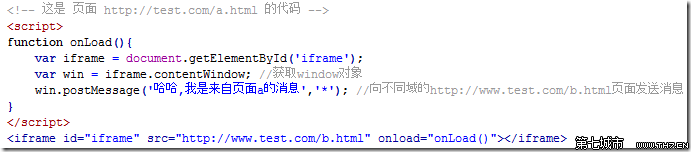
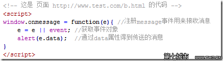

## iframe内联框架
iframe 元素会创建包含另外一个文档的内联框架（即行内框架）。

1996年，Internet Explorer 将iframe元素加入到了 HTML 中，并在IE 4.0中实现了对其支持，在IE5.5中，实现了通过设置allowTransparency属性来设置透明的 iframe 功能。

**zwlj：其实就是在页面里，相当于又嵌入了一个子窗口(子页面)。这个页面可以展示别的其他内容，并且父框架可能可以和子框架(子页面)实现dom的互相操作。**


在 HTML4.0 版本之后，iframe 以及“框架集”技术都被不建议使用，这是因为 iframe 对浏览器加载页面具有很大的干扰性，搜索引擎的蜘蛛不会识别在 iframe 中被调用的图片、文本、url等内容的，因为该内容不属于该页面，只是访问的时候被临时的调用

**但是目前的 HTML5 中 iframe 又被重新启用**。这是因为它对以下的使用环境，还具有很大的**优势**：

 - 引入第三方的内容
 - 用于需要保存历史记录或操作步骤以及焦点的独立子窗口。
 - 用于解决跨域问题。

### iframe一些基本属性

比较常用的，src属性规定载入页面的 URL。

name属性定义框架窗口的名称。a,shape,form等标签的target属性，可以指定内容在该框架窗口中打开。　

html5以后，**有一个sandbox属性要注意**。该属性是 HTML5 新增属性。启用一系列对 \<iframe\> 中内容的额外限制。

 - allow-forms： 允许iframe中的表单提交
 - allow-same-origin：开启同源策略，这里的所开启的同源策略相当于浏览器同源策略的子集。
 - allow-scripts：允许iframe中的脚本运行
 - allow-top-navigation ： 嵌入的页面的上下文可以导航（加载）内容到顶级的浏览上下文环境（browsing context）。如果未使用该关键字，这个操作将不可用。

### 使用
创建iframe，用js

``` javascript
var ifr = document.createElement('iframe');
```

或者用IE8特殊插入

``` javascript
var ifr = document.createElement('<iframe id="iframe src="" ></iframe>')
```

同源获取iframe的内容，标准写法是通过contentWindow属性，获取iframe内部的窗口(window)对象。

``` javascript
var ifr = document.getElementById('iframe');
ifr.contentWindow // 即iframe所载入页面的window对象。
```

同样 iframe 也会像 \<frame\> 元素一样，加入 window.frames 伪数组中

``` javascript
window.frames['iframe'] // 通过frames伪数可以直接获取iframe所载入页面的window对象。
```

注：iframe 是 id名称。

子框架中一样可以获取上层的window对象

``` javascript
window.parent // 获取上层页面的window对象。
window.top // 获取顶层页面的window对象。
```

### iframe解决跨域
在跨域问题的笔记里有提到。

浏览器都有一个同源策略，其限制之一就是第一种方法中我们说的不能通过ajax的方法去请求不同源中的文档。 它的第二个限制是浏览器中**不同域的框架之间是不能进行js的交互操作的**。

有一点需要说明，不同的框架之间（父子或同辈），是能够获取到彼此的window对象的，但蛋疼的是你却不能使用获取到的window对象的属性和方法(html5中的postMessage方法是一个例外，还有些浏览器比如ie6也可以使用top、parent等少数几个属性)。**总之，你可以当做是只能获取到一个几乎无用的window对象**

#### windows.domain解决跨域

这时候我们可以用document.domain来解决这个问题。

比方说，我们只要把 http://www.example.com/a.html 和  http://example.com/b.html(a网页里的iframe src) 这两个页面的document.domain都设成相同的域名就可以了。

但是**document.domain的设置是有限制的**，我们只能把document.domain设置成**自身或更高一级的父域，且主域必须相同**。

例如：a.b.example.com 中某个文档的document.domain 可以设成a.b.example.com、b.example.com 、example.com中的任意一个，但是不可以设成 c.a.b.example.com,因为这是当前域的子域，也不可以设成baidu.com,因为主域已经不相同了。

不过如果你想在 http://www.example.com/a.html 页面中通过ajax直接请求 http://example.com/b.html 页面，即使你设置了相同的document.domain也还是不行的.也就是ajax无论如何不允许你这样跨域

所以修改document.domain的方法只适用于不同子域的框架间的交互(zwlj：也就是你可以用js dom操作获取子窗口里的各种属性)。

如果你想通过ajax的方法去与**不同子域的页面**交互，除了使用jsonp的方法外，还可以用一个**隐藏的iframe来做一个代理**。原理就是让这个iframe**载入一个与你想要通过ajax获取数据的目标页面处在相同的域的页面**，所以这个iframe中的页面是可以正常使用ajax去获取你要的数据的，然后就是通过我们刚刚讲得修改document.domain的方法，让我们能通过js完全控制这个iframe，这样我们就可以让iframe去发送ajax请求，然后收到的数据我们也可以获得了。

zwlj:简而言之就是开一个iframe去帮你先把想加载的内容用ajax加载好，这样就可以用修改domain，然后js访问窗口属性的方式访问内容了，回避了ajax。**这种方法依旧是只适用于父域名和子域名**

#### window.name解决跨域
window对象有个name属性，该属性有个特征：即在一个窗口(window)的生命周期内,窗口载入的所有的页面都是共享一个window.name的，每个页面对window.name都有读写的权限，window.name是持久存在一个窗口载入过的所有页面中的，并不会因新页面的载入而进行重置。

我们可以在a页面中设置一个window.name的值，子框架中的b也可以访问到这个值，无论是否同域。

注意，window.name的值只能是字符串的形式，这个字符串的大小最大能允许**2M左右**甚至更大的一个容量，具体取决于不同的浏览器，但一般是够用了。

#### html5中最新的postMessage方法实现跨域
window.postMessage(message,targetOrigin)  方法是html5新引进的特性，可以使用它来向其它的window对象发送消息，无论这个window对象是属于同源或不同源，目前IE8+、FireFox、Chrome、Opera等浏览器都已经支持window.postMessage方法。

调用postMessage方法的window对象是指要接收消息的那一个window对象，该方法的第一个参数message为要发送的消息，类型只能为字符串；第二个参数targetOrigin用来限定接收消息的那个window对象所在的域，如果不想限定域，可以使用通配符 *  。

需要接收消息的window对象，可是通过监听自身的message事件来获取传过来的消息，消息内容储存在该事件对象的data属性中。

下面是js具体用法




