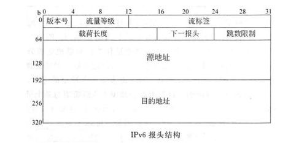
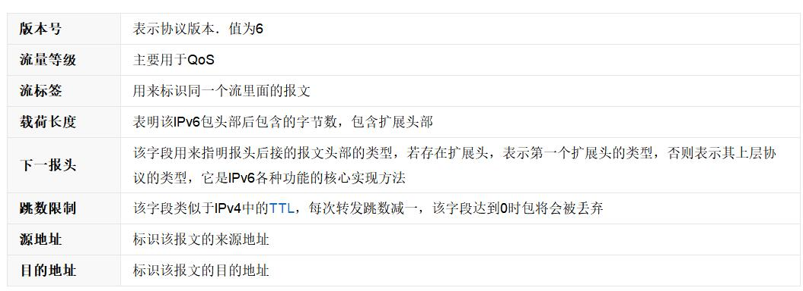
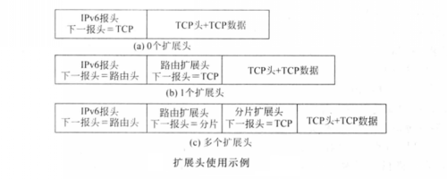

## ipv6
IPv4地址是类似 A.B.C.D 的格式，它是32位，用\".\"分成四段，用10进制表示；而IPv6地址类似X:X:X:X:X:X:X:X的格式，它是**128位**(16字节)的，用\":\"分 成8段，用16进制表示；可见，IPv6地址空间相对于IPv4地址有了极大的扩充。

例如： 2001:0000:1F1F:0000:0000:0100:11A0:A`   DDF

在某些情况下，一个IPv6地址中问可能包含很长的一段0，可以把连续的一段0压缩为“::”。但为保证地址解析的唯一性，地址中”::”只能出现一次，

例如：FF01:0:0:0:0:0:0:1101 → FF01::1101

### 报文内容
IPv6报文的整体结构分为IPv6报头、扩展报头和上层协议数据3部分。IPv6报头是必选报文头部，长度固定为40Byte，包含该报文的基本信息；扩展报头是可选报头，可能存在0个、1个或多个，**IPv6协议通过扩展报头实现各种丰富的功能**；上层协议数据是该IPv6报文携带的上层数据，可能是ICMPv6报文、TCP报文、UDP报文或其他可能报文。

扩展头部：IPv6报文中不再有“选项”字段，而是**通过“下一报头”字段配合IPv6扩展报头来实现选项的功能**。使用扩展头时，将在IPv6报文下一报头字段表明首个扩展报头的类型，再根据该类型对扩展报头进行读取与处理。每个扩展报头同样包含下一报头字段，若接下来有其他扩展报头，即在该字段中继续标明接下来的扩展报头的类型，从而达到添加连续多个扩展报头的目的。在最后一个扩展报头的下一报头字段中，则标明该报文上层协议的类型，用以读取上层协议数据。

### 地址类型
IPv6协议主要定义了三种地址类型：单播地址（Unicast Address）、组播地址（Multicast Address）和任播地址（Anycast Address）。与原来在IPv4地址相比，新增了“任播地址”类型，取消了原来IPv4地址中的广播地址，因为在IPv6中的广播功能是通过组播来完成的。

 - **单播地址Unicast Address**：用来唯一标识一个接口，类似于IPv4中的单播地址。发送到单播地址的数据报文将被传送给此地址所标识的一个接口。

 - **组播地址Multicast Address**：用来标识一组接口（通常这组接口属于不同的节点），类似于IPv4中的组播地址。发送到组播地址的数据报文被传送给此地址所标识的所有接口。

 - **任播地址Anycast Address**：用来标识一组接口（通常这组接口属于不同的节点）。发送到任播地址的数据报文被传送给此地址所标识的一组接口中距离源节点最近（根据使用的路由协议进行度量）的一个接口。

### ipv6对比v4的优点

1. IPv6具有更大的地址空间。

2. IPv6使用**更小的路由表**。IPv6的地址分配一开始就遵循聚类（Aggregation）的原则，这使得路由器能在路由表中用一条记录（Entry）表示一片子网，大大减小了路由器中路由表的长度，提高了路由器转发数据包的速度。

3. IPv6增加了增强的组播（Multicast）支持以及对流的控制（Flow Control），这使得网络上的多媒体应用有了长足发展的机会，为服务质量（QoS，Quality of Service）控制提供了良好的网络平台。**也就是QoS支持好**

4. IPv6加入了对自动配置（Auto Configuration）的支持。这是对DHCP协议的改进和扩展，使得网络（尤其是局域网）的管理更加方便和快捷。

5. IPv6具有更高的安全性。在使用IPv6网络中用户可以对网络层的数据进行加密并对IP报文进行校验，在IPV6中的加密与鉴别选项提供了分组的保密性与完整性。极大的增强了网络的安全性。

6. 允许扩充。如果新的技术或应用需要时，IPV6允许协议进行扩充(zwlj:应该是用启动新的报头来扩充)。

7. 更好的头部格式。IPV6使用新的头部格式，其选项与基本头部分开，如果需要，可将选项插入到基本头部与上层数据之间。这就简化和加速了路由选择过程，因为大多数的选项不需要由路由选择。zwlj：也是扩展头的使用

8. 新的选项。IPV6有一些新的选项来实现附加的功能
