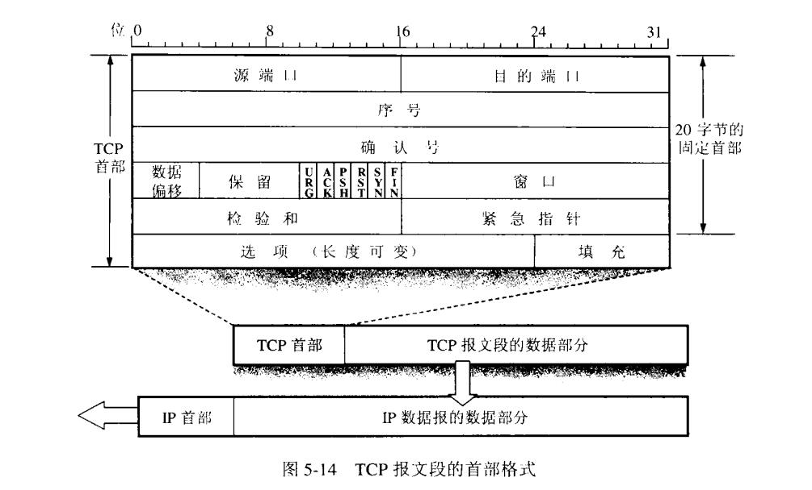
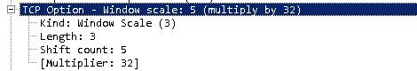

### TCP报文格式

TCP报文格式如下图所示。

前面4个字节是源端口，目的端口不用说了。

#### 序号
占4字节，TCP是面向字节流的，这里记录的是本次报文发送的**第一个字节的序号**。

#### 确认号
占4字节，**期望收到的对方的下一个报文的第一个字节序号**。

#### 数据偏移
占4位，表明数据部分距离起始处有多远，实际上**就是指出这个分组TCP header的实际大小**

这里注意，是以4个字节为单位的。比如数据偏移是1111(十进制15)的话，15*4=60字节。可得头部为60字节。**同时我们也知道了TCP头部最大为60字节，除去常规的20字节，即选项(变长头部)长度最大为40字节。**

#### 保留
给以后用的，全置0.

#### 紧急URG
用来插队，即让这个分组可以在缓存中被优先读取。

跟紧急指针配合使用

#### ACK
ACK为1时，确认号才有效。

TCP规定建立连接后所有分组的ACK都要置1.

#### PSH
push，收到这个字段以后，将会“尽快”创建成一个报文段发出。对方也会“尽快”创建成一个报文段交付给进程。

解决的问题是，**不需要等缓存满了再向上交付**

#### RST
要求释放连接并重新再握手创建连接。

#### SYN
同步位，用来同步的时候用。

#### FIN
要求释放连接

#### 窗口字段
这里是告诉对方，自己的**接受窗口**大小，切勿弄错。

#### 校验和
顾名思义，用来差错检测。

#### 紧急指针
配合URG使用，指出紧急数据的字节数。

#### 选项
变长头部数据，根据数据偏移字段可知，最长可达40字节。

选项有几种数据可以指定，比如MSS，SACK(用于选择重传)等。每个选项的开始是1字节的kind字段，说明选项的类型。比如：

 - Kind=0:选项表结束（1字节）
 - Kind=1:无操作（1字节）
 - Kind=2：最大报文段长度（4字节） 　　
 - Kind=3:窗口扩大因子（4字节） 　　
 - Kind=8:时间戳（10字节）

这里说一说MSS

##### MSS(Maximum Segment size)最大报文段长度
顾名思义，就是整个报文，**除去头部的数据部分的长度**。

因为tcp报文大的话，会导致IP层分片，太小的话，头部又成了主要传输对象，传输效率低，所以指定一个合适的MSS很重要。

不指定的话，默认是**536字节**

##### 窗口扩大（WScale）选项
窗口扩大选项使TCP的窗口定义从16位增加为32位。这并不是通过修改TCP首部来实现的，TCP首部仍然使用16位，而是通过定义一个选项实现对16位的扩大操作(scaling operation)来完成的。于是TCP在内部将实际的窗口大小维持为32位的值。

这个选项只能够出现在一个SYN报文段中，因此当连接建立起来后，在每个方向的扩大因子是固定的。为了使用窗口扩大，TCP通信的两端必须在它们的SYN报文段中发送这个选项。主动建立连接的一方（这里一般是客户端）在其SYN中发送这个选项，但是被动建立连接的一方（负载均衡器和服务节点）只能够在收到带有这个选项的SYN之后才可以发送这个选项。每个方向上的扩大因子可以不同。

最后的窗口值为：TCP头部窗口值*2^scale

如图，option字段里，设置了window scale值(注意看是shift count)为5，2的5次方为32.

那么最终应该是要将原头部中的大小扩大32倍。

##### 时间戳选项(测量RTT)
首先明确RTT的概念。

RTT(Round-Trip Time): 往返时延。在计算机网络中它是一个重要的**性能指标**，表示**从发送端发送数据开始**，到**发送端收到来自接收端的确认**（接收端收到数据后便立即发送确认），总共经历的时延。

当接收端和发送端同时支持TCP时戳选项时,发送端记录在TCP包头选项内的时戳可以被接收端随响应反射回来(**其实就是原封不动的把时间戳发回来方便你计算**),发送端就可以利用响应报文的反射时戳计算出某个TCP包的即时往返传输时间.

当这个时间戳选项被设置时，RTT的计算更为精确。
