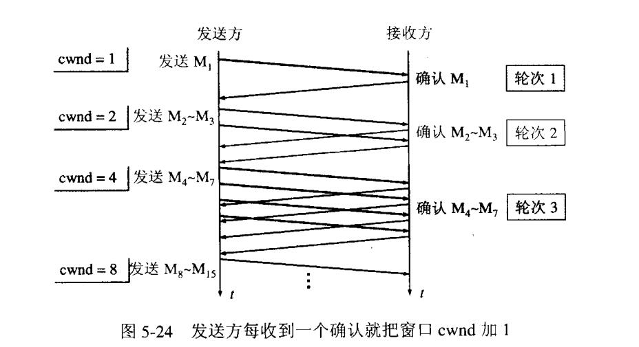
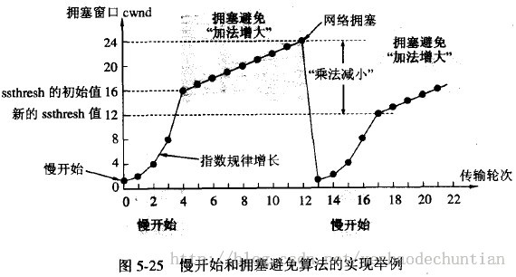
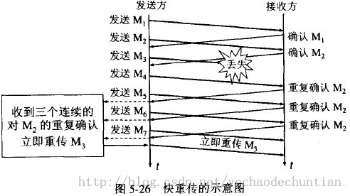

## TCP拥塞控制
tcp采用一些机制面对网络拥塞问题。拥塞控制是一个**全局性过程**。

为了**防止网络的拥塞现象**，TCP提出了一系列的拥塞控制机制。

最初由V. Jacobson在1988年的论文中提出的TCP的拥塞控制由 **“慢启动(Slow start)”和“拥塞避免(Congestion avoidance)”组成**。

后来TCP Reno版本中又针对性的加入了**“快速重传(Fast retransmit)”、“快速恢复(Fast Recovery)”算法**.

再后来在TCP NewReno中又对 **“快速恢复”算法进行了改进**

近些年又出现了**选择性应答( selective acknowledgement,SACK)算法**，还有其他方面的大大小小的改进，成为网络研究的一个热点。

zwlj:总结之后就是有：
 - 慢启动(Slow start)和拥塞避免(Congestion avoidance)
 - 快速重传(Fast retransmit)、快速恢复(Fast Recovery)算法
 - 快速恢复再改进
 - 最新的选择性应答( selective acknowledgement,SACK)算法

### 慢开始和拥塞避免
发送方**维持一个拥塞窗口 cwnd ( congestion window )的状态变量**。拥塞窗口的大小**取决于网络的拥塞程度**，并且动态地在变化。发送方让自己的**发送窗口等于拥塞窗口**。

**zwlj：实质上是让发送窗口=min(拥塞窗口,对方的接受窗口)**

发送方控制拥塞窗口的原则是：只要网络没有出现拥塞，拥塞窗口就再增大一些，以便把更多的分组发送出去。但只要网络出现拥塞，拥塞窗口就减小一些，以减少注入到网络中的分组数

#### 慢开始算法
现在并不清楚网络的负荷情况。较好的方法是先探测一下，即由小到大逐渐增大发送窗口。通常在刚刚开始发送报文段时，**先把拥塞窗口 cwnd 设置为一个最大报文段MSS的数值--也就是1**。而在每收到一个对新的报文段的确认后，把拥塞窗口增加**至多一个MSS的数值**。用这样的方法**逐步增大发送方的拥塞窗口 cwnd** ，可以使分组注入到网络的速率更加合理。

zwlj:这里有一点要注意，虽然拥塞窗口也就是发送窗口在增大，但是报文仍是以MSS为单位发送。所以发送窗口导致的是每次可以发送的报文段增多了。而定义上是，每收到一个**报文段**的确认，让阻塞窗口增加1个MSS。那么导致的结果则是每一轮**会使阻塞窗口倍增**,例:第一轮发了一个包，收回了一个ACK，阻塞窗口加1变成了2.第二轮发了2个包，收到了**2个ACK**，导致阻塞窗口+2也就是每轮都倍增。

如图，既能理解为什么阻塞窗口是每轮倍增了。

慢开始的“慢”并不是指cwnd的增长速率慢，而是指在TCP开始发送报文段时先设置cwnd=1，使得发送方在开始时只发送一个报文段（目的是试探一下网络的拥塞情况），然后再逐渐增大cwnd
为了防止拥塞窗口cwnd增长过大引起网络拥塞

##### 慢开始到达门限
还需要设置一个**慢开始门限ssthresh状态变量**。慢开始门限ssthresh的用法如下：
 - 当 cwnd < ssthresh 时，使用上述的慢开始算法
 - 当 cwnd > ssthresh 时，停止使用慢开始算法而改用拥塞避免算法
 - 当 cwnd = ssthresh 时，既可使用慢开始算法，也可使用拥塞控制避免算法

#### 拥塞避免算法
让拥塞窗口cwnd缓慢地增大，即每经过一个往返时间RTT就把发送方的拥塞窗口**cwnd加1**，而不是加倍。这样拥塞窗口cwnd按线性规律缓慢增长，比慢开始算法的拥塞窗口增长速率缓慢得多。

#### 拥塞处理
**无论在慢开始阶段还是在拥塞避免阶段**，只要发送方判断网络**出现拥塞**（其根据就是没有收到确认），就要**把慢开始门限ssthresh设置为出现拥塞时的发送方窗口值的一半**（但不能小于2）。然后把**拥塞窗口cwnd重新设置为1，执行慢开始算法**。这样做的目的就是要迅速减少主机发送到网络中的分组数，使得发生拥塞的路由器有足够时间把队列中积压的分组处理完毕

如下图，用具体数值说明了上述拥塞控制的过程。现在发送窗口的大小和拥塞窗口一样大

“拥塞避免”并非指完全能够避免了拥塞。利用以上的措施要完全避免网络拥塞还是不可能的。“拥塞避免”是说在拥塞避免阶段将拥塞窗口控制为按线性规律增长，使网络比较不容易出现拥塞

### 快重传和快恢复
如果发送方设置的超时计时器时限已到但还没有收到确认，那么很可能是网络出现了拥塞，致使报文段在网络中的某处被丢弃。这时，TCP马上把拥塞窗口 cwnd 减小到1，并执行慢开始算法，同时把慢开始门限值ssthresh减半。**这是不使用快重传的情况**

#### 快重传算法
快重传算法**首先要求接收方每收到一个失序的报文段后就立即发出重复确认**（为的是使发送方及早知道有报文段没有到达对方）而不要等到自己发送数据时才进行捎带确认。

zwlj:首先关闭流量控制中的捎带确认功能，要求立即发出确认。

接收方收到了M1和M2后都分别发出了确认。现在假定接收方没有收到M3但接着收到了M4。显然，接收方不能确认M4，因为M4是收到的失序报文段。根据可靠传输原理，接收方**可以什么都不做，也可以在适当时机发送一次对M2的确认**。但按照**快重传算法的规定，接收方应及时发送对M2的重复确认**，这样做可以让发送方及早知道报文段M3没有到达接收方。

快重传算法还规定，发送方只要**一连收到三个重复确认**就应当**立即重传对方尚未收到的报文段M3**，而不必继续等待M3设置的重传计时器到期。由于发送方尽早重传未被确认的报文段，因此采用快重传后可以使整个网络吞吐量提高约20%

#### 快恢复算法
快恢复算法，其过程有以下两个要点：

1. 当发送方连续收到三个重复确认，就执行“乘法减小”算法，把慢开始门限ssthresh减半。这是为了预防网络发生拥塞。请注意：**接下去不执行慢开始算法**。

2. 由于发送方现在认为网络**很可能没有发生拥塞**，因此与慢开始不同之处是现在不执行慢开始算法（即拥塞窗口cwnd现在不设置为1），而是**把cwnd值设置为慢开始门限ssthresh减半后的数值**，然后开始执行**拥塞避免算法-加法增大**，使拥塞窗口缓慢地线性增大。 下图给出了快重传和快恢复的示意图，并标明了“TCP Reno版本”。 区别：新的 TCP Reno 版本在快重传之后采用快恢复算法而不是采用慢开始算法。

在采用快恢复算法时，慢开始算法只是在TCP连接建立时和网络出现超时时才使用
采用这样的拥塞控制方法使得TCP的性能有明显的改进

#### 流程总结(zwlj)
也就是启用了快重传和快速恢复算法之后，流程相比于慢开始有了更新一步的改进。

在TCP连接建立时仍是使用慢开始算法，超过门限之后仍然是使用拥塞避免算法线性增加阻塞窗口。区别在于，**启用快重传的前体现**，出现拥塞之后，并不是重新执行慢开始，而是把cwnd重新设置成新门限ssthresh并再执行拥塞避免，这个过程也就是**快恢复**。

**由上图就知道流程被优化成了:慢开始->拥塞避免(到达门限)->门限减半处执行拥塞避免(出现拥堵，快恢复)**
