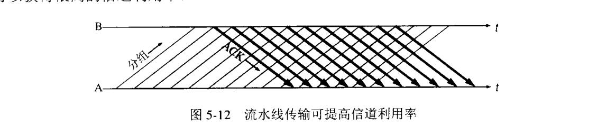
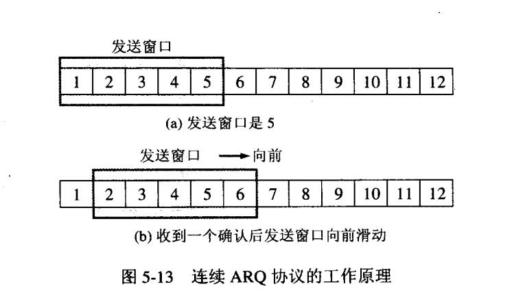
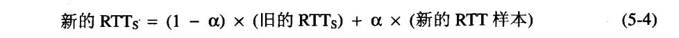
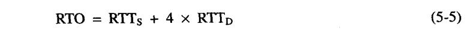
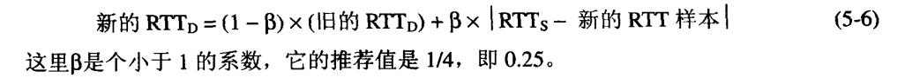

## tcp协议详解
根据tcp和udp协议的笔记，我们知道了tcp和udp的关键区别就是，tcp是个可靠的传输协议。那么什么是可靠的传输协议呢？

### 什么是可靠的传输协议
最理想的传输有**两个特点**：
 - 传输信道不产生差错(**内容和顺序都正确**)；
 - 不管发送方是否降低发送数据的速度，不需要采取任何措施就能够实现可靠传输。

也就是要保证两点，**传输不出差错，还有就是解决传输过程中的丢包问题**。

然而实际中的网络并不能够达到这种理想的状态，但我们可以通过使用一些可靠传输的协议去处理这些问题，比如规定如果发现发送的数据发生错误时让发送方重新发送，这样的协议有停止等待协议、连续ARQ协议等。

### 保证可靠性的机制

#### 停止等待协议(不使用)

最开始设计的简单协议就是**停止等待协议stop-and-wait protocol**，也就是发送方发送一个分组，在收到对方确认之前我停止发送下一个分组，进行等待。如果没收到确认则**超时重传**

显然这种一次只发一个分组，然后等待的方法效率太低了。在现代网络产生拥阻的情况下非常难受。性能非常糟糕。所以**现在传输层，不会使用这种协议**。

#### 连续ARQ协议

##### 流水线改进停止等待协议

前面我们提到了停止等待协议的缺点，一次只发送一个分组效率太低。

所以我们就需要使用**流水线pipelining**的方式，一次传输多个分组。所以我们需要解决的问题就是，怎样有序的保证对面正确有序的接受了你连续发过去的东西。这也是个管理ACK(确认)的问题。

使用流水线机制，那么解决流水线差错恢复则有两种机制可以解决。一个是**选择重传，一个是回退N**，当然，使用流水线机制的话，收发双发都会采用滑动窗口的收发机制。

###### ARQ协议
在讲连续ARQ之前，我们还先要知道ARQ协议是什么。

**ARQ协议，即Automatic Repeat reQuest自动重传请求协议**，核心其实就是围绕重传这个操作。一旦对方没有发来确认(可能中途丢包，也可能出差错被对方丢弃)，则超时重传。还有，**接收方收到重复的包(可能确认丢失)，也重传确认**。

##### 滑动窗口机制
在提到上面所说的回退N和选择重传之前。先看下连续ARQ采用滑动窗口机制，收发双发在缓存中都是维护一个窗口，用来接收和发送字节流。

如图所示，收到确认以后，就按照相应的机制向前滑动。

##### 回退N
**回退N，即Go-Back-N,也叫GBN**。

结合刚才的滑动窗口，在这种机制下：

首先，接收方，只对**按序到达的最后一个分组发出确认**，**累计确认cumulative ACK**，累计一定按序在合适的时候发回确认。

其次，发送方**只对这个按序收到的确认**向前滑动，则是回退窗口。

比如，我发送了12345，对面重传了1245,没有3的确认。那我就只把窗口滑到3，**重传3以后的所有字节，也就是345**.这相当于我先滑了5，然后回退2格。这就是回退N机制。

**优点是实现简单**，不需要缓存失序的分组，但是**缺点**也是显而易见的，就那是**浪费**。发送方无法完整的知道接收方的接受情况，比如根本不知道对方是否接受了4和5，只知道对面3没收到。相当于要**退回去重传丢失数据后面所有的字节**。在通信质量不好的时候，很影响性能。

##### 选择重传
由于回退N不缓存失序分组，每次一个分组的丢失可能导致其后大量分组的重传，在网络质量不好的情况下，流水线很容易被这些大量重传的分组填满。

那么**选择重传SR select repeat**，就是只让发送方发送它怀疑对面丢失的分组。对于未按序到达的分组，接收方把它们全部缓存起来，对**所有收到的分组**都发出确认(**并不是累计确认，是**单独**对每个收到的包确认)。发送方会为每一个分组都设置一个计时器，超时了就重传那个具体分组。

选择重传基于SACK机制,事实上要记录丢失分组的边界会大大增加TCP宝header的字节数大小。

所以TCP具体如何实现还要视具体情况确定，因为**无明确规定**，既有可能是**回退N也有可能是选择重传，也有可能是两种的混合**。

根据《自顶向下方法》一书中提到，TCP实现是两者混合，既发送方采用类GBN，只保留按序到达的最后一个分组确认。接收方采用类SR，既有选择的确认失序报文，而不是只确认按序到达的最新一个。

#### 总结
由此我们也可以得知，TCP为了保证可靠性，**运用了连续ARQ+滑动窗口机制，控制分组丢失使用的机制是回退N和选择重传的混合**。

### 超时重传的时间选择
首先明确RTT的概念。

RTT(Round-Trip Time): 往返时延。在计算机网络中它是一个重要的**性能指标**，表示**从发送端发送数据开始**，到**发送端收到来自接收端的确认**（接收端收到数据后便立即发送确认），总共经历的时延。

TCP里记录了一个变量**加权平均往返时间RTTs**，当第一次测量到RTT样本的时候，就取这个值，每次测量到新的值就根据公式重新计算。

RFC2988推荐α取八分之一。

但是，注意，超时重传时间RTO(RetransmissionTime-Out)应该略大于这个RTTs

上两个是计算公式，比较复杂。

要注意，如果报文段发生了重传，那么此报文段不计入RTT的计算当中。

### tcp报文格式
见笔记

### tcp流量控制
见分离笔记

### tcp拥塞控制
见分离笔记
