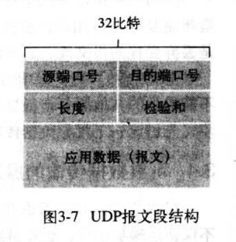

## UDP
用户数据包协议（英语：User Datagram Protocol，缩写为UDP），又称用户数据报文协议，是一个简单的面向数据报的传输层协议，正式规范为RFC 768。

UDP只提供数据的不可靠传递，它一旦把应用程序发给网络层的数据发送出去，就不保留数据备份（所以UDP有时候也被认为是不可靠的数据报协议）。UDP在IP数据报的头部**仅仅加入了复用和数据校验字段**。

典型网络上的众多使用UDP协议的关键应用一定程度上是相似的。这些应用包括域名系统（DNS）、简单网络管理协议（SNMP）、动态主机配置协议（DHCP）、路由信息协议（RIP）和某些影音流服务等等。

### 报文格式
UDP报文比较简单，由四个字段组成，每个字段2个字节：

 - 源端口 source port
 - 目的端口 destination port
 - 长度 :UDP用户数据报的长度
 - 检验和  checksum

由于端口只有16位，所以范围只是0-65536

udp校验和用于检验传输中是否有发生比特变化，提供了**差错检测的功能**。
