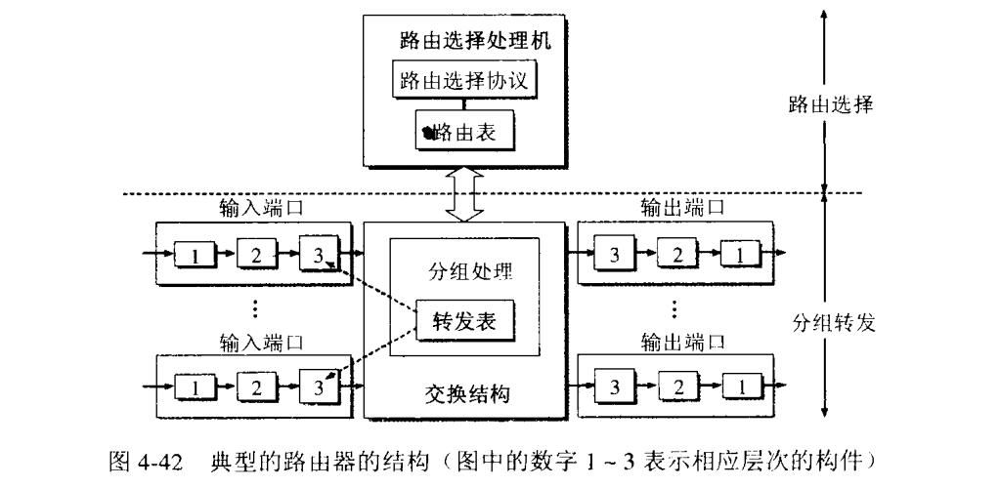

## 路由器工作原理
路由器（Router），是连接因特网中各局域网、广域网的设备，它会根据信道的情况自动选择和设定路由，以最佳路径，按前后顺序发送信号。

如上图，是路由器的经典结构图。整个路由器结构可以分为两个：
 - **路由选择**
 - **分组转发**

路由选择处理机负责根据路由算法构造路由表，然后定时和附近的路由器交换路由信息。

而分组转发则分为3个结构，交换结构，输入端口和输出端口。分组转发的作用就是**根据转发表进行处理**，将某个端口进来的分组从另外一个合适的输出端口转发出去。
