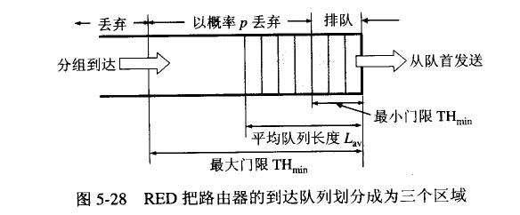
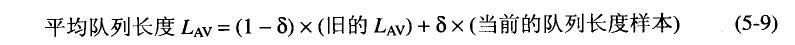

## 路由器工作原理
路由器（Router），是连接因特网中各局域网、广域网的设备，它会根据信道的情况自动选择和设定路由，以最佳路径，按前后顺序发送信号。

如上图，是路由器的经典结构图。整个路由器结构可以分为两个：
 - **路由选择**
 - **分组转发**

路由选择处理机负责根据路由算法构造路由表，然后定时和附近的路由器交换路由信息。

而分组转发则分为3个结构，交换结构，输入端口和输出端口。分组转发的作用就是**根据转发表进行处理**，将某个端口进来的分组从另外一个合适的输出端口转发出去。

### 分组丢弃策略
路由器队列按照**先进先出FIFO**来处理到达的分组。

先要知道，如果队列满了之后再讲多余到达的分组丢弃，这叫做**尾部丢弃策略**。

路由器**不采用尾部丢弃分组**的方式来处理，因为如果采用尾部丢弃，往往一连串的分组会被丢弃导致超时，使TCP进入慢开始状态。队列突然满，则会导致许多TCP连接进入阻塞开始慢开始，这在网络术语中称为**全局同步global synchronize**。全局同步是的全局通信量突然下降，然后又会突然增大。

为了避免全局同步，路由器采用**随机早期检测(RED Random early detection)的策略**。

队列维护两个变量**THmin和THmax**。每一个分组到达的时候会计算出一个平均队列长度L

如上图，分组到达时，如果L小于THmin，则进入队列，大于THmax，丢弃分组，处于两变量中间，以p概率随机丢弃分组。

也就是说路由器不是在阻塞发生时才分组丢弃，而是有这个症状的时候就已经开始丢弃。

注意长度L，也不是用的瞬时长度(有时突发数据不具备代表性)，而是用了类似RTT的加权平均方式计算。

