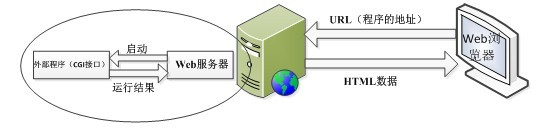

## CGI
通用网关接口（Common Gateway Interface/CGI）是一种重要的互联网技术，可以让一个客户端，从网页浏览器向执行在网络服务器上的程序请求数据。**CGI描述了服务器和请求处理程序之间传输数据的一种标准。**

CGI不是一门编程语言。它是**网页的表单(或者说数据)和你写的程序之间通信的一种协议**。可以用任何语言写一个CGI脚本，这些语言只要能接收输入输出信息，读取环境变量。所以，几乎所有的编程语言都能写一个CGI脚本，例如：python

Common Gateway Interface，简称CGI。CGI程序在物理上是一段程序，运行在服务器上，提供同客户端HTML页面的接口。

**zwlj:也就是说CGI程序用来处理用户提交的数据并返回HTML页面。**

也就是说CGI只是处理数据，web服务器进程则负责进行通信。当客户端有请求来时，web服务器将调用cgi程序处理请求数据，然后得出数据后返回给客户端。

### 遵循CGI标准的脚本结构
典型的CGI脚本做了如下的事情：
1. 通过Internet把用户请求送到web服务器。
2. web服务器接收用户请求并交给CGI程序处理。
3. CGI程序把处理结果传送给web服务器。
4. web服务器把结果送回到用户。

### 工作原理
每当客户请求CGI的时候，WEB服务器就请求操作系统**生成一个新的CGI解释器进程(如php-cgi.exe)，CGI 的一个进程则处理完一个请求后退出，下一个请求来时再创建新进程**。当然，这样在访问量很少没有并发的情况也行。可是当访问量增大，并发存在，这种方式就不适合。
