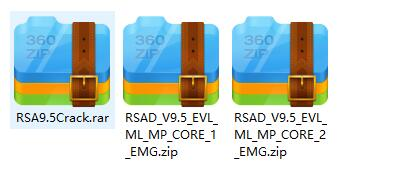
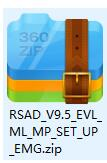

## 安装IBM Rational Software Architect
IBM Rational Software Architect 是个专业的UML设计软件。

这里记录下它9.5版本的安装和破解方法

### 下载
从网盘或者官网上下好以下几个软件





注意一个是CORE1(disk1)，一个是CORE2(disk2),这两个是安装IBM RSA的必须组件。

然后SET_UP包中的东西是用来启动安装的。

解压set_up包，启动laucher，第一次启动可能会无法run成功安装程序，重启再试。

然后根据提示下一步，load两个disk就可以了。

安装好以后，解压crack包，然后将文件复制到对应目录。

### 调整语言
如果装了中文，是有办法调成英文的。只需要在软件目录下的elipse.ini中添加一行

```
-Duser.language=en
```

在那个配置文件中添加那个配置即可。
