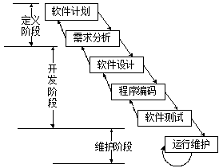
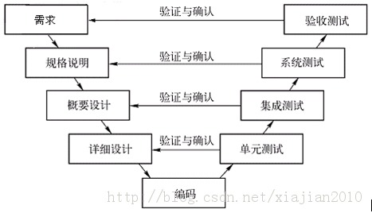
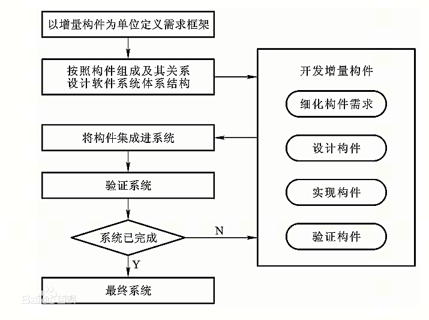
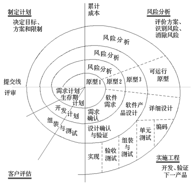

## 软件开发过程模型

### 瀑布模型
瀑布模型（Waterfall Model） 是一个项目开发架构，开发过程是通过设计一系列阶段顺序展开的，从系统需求分析开始直到产品发布和维护，每个阶段都会产生循环反馈。因此，如果有信息未被覆盖或者发现了问题，那么**最好 “返回”上一个阶段并进行适当的修改**，项目开发进程从一个阶段“流动”到下一个阶段，这也是瀑布模型名称的由来。

将软件生命周期划分为制订计划、需求分析、软件设计、程序编写、软件测试和运行维护等六个基本活动，并且规定了他们自上而下、相互衔接的固定次序，如同瀑布流水，逐级下落

如图，若某一阶段发现上一阶段产品不能满足要求, 则需返回重做.

#### 优点
1. 为项目提供了按阶段划分的检查点。
2. 当前一阶段完成后，您只需要去关注后续阶段。
3. 可在迭代模型中应用瀑布模型。
4. 它提供了一个模板，这个模板使得分析、设计、编码、测试和支持的方法可以在该模板下有一个共同的指导。

#### 缺点
1. 各个阶段的划分完全固定，阶段之间产生大量的文档，极大地增加了工作量。
2. 由于开发模型是线性的，用户**只有等到整个过程的末期才能见到开发成果**，从而增加了开发风险。
3. 通过过多的强制完成日期和里程碑来跟踪各个项目阶段。
4. 瀑布模型的**突出缺点是不适应用户需求的变化**。

对于经常变化的项目而言，瀑布模型毫无价值。

### V模型
V模型强调软件开发的协作和速度，将软件实现和验证有机地结合起来，在保证较高的软件质量情况下缩短开发周期

优点：适合工程量小、人力资源少并且开发过程中改动不大的项目

缺点：错误发现时间迟，产生的风险代价高

### 原型模型
**先建立一个快速原型**，实现客户与系统的交互，客户对原型进行评价，进一步细化待开发软件的需求.

通过逐步调整原型使其满足客户的要求，开发人员可以借此确定客户的真正需求.

原型模型分为两种:

 - **演化式原型模型: 逐步修改原型, 直至其成为可以满足客户需求的最终软件产品.**

 - **快速原型模型: 原型获得用户真实需求后即被抛弃, 重新开始开发.**

优点: 可以得到比较良好的需求定义，容易适应需求的变化, 开发费用低、开发周期短且对用户更友好

缺点: 客户与开发者对原型理解不同, 准确的原型设计比较困难, 不利于开发人员的创新。

### 增量模型
软件被作为一系列的增量构件来设计、实现、集成和测试，每一个构件是由多种相互作用的模块所形成的提供特定功能的代码片段构成。

增量模型在各个阶段并不交付一个可运行的完整产品，而是交付满足客户需求的一个子集的**可运行产品**。

整个产品被分解成若干个构件，开发人员逐个构件地交付产品，这样做的好处是软件开发可以**较好地适应变化**，客户可以不断地看到所开发的软件，从而降低开发风险，有利于快速开发软件。

#### 优点
1. 将待开发的软件系统模块化，可以分批次地提交软件产品，使用户可以**及时了解软件项目的进展**。

2. 以组件为单位进行开发**降低了软件开发的风险**。一个开发周期内的错误不会影响到整个软件系统。

3. **开发顺序灵活**。开发人员可以对组件的实现顺序进行优先级排序，先完成需求稳定的核心组件。当组件的优先级发生变化时，还能及时地对实现顺序进行调整。

同时，**增量模型的缺点是要求待开发的软件系统可以被模块化。如果待开发的软件系统很难被模块化，那么将会给增量开发带来很多麻烦。**

增量模型适用于具有以下特征的软件开发项目：
1. 软件产品可以分批次地进行交付。
2. 待开发的软件系统能够被模块化。
3. 软件开发人员对应用领域不熟悉，难以一次性地进行系统开发。
4. 项目管理人员把握全局的水平较高。

### 螺旋模型
综合了瀑布模型和演化模型的优点，还增加了风险分析，**特别适合于大型复杂的系统**。

螺旋模型是一种演化软件开发过程模型，它兼顾了**快速原型的迭代的特征以及瀑布模型的系统化与严格监控**。螺旋模型最大的特点在于引入了其他模型不具备的**风险分析**，使软件在无法排除重大风险时有机会停止，以减小损失。同时，**在每个迭代阶段构建原型** 是螺旋模型用以减小风险的途径。螺旋模型更适合大型的昂贵的系统级的软件应用.

#### 缺点
很难让用户确信这种演化方法的结果是可以控制的。**建设周期长**，而软件技术发展比较快，所以经常出现软件开发完毕后，和当前的技术水平有了较大的差距，无法满足当前用户需求。

螺旋模型的项目适用：

对于新近开发，**需求不明确的情况下**，适合用螺旋模型进行开发，便于**风险控制和需求变更**。

### 敏捷开发
敏捷开发是一种以人为核心、迭代、循序渐进的开发方法。在敏捷开发中，软件项目的构建被**切分成多个子项目**，各个子项目的成果都经过测试，具备集成和可运行的特征。换言之，就是把一个大项目分为多个相互联系，但也可独立运行的小项目，并分别完成，在此过程中软件一直**处于可使用状态**

敏捷开发有很多实践，相信的可以另寻找资料。

<a>http://wiki.mbalib.com/wiki/%E6%95%8F%E6%8D%B7%E5%BC%80%E5%8F%91</a>
