# 形式化方法Formal Methods
基于UML的面向对象方法设计，也有他的局限性。这里会简单介绍另一种基于Formal methods的设计方法，以**CSP(Communication Sequential Processes)语言举例**。

在计算机科学和软件工程领域，形式化方法是**基于数学的特种技术**，适合于软件和硬件系统的描述、开发和验证。将形式化方法用于软件和硬件设计，是期望能够像其它工程学科一样，使用适当的数学分析以**提高设计的可靠性和鲁棒性**。但是，由于采用形式化方法的成本高意味着它们通常只用于开发**注重安全性的高度整合的系统**。

更具体的简介见百科：

<a>https://baike.baidu.com/item/%E5%BD%A2%E5%BC%8F%E5%8C%96%E6%96%B9%E6%B3%95</a>

## advantage
Formal Methods有几个常见优点

 - Consistent and unambiguous(一致性，非模糊[UML设计常基于assumtion,所以可以说是模糊的])
 - Reduces coding time despite slightly longer time for speification(尽管时间略长仍能减少编码时间)
 - Proof of correctness(正确性可证明，不需要通过测试验证)
 - Eases future enhancements(减轻未来添加功能的压力)

## 一个场景案例

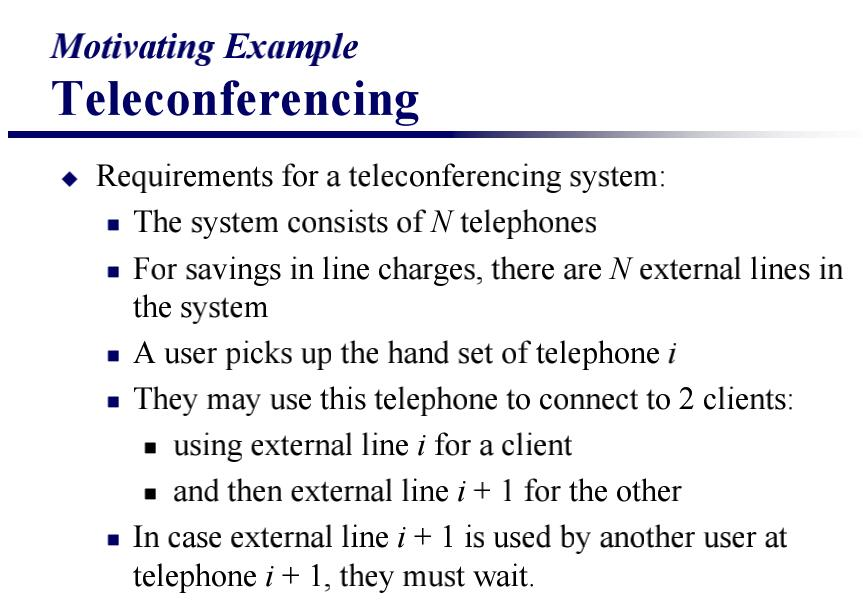

一个内部电话会议，有N个电话，N条线，当用户打电话的时候，他拿起第i个电话，使用线路i，并且分配第i+1号线路给他拨打的用户。如果第i+1号线路已经被分配出去了，他就必须等待线路空闲。

uml的顺序图表示如下：

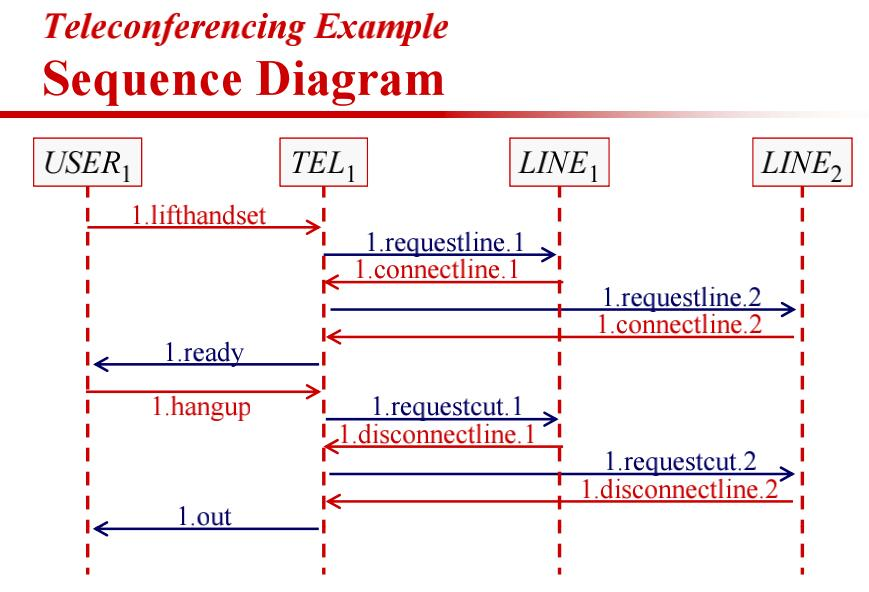

状态机图(TEL)如下：

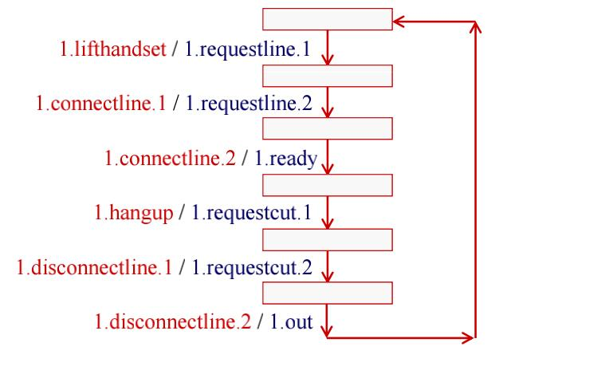

注意uml下，状态机图和顺序图，TEL和LINE都是分别构建一个就行，不是构建N个。

这个系统会出现严重的**问题**，且用UML图形来分析的话很难发现问题。

### 1.死锁(Deadlock)
N个users都拿起了电话的时候，每个用户都得到自己的Line，而且获取不到i+1Line，此时进入死锁，每个人都在等待状态。

UML diagram无法很好的发现这个问题，这就是**UML OO设计的局限性之一**。

### 2.饿死(Starvation)
如果某个用户i经常使用电话，导致他把i+1号线路长时间占领。那么第i+1号用户，甚至都不能取到属于他自己的i+1号线路(也就是第一步RequestLine1都不能完成)，长时间等待，并饿死。

这也是UML图不能直观体现的问题。

由此可见，**顺序图和状态机图都不能很好体现这两个问题(死锁和饥饿)。** 想要UML图详细表现出问题，我们可能需要画出每一个TELi的顺序图和序列图，这样显然是不现实的(**State Machine for all objects is complex**)。

在这种场合下，用Formal Methods分析案例，会有更好的效果。

## CSP(Communication Sequential Processes)
通信顺序进程，用于Formal Methods的一种语言。下面做简单介绍

### Process

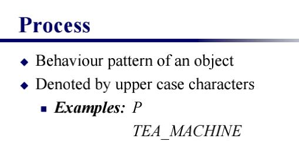

进程，在CSP里用来描述一个事物的状态，这个状态是由一系列事件组合完成的。比如*TEA_MACHINE*

### event
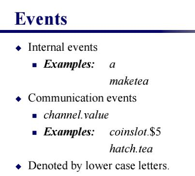

事件，用上图的一些方法表示，比如maketea表示产生茶，coninslot.$5表示投入5美元。

### alphabet

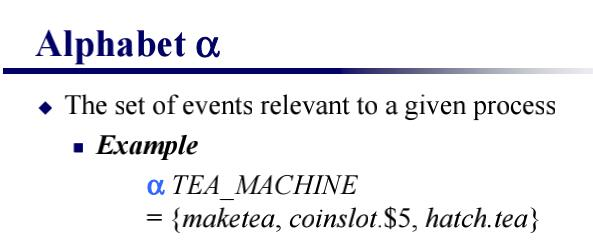

alphabet表示，某特定process相关的event集合，如上图所示。

### prefix
设x为一事件，P为一进程，则

(x → P) (读做“x 然后 P”)，x then P

它首先执行事件x，然后**按照进程P的进行下一步动作**。
我们定义进程(x→P)与进程P有同样的字母表，所以，只有**当x在P的字母表内时**，这个记法才有意义

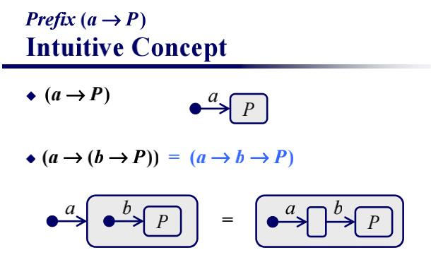

可以用状态机图稍微表示prefix概念，如上图，并且prefix有性质,显然

(a->(b->P)) = (a->b->P)

注意几点错误

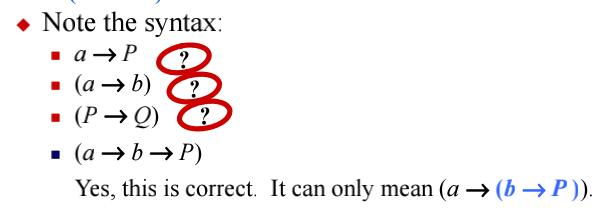

使用prefix时要在外面有括号(代表生成了一个新的Process)，且大小写代表的东西不能搞错。

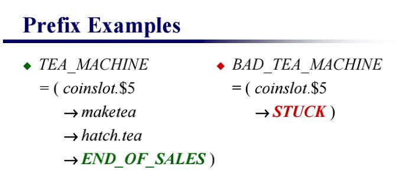

注意END_OF_SALES和STUCK也都是一个Process

### SKIP and STOP
结束状态有两种，一个是SKIP，一个是STOP。SKIP代表成功结束，比如上面状态的END_OF_SALES,STOP代表一个失败的结束状态，比如上图的STUCK。

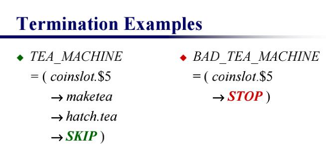

### Recursion

表示一种递归状态

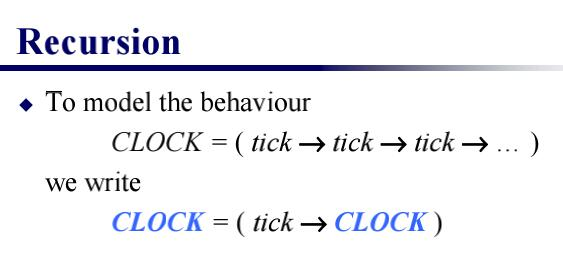

### Choice

使用前缀和递归的方法，我们可以刻画那些只具备单一行为的对象，这类对象的行为不受外界影响。然而，有许多对象在其所处的环境中与环境相互作用，致使对象的行
为受到环境影响。例如，一台自动售货机可能有两个硬币槽，一个只能投入二便士的硬币，另一个只能投入一便士的硬币；选择触发哪一事件是由顾客来决定的。假设x和
y是两个不同事件，则表达式

`(x→P | y→Q)`

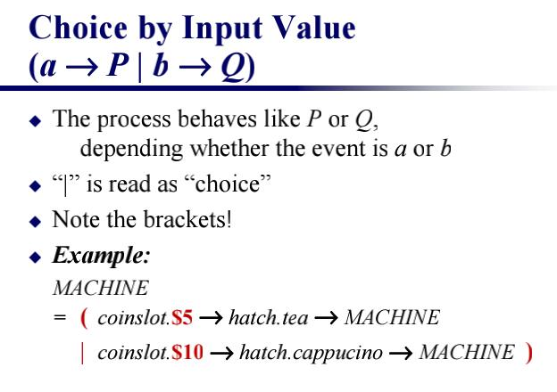

#### Choice By Channel
Choice中的一种情况

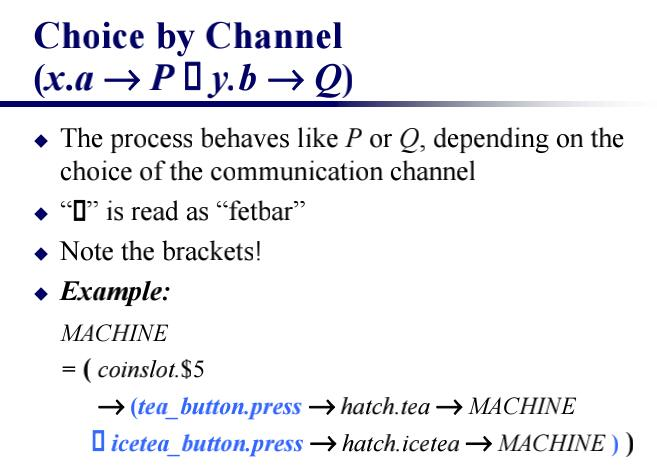

理解：在choic图1(By value)里是通过某个相同动作，但是不同的值value来决定process走向的，而fetbar(By channel)则是根据外界的行为的不同，来决定process走向。

比如上两图，图1就是都同为coinslot，图2则是两个不同的channel tea_button和icetea_button

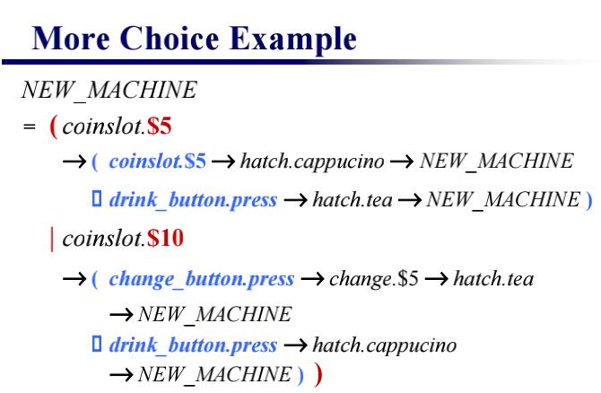

### Interaction
交互作用,当把**两个进程**放到一起，让它们并行运行时，我们一般是期望它们交互作用。

`P||Q`

表示一个进程，其行为就是P和Q构成的整个系统的行为，P和Q的交互作用按上述说明
为严格同步的

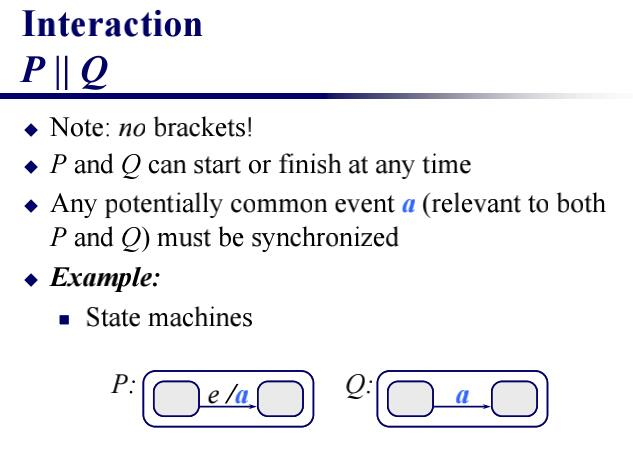

以上是状态机图的表示。

zwlj：本质上就是两个对象之间有交互，正如上图的状态机图P和Q，P和Q是互相联系的，P由于事件e触发了事件a，而a会对Q产生影响，就跟sequence diagram里的消息传递一样。用`P||Q`能很好的表示这一情况。

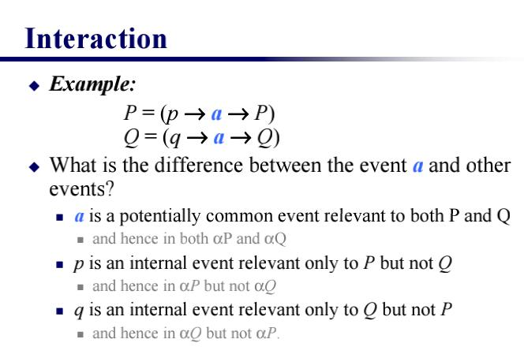

注意其中a是有公共事件的。

#### example

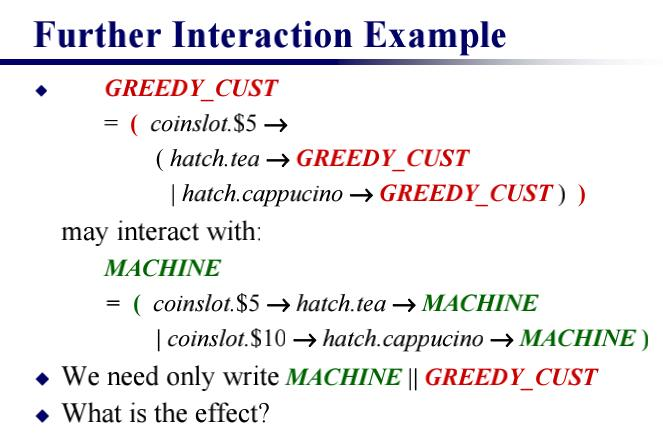

zwlj：greedy cust可以想象成一个customer object，而Mchine就是一个贩卖机。两者消息传递时，customer投钱切换状态，Machin生产物品也切换状态，两者用表达式写成`MACHINE||GREEDY_CUST` 其效果就相当于两个状态机图联立在了一起。

### Laws法则

#### Axioms公理

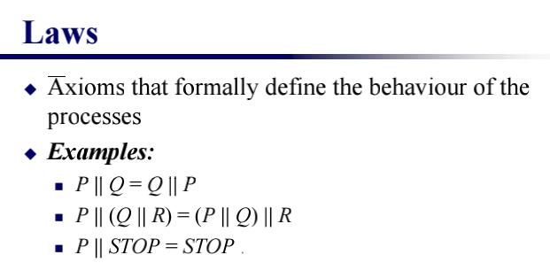

公理无需证明，所以只需知道

以上所示，皆为CSP公理。

zwlj：上图第二条公式，我们可以理解为，a和b都是P和Q的共有事件，P被输入了一条a信息，那么此时就会向Q也发送一条a信息，然而此时Q却在等待b信息，那么两边不同步，就会引起STOP。

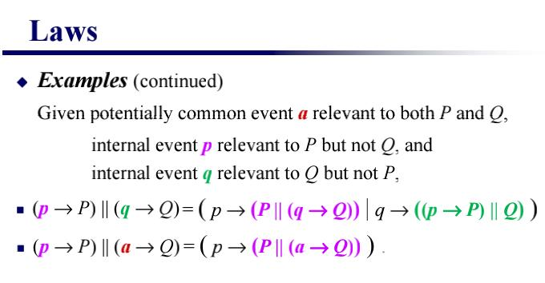

上图公式，由于p和q分别只属于P和Q，a是共有事件。则有上图事件，可以理解为，第一条公式转换为了，p事件先发生或q事件先发生。而第二条公式，由于a是共有事件，不能先行，所以只能p先行。

所以重要的就是上两条公式了

理解了上面2个公式(本质就是让p，q事件分别先发生)，就可以推倒出许多定理。比如

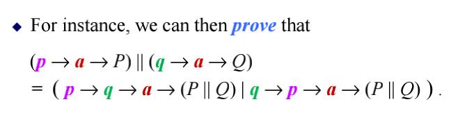

证明过程略。。。。。。

## 利用CSP解决案例
刚才的案例中，我们知道了UML的OO分析，难以解决电话会议案例的死锁问题，这是我们用基于Formal Methods的方法，用CSP来分析案例。

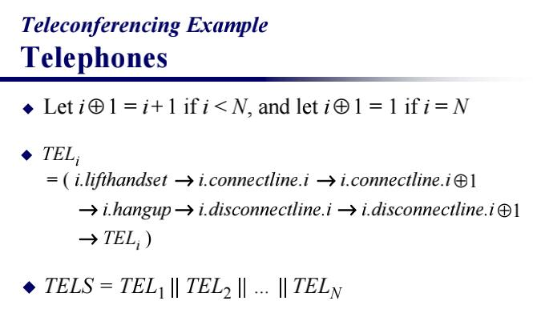

设定带圈的加号是一个循环加法，i到达N如果加一，就自动循环到1。

那么TEL(i)的状态就可以表示成上图所示的公式，这是TEL的状态表示。最后可以用interaction把它们并起来。

同理我们可以定义Line的状态

定义了循环减号，而且吧LINES也表示出来了。注意，这里出现了choice by channel的fetbar符号，表示LINE有主动打开和被动打开两种模式。

最后定义了Process NETWORK=TELS||LINES

#### 解决死锁
虽然定义了`NETWORK=TELS||LINES`,但我们还没有解决任何问题。

解决死锁问题，必须要给出一个额外的方案，比如我们安装一个guard软件。

总之就是安装一个guard软件，防止N个电话同时被使用，这样至少有方法解决死锁。

当然，你说这个方案用UML就不行吗？当然可以，但是设计人员只能加这两行字然后交给programmer，而用CSP，我们则能很直观的体现出死锁问题，然后给出对应方案。

我们用CSP定义一些内容

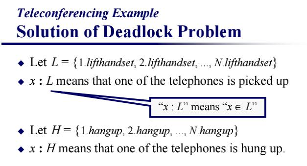

上图定义了L集合和H集合，L集合代表某个电话被拿起的事件集合。H集合代表某个电话被挂断的事件集合。

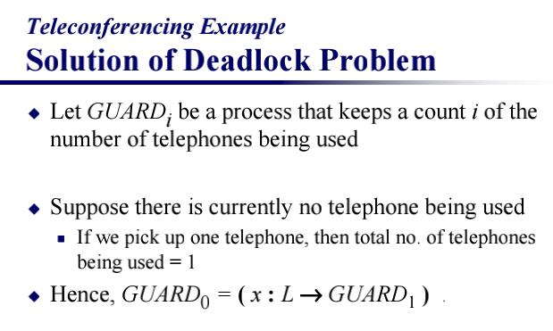

定义GUARD(i)代表**当前有i个电话正在被使用，此时GUARD的状态为GUARD_i**

因此我们知道GUARD0的状态转换如上图，当GUARD1的情况下，一个电话被拿起，状态就会转换成GUARD0.

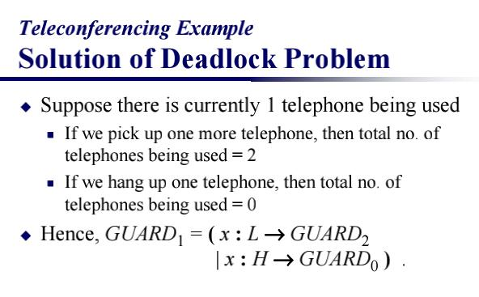

因此我们很容易可以推导出GUARD1的状态转换如上图，有0放下电话切换而成，或者由2状态拿起电话切换而成。

推理到一般论，当然i不能取n-1，最大只能到n-2，因为不能让N个电话都被拿满，会死锁。

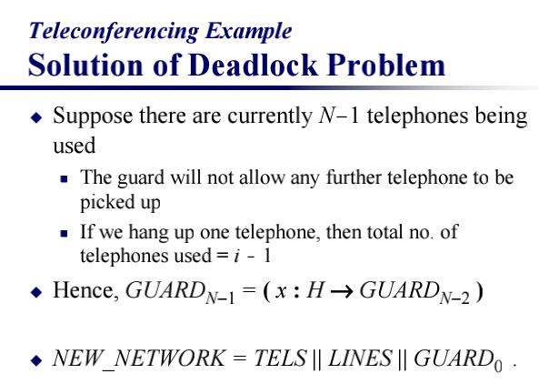

所以N-1分出来讨论(0在之前也分出来讨论了)，最后我们可以得到新的系统的表达式。

`NEW_NEWWORK=TELS||LINES||GUARD0`

#### 思考

只要用CSP这样写出来，实现人员实现系统就非常明朗了。否则只给UML图会使得系统实现人员(programmer)一头雾水。

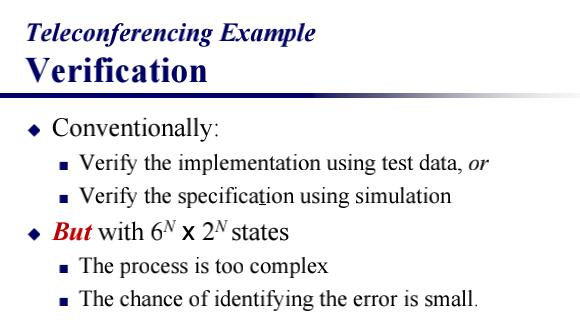

传统的UML技术，需要使用测试数据和模拟才能找出问题，并想办法解决问题。同时状态图可能要画出很多，且UML解决方案也无法证明其正确性。但是基于Formal method的设计，却能给出证明证明其正确性。

## Formal Methods缺点

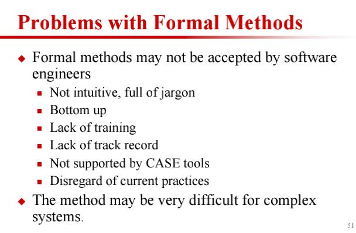

当然形式化方法缺点也特别多，以上列出了一些。以上就是形式化方法的简单介绍。
