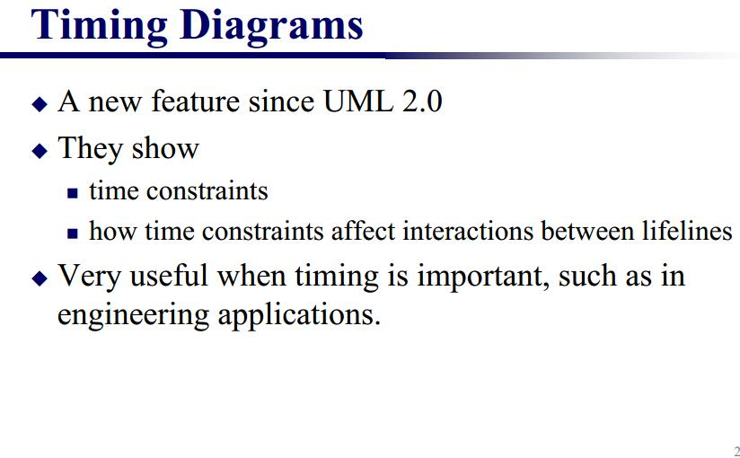
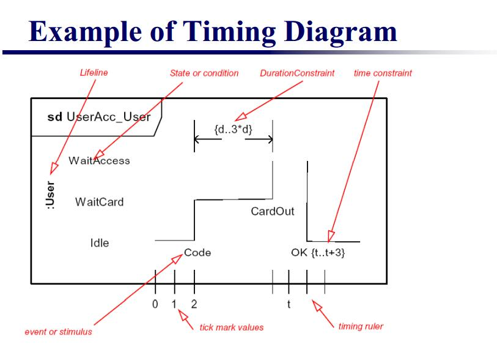

## timing diagram
时间图timing diagram是uml2的新特性。

UML 时间图被用来显示随时间变化，一个或多个元素的值或状态的更改。也显示时控事件之间的交互和管理它们的时间和期限约束。

下图显示一个概况

### 状态生命线
状态生命线显示随时间变化，一个单项状态的改变。不论时间单位如何选择，X轴显示经过的时间，Y轴被标为给出状态的列表。状态生命线如下所示：

### 值生命线
值生命线显示随时间变化，一个单项的值的变化。X轴显示经过的时间，时间单位为任意，和状态生命线一样。平行线之间显示值，每次值变化，平行线交叉。如下图所示。

### 将它们放在一起
状态和值的生命线能叠加组合。它们必须有相同的X轴。 消息可以从一个生命线传递到另一个。每一个状态和值的变换能有一个定义的事件，**一个时间限制是指一个事件何时必须发生(when)，和一个期限限制说明状态或值多长时间(how long)必须有效**。一旦这些已经被应用，其时间图可能显示如下。

