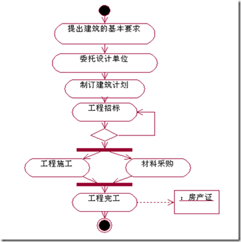
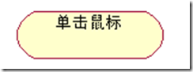
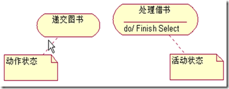
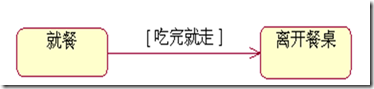
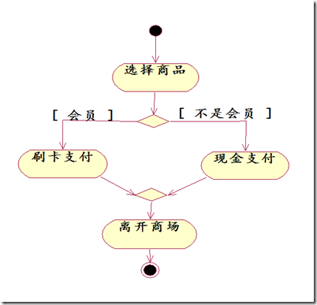
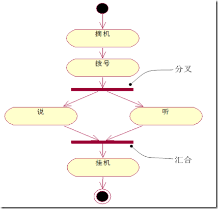
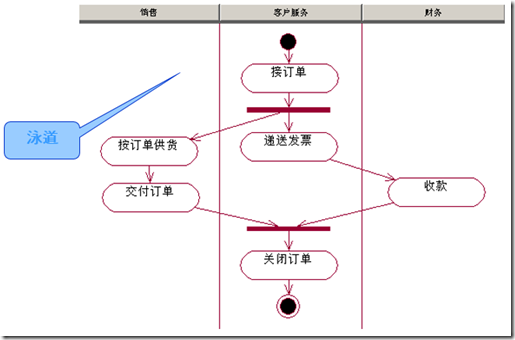
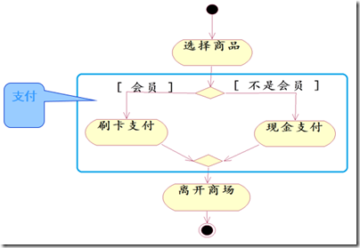

## 活动图Activity diagram
活动图是UML用于对系统的动态行为建模的另一种常用工具，它描述活动的顺序，展现从一个活动到另一个活动的控制流。活动图在本质上是一种流程图。活动图着重表现从一个活动到另一个活动的控制流，是内部处理驱动的流程。

活动图用于描述系统的工作流程和并发行为。活动图被设计用于简化描述一个过程或操作的工作步骤。例如，可以用活动图对一个软件的开发过程建模；还可以对诸如求Fibnacci数列第n个数的数值之类的操作进行建模。

活动图可用于对系统对算法等的建模。

### 活动图的组成元素
 - 活动（Activity）
 - 动作流（Action Flow）
 - 分支（Branch）与合并（Merge）
 - 分叉（Fork）和汇合（Join）
 - 泳道（Swimlane）
 - 对象流（Object Flow）

### 动作状态
动作状态是指执行原子的、不可中断的动作，并在此动作完成后通过完成转换转向另一个状态的状态。
动作状态使用平滑的圆角矩形表示，动作状态所表示的动作写在圆角矩形内部。

### 活动状态
活动状态是可分解的，不是原子的，其工作的完成需要一定的时间。
可把动作状态看作活动状态的特例。
活动状态的表示图标也是平滑的圆角矩形，并可以在图标中给出入口动作和出口动作等信息。

活动状态的内部活动可以用另一个活动图来表示

### 动作流Action Flow
所有动作状态之间的转换流称之为动作流。
活动图的转换不需要特定事件的激发，一个动作状态执行完后自动转换到另外一个状态。
活动图的转换用带箭头的直线表示。
可用条件限制转换。

### 分支与合并branch and merge
分支一般用于表示对象类所具有的条件行为。
条件行为用分支和合并表达。
一个分支有一个入转换和两个带条件的出转换，出转换的条件**应当是互斥的**。
一个合并有两个带条件的入转换和一个出转换，合并表示从对应的分支开始的条件行为的结束。

### 分叉与汇合fork and join
分叉用于将动作流分为两个或者多个**并发运行**的分支，而汇合则用于同步这些并发分支，以达到共同完成一项事务的目的。
分叉可以用来描述并发线程。
汇合代表两个或多个并发控制流同步发生，当所有的控制流都达到汇合点后，控制才能继续往下进行。

### 泳道Swimlane
泳道将活动图中的活动化分为若干组，并把每一组指定给负责这组活动的业务组织，通常为对象。

**泳道区分了负责活动的对象，明确地表示了哪些活动是由哪些对象进行的**。
每个活动只能**明确地属于一个泳道**。
泳道用垂直实线绘出，垂直线分隔的区域就是泳道。在泳道上方可以给出泳道的名字或对象（对象类）的名字，该对象（对象类）负责泳道内的全部活动。
泳道没有顺序，不同泳道中的活动既可以顺序进行也可以并发进行，动作流和对象流允许穿越分隔线。

### 活动图分解
一个活动可以分为若干个动作或子活动，这些动作和子活动本身可以组成一个活动图。

### 和状态机图的对比
要注意，虽然形式上很像，但是**状态机图是一个具体对象的状态转移**，而活动图是整个系统的流程控制，所以千万不能搞混。
