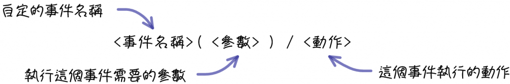
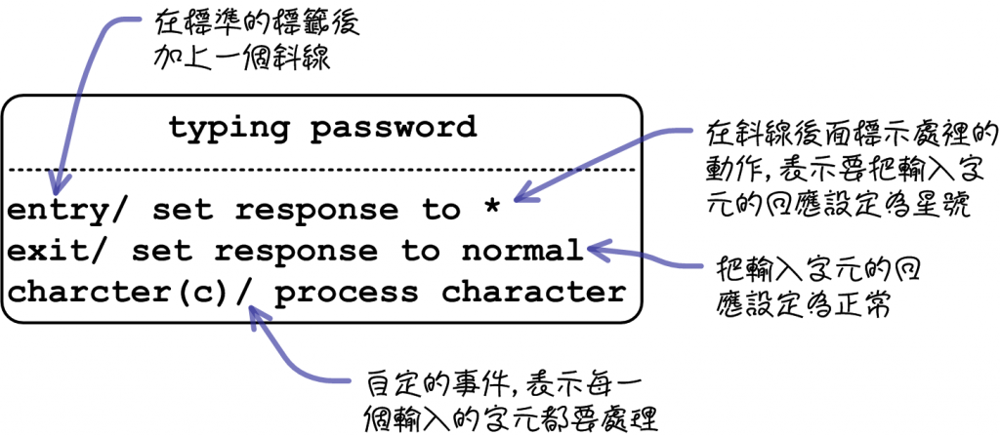
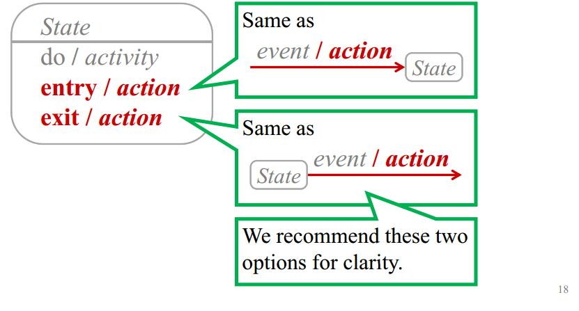
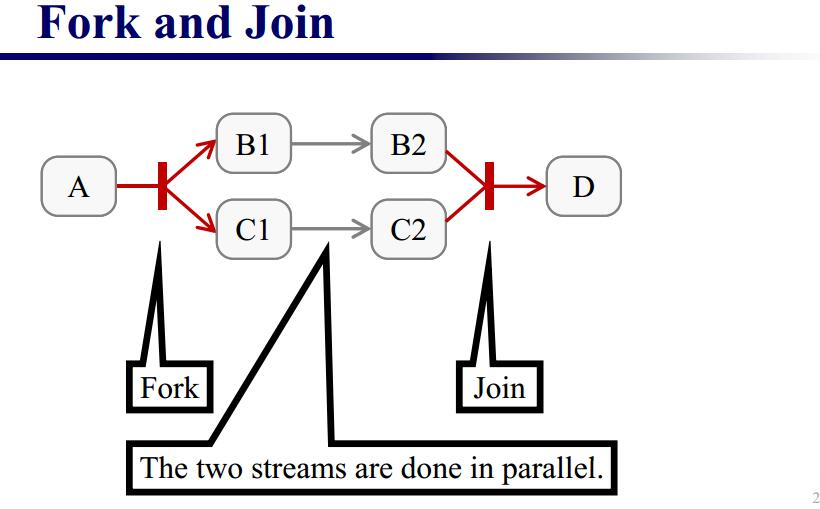
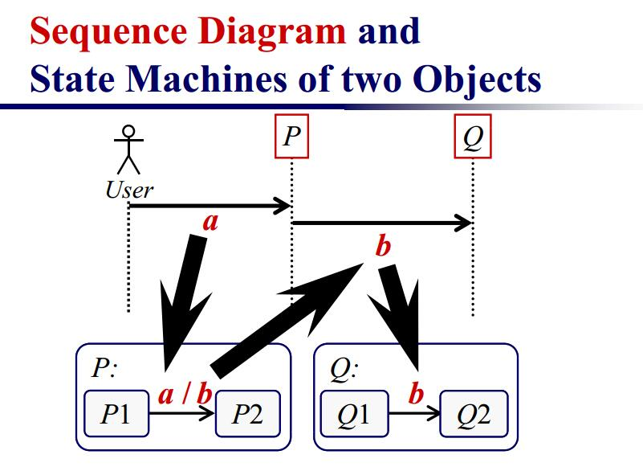
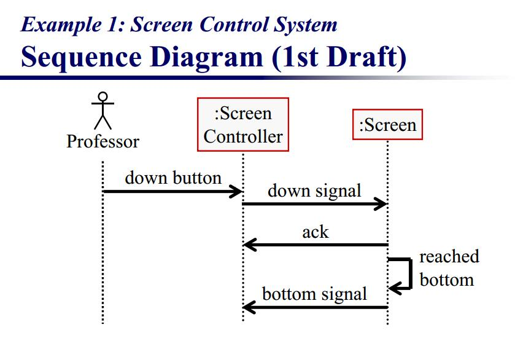
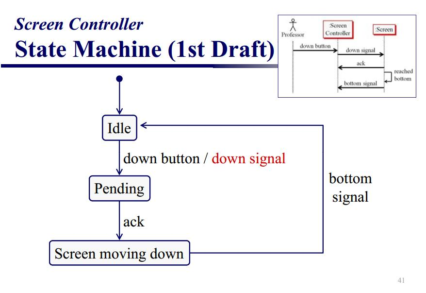
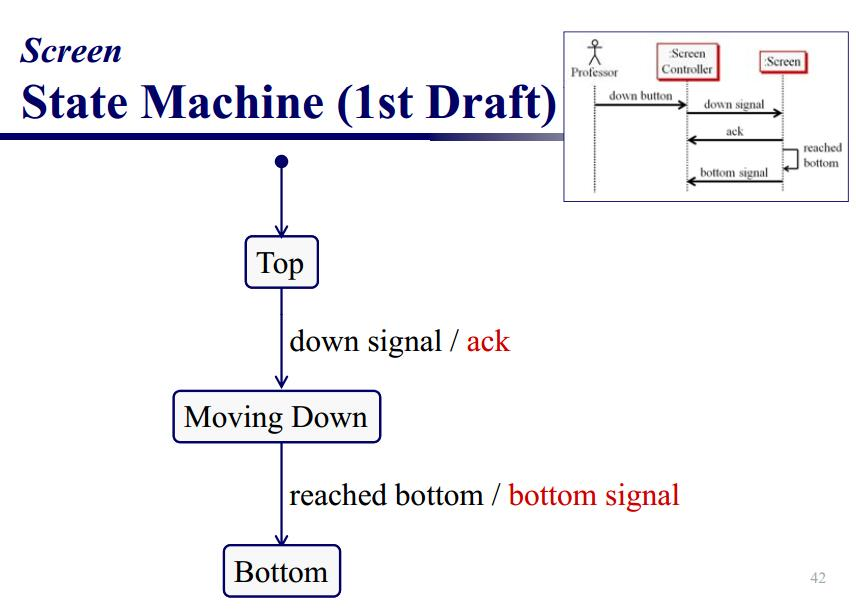

## 状态图(statechart diagram)
UML表示法中，**状态转换图被称为状态机(State Machine)图**。

对象拥有行为和状态。对象的状态是由对象当前的行动和条件决定的。状态图statechart diagram显示出了对象可能的状态以及由状态改变而导致的转移。

我们的模型例图建立了一个银行的在线登录系统。登录过程包括输入合法的密码和个人账号，再提交给系统验证信息。

登录系统可以被划分为四种不重叠的状态：Getting SSN, Getting PIN, Validating, 以及 Rejecting。每个状态都有一套完整的转移transitions来决定状态的顺序。

**状态是用圆角矩形来表示的。转移则是使用带箭头的连线表示。触发转移的事件或者条件写在箭头的旁边,初始状态是小黑圈，终结状态是大白圈里的小黑圈。**。我们的图上有两个自转移。一个是在Getting SSN，另一个则在上Getting PIN。

**事件或条件event and guard**触发**动作activity** 时用（/动作）表示。当进入Validating状态时，对象并不等外部事件触发转移。取而代之，它产生一个 **动作action** 。动作的结果决定了下一步的状态。

### activity label
使用四種標籤來表示從進入到離開狀態節點之間作了哪些動作：

 - entry：進入狀態節點時的動作
 - exit：離開狀態節點時的動作
 - do：停留在這個狀態節點時執行的動作

除了這三種UML規定的標籤外，你可以使用下列的格式定義自己的動作：

正如最上面的例子图一般

上面是个例子，但是要注意，**按照hku老师的说法，不要把这些动作写到状态的里面，要写到状态图，也就是这个圆角矩形的外面，因为人们大都不关注state里面的内容**。

### 组合状态Composite State

#### 入口点
有时，你不想在正常的初始状态进入子状态机。例如下面的子状态机，它通常从"初始化"状态开始，但是如果因为某些原因，它不必执行初始化，可能靠转移到指定的入口点来从 "Ready" 状态开始。

下图显示了状态机的上一层。

#### 出口点
有与入口点相类似的方式，它可能也指定可选择的出口点。下图给出了主处理状态执行后，所执行状态的去向将取决于该状态转移时所使用的路径。

### 并发区fork and join
一个状态可以被分成几个不同的区，包含同时存在和执行的子状态。下面的例子显示状态 "Applying Brakes"， "front brake"和"rear brakes" 将同时独立运作。注意使用了分叉和结合join伪状态而不是选择和合并伪状态。这些符号用来同步并发的线程。

### 选择伪状态
选择伪状态显示为菱形，有一个转移输入，两个或多个输出。下图显示不管到达哪一个状态，经过选择伪状态后的去向，取决于在伪状态中执行时所选择的消息格式。

### 顺序图和状态机图的协作

如何根据顺序图分析状态机图呢？

如上图所示，根据顺序图的知识，User是个actor不是Object，P和Q才是个Object。而state machine的状态图是关于某个具体Object的状态转移。

所以如上图，P和Q应该是两个独立的状态机图。P有未接受a消息的状态和接受了a消息的状态，接受了a消息之后发送了b，到p2.

q则有未接受b和接受后两个状态。

所以要弄清，顺序图是有关多个Object的，状态机图每个是关于一个特定object的状态转移。根据顺序图分析是，根据每个column，也就是life line来写状态机。

#### 实例分析

根据上面的顺序图，分析出对应的状态机图。场景便是，我按下一个down按钮，控制器发出down信号，screen接受到以后先发出一个确认说明接受到信号了，然后执行了down操作后再返回个bottom信号说明到达底部，完成了down信号。

