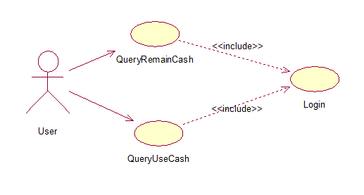
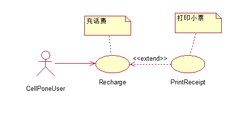

### 用例图(Use case diagram)
用例图描述了系统提供的一个功能单元。用例图的主要目的是帮助开发团队以一种可视化的方式理解系统的功能需求

也就是说用例图Use case diagrams描述了作为一个外部的观察者的视角对系统的印象。强调这个系统是什么而不是这个系统怎么工作。

用例图与**情节(Scenario)** 紧紧相关的。**情节scenario**是指当某个**角色actor**与系统进行互动时发生的情况。下面是一个医院门诊部的情节。

“一个病人打电话给门诊部预约一年一次的身体检查。接待员找出在预约记录本上找出最近的没有预约过的时间，并记上那个时间的预约记录。”

**用例Use case是为了完成一个工作或者达到一个目的的一系列情节的总和**。 **角色actor**是发动与这个工作有关的事件的人或者事情。角色简单的扮演着人或者对象的作用。

下面的图是一个门诊部Make Appointment用例。角色是病人。角色与用例的联系是通讯联系communication association（或简称通讯communication）

actor Patient完成一个Make Appointement功能的用例图

**角色是人状的图标(角色可以是人、也可以是物。)，用例是一个椭圆，通讯是连接角色和用例的线。**

下面是几种常用来确定系统角色的方法:
1. 直接使用系统的人
2. 系统的维护人员
3. 从系统被动接受信息的人
4. 系统使用的外设
5. 需要与此系统相连的其它系统

而**一个用例图是角色，用例，和它们之间的联系的集合**。我们已经把Make Appointment作为一个含有四个角色和四个用例的图的一部分。注意一个单独的用例可以有多个角色。

即可知一个用例(Use case),包含了一系列情景。

#### 包含关系（include）

此图中用户在查询余额和查询使用金额之前都要先登录系统，登录系统（Login）是在完成其他基本用例时必须要执行的一个**子过程**，这一用例的粒度相对较细。**子功能级的用例常用来被其它用例包含（include）**、细化（refine）其他用例。

#### 扩展关系（extend）
扩展关系用一个虚箭头外加版型《extend》表示，由扩展用例指向被扩展用例

扩展用例是可选的，包含用例是必选的，如上图所示：手机用户在用自动缴费机充值之后，可以打印小票，也可以不打印，这完全取决于用户的意愿，并不是必须要执行的。

扩展关系可以基于以下理由

1. 表明用例的某一部分是可选的系统行为，这样就可以将用例图中的可选行为和必选行为分开。
2. 表明只在特定条件下才执行的特定分支用例
3. 表明多个基本用例中都有可能触发的某个可选用例

### 作用

用例图在三个领域很有作用。

 - 决定特征（需求）。当系统已经分析好并且设计成型时，新的用例产生新的需求
 - 客户通讯。使用用例图很容易表示开发者与客户之间的联系。
 - 产生测试用例。一个用例的情节可能产生这些情节的一批测试用例。
