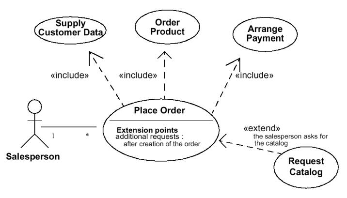
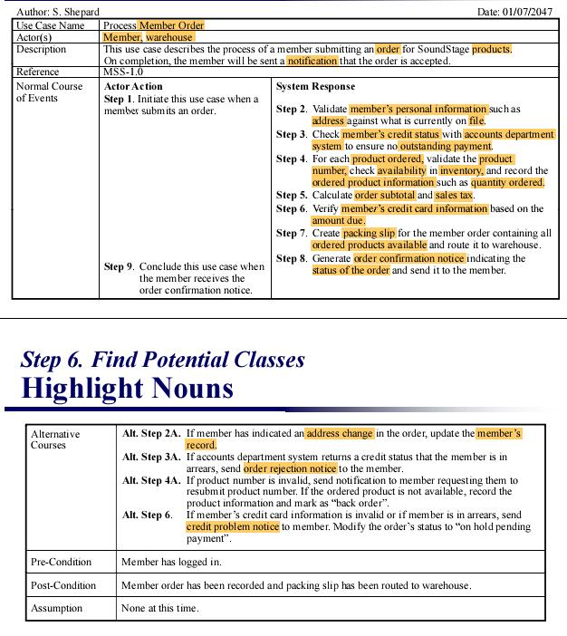
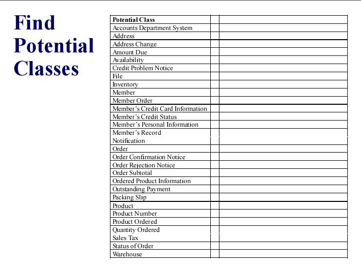
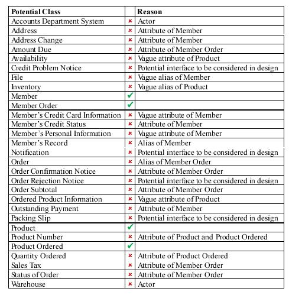
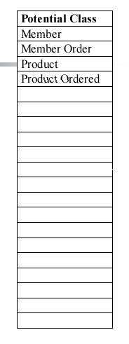

## 业务类分析

根据COMP7201 UML课程，根据面向对象分析技术设计类模型的时候分成7步走，从情景中设计出合适的类结构模型。

如上图

### step1 Identify Actors and Use Cases

第一步，先根据需求，找出Actors和Use Cases

也就是根据给出的需求情景，抽出Actor和UseCase。

比如以下example

User requirements for a bank account system are as follows:

*First, customers log in to the system.  Then they select debit or credit, followed by the transaction amount.  If it is a debit and the transaction amount is more than the balance, reject the transaction.  Otherwise, process the transaction.*

抽象出需求中的情景，找出actors和Use Case，构造出下面表格

向上图一样构建出表格，这就是步骤1.

### Step 2. Construct a use case diagram

步骤2，构建用例图。

继续拿步骤1中的需求做例子。

也就是构建出如上的用例图模型。

### Step 3. For each use case, document normal course

对于每一个use case,把**常规normal**过程文档化。

依旧沿用上面的例子

文档化之后是上图表格，前三行是步骤1中的表格属性，重要的是noraml course of events。将use case分成许多常规步骤，一一具体描述，并且分为Actor Action和System Response。

注意上表格的pre-condition(前置条件)那一栏。这里的条件是指以上操作，存在前置条件。比如是用户是否已经log in等。

同理，也有post-condition(后置条件),比如用户的order是否已经进行了recorded。

#### step4 Document Alternative Courses of Events

对于每一个use case,把**可选Alternative**过程文档化。

这个过程其实已经体现在了step3的表格当中了，注意表格中有Alternative Course(s)，这一栏中阐述了一些Noraml Course中出现情况的具体细节。

#### step5 Identify Any Use Case Relationships

这一步骤用以完善use case的各种关系。比如extend还是include，还有继承关系等。

如上图所示完善用例图

#### step6 Find Potential Classes
根据用例图，找出潜在的类，进行Class diagram的设计。

方法就是提取关键词，比如把**名词nouns**都提取出来，看是否有对应相应的**实体entity**。

如上图所示，把之前表格中的noun都highlight。

最后提取出，找到潜在的类。

#### step7 Select Proposed Classes

接上，筛选出合适的类

如图所示。

完成以上7步以后，就可以根据筛选出的类，完成的类设计了。
