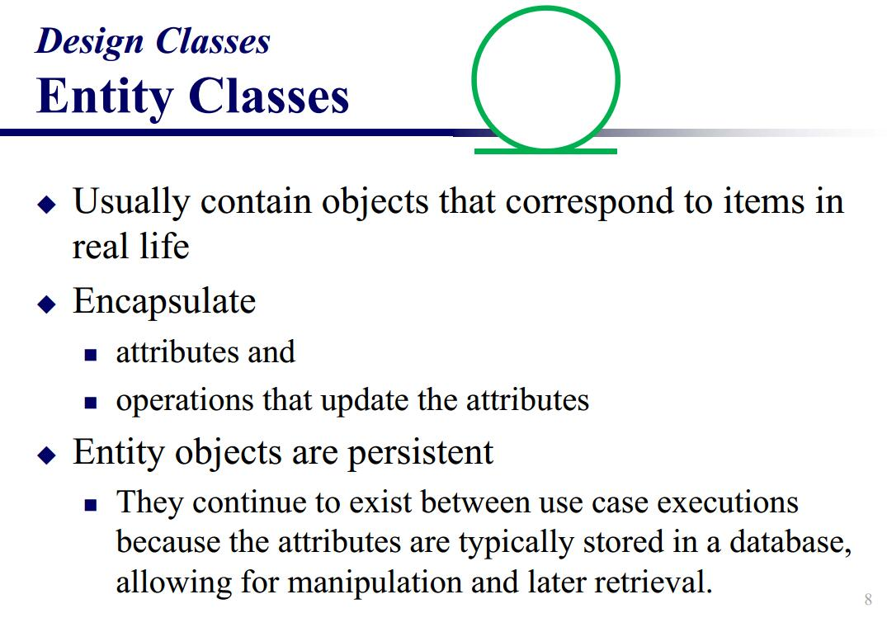
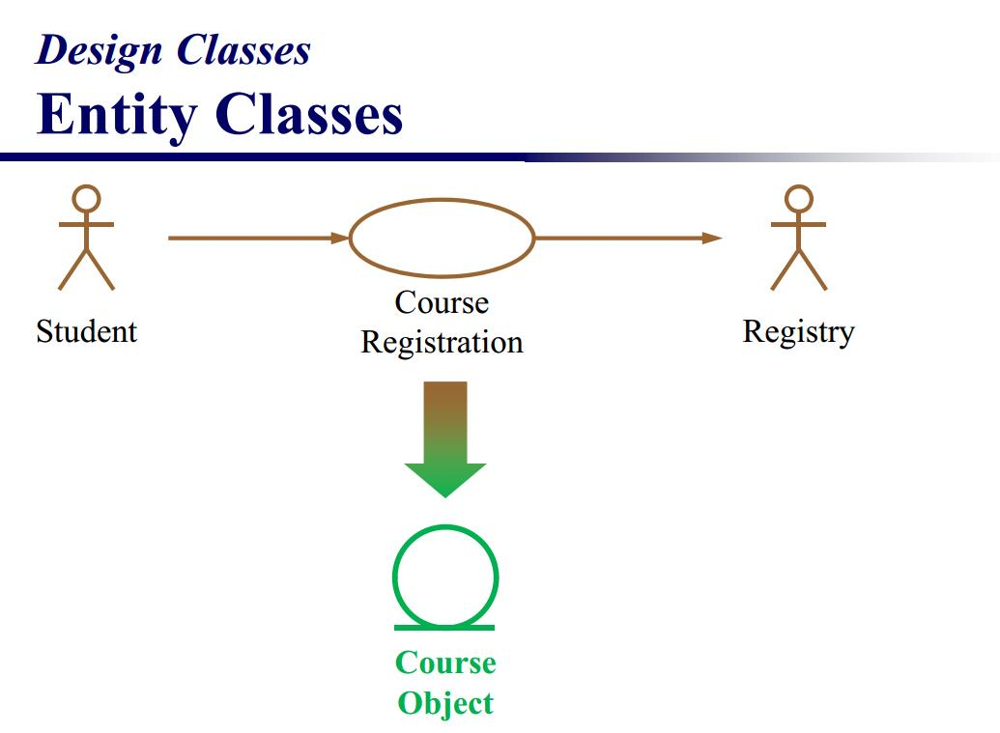
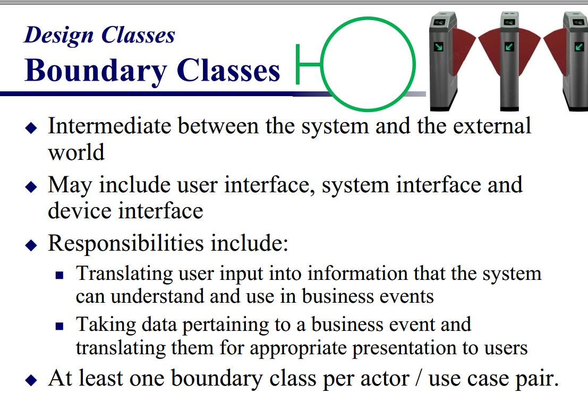
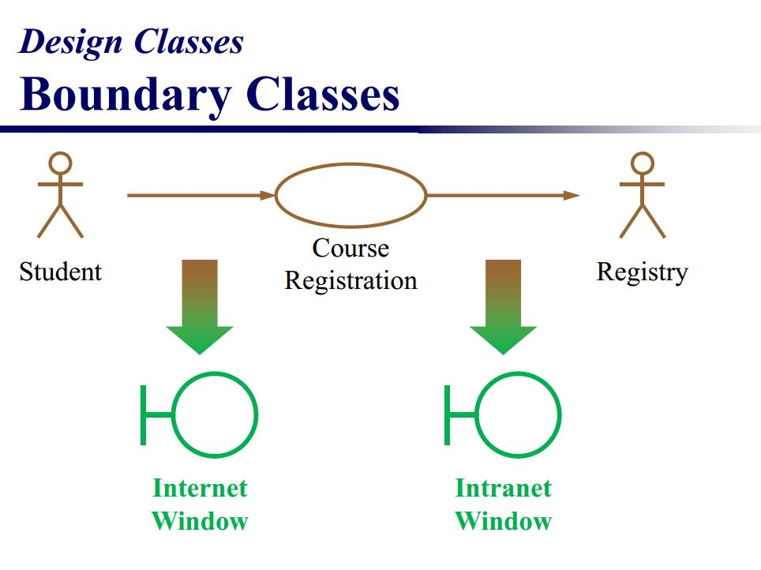
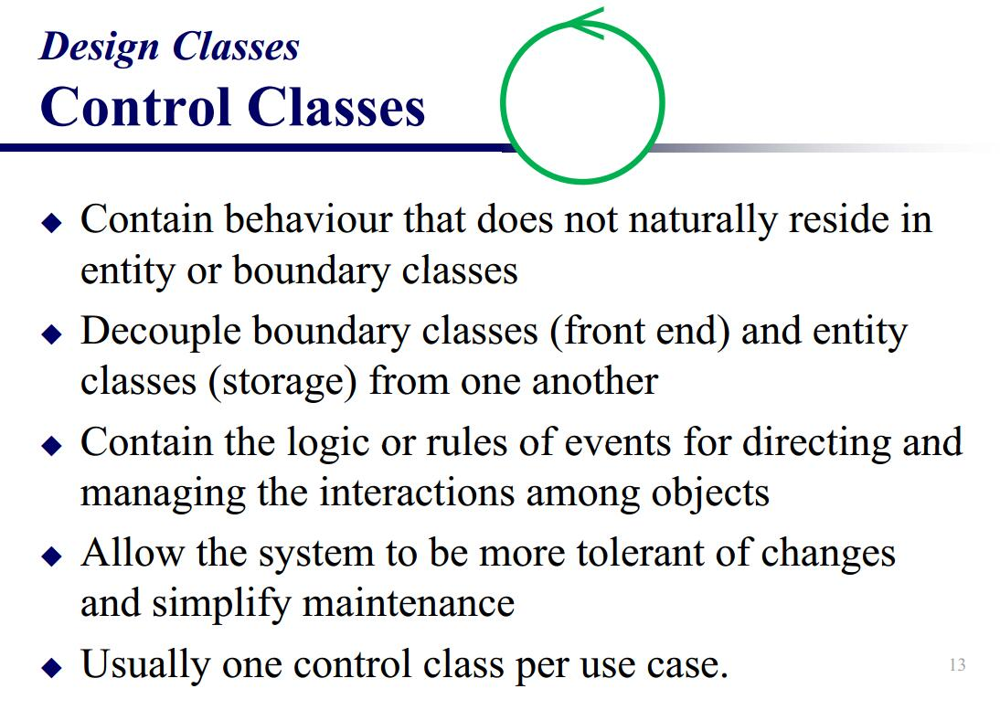
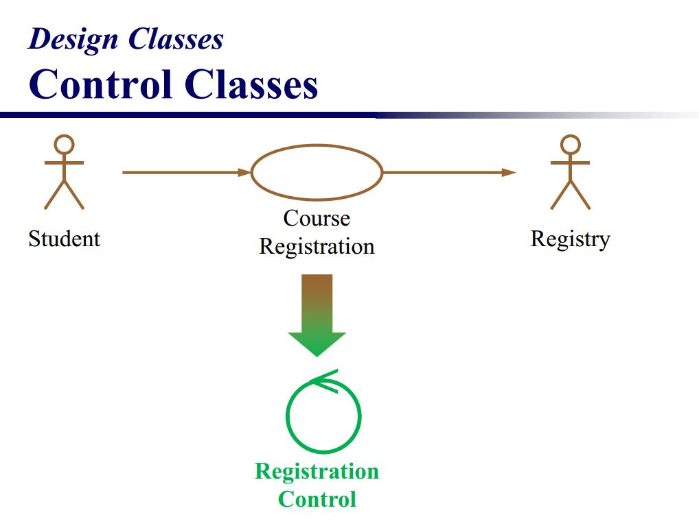
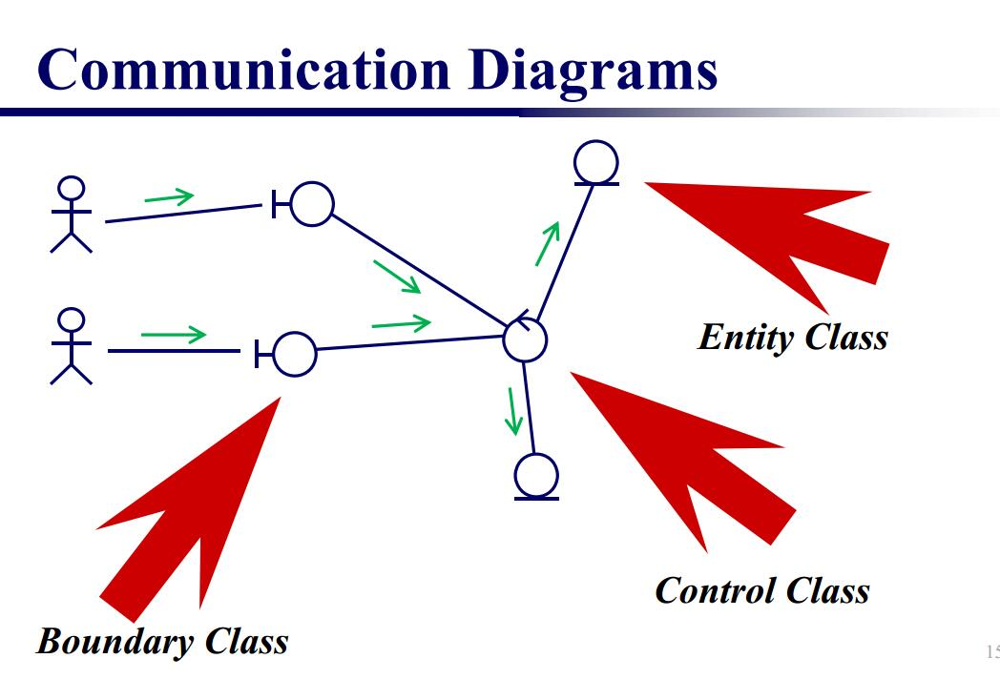

## 面向对象设计
如何利用UML进行面向对象设计很重要。

### 类设计

我们将类分为3中(有点像MVC)

 - Entity Class(实体类)
 - Control Class(控制类)
 - Boundary Class(边界类)

### Entity Class(实体类)

如上图，实体类用下划线绿圆表示。类用来封装属性，并且具有更新属性的操作。(有点像model)

### Boundary Class(边界类)

左划线圆表示边界类。

边界类用来表示系统和外部的交互，实质上就是用户界面的操作，用来连接actor和use case。(有点像View)

### Control Class(控制类)

一个loop绿圈表示控制类

用来控制流程，封装事件的逻辑，管理数据流。一般来说，一个use case匹配一个控制类。(有点像controller)

### 通信图概览

用通信图表示几种类的作用一目了然。
