## 顺序图(Sequence diagram)

顺序图将交互关系表示为一个二维图。纵向是时间轴，时间沿竖线向下延伸。横向轴代表了在协作中各独立对象的类元角色。类元角色用生命线(lifeline)表示,生命线也就是垂直虚线。

每条生命线也可以使用双实线表示**对象正在执行**的时间。

下面是个复杂点的示例

有几个概念也需要弄清

### 控制焦点（Focus of Control）
控制焦点是顺序图中表示时间段的符号，在这个时间段内对象将执行相应的操作。用小矩形表示，如下图。

### 消息（Message）
通俗的说，上面序列图里那些生命线之间指向的线和箭头就是消息Message。

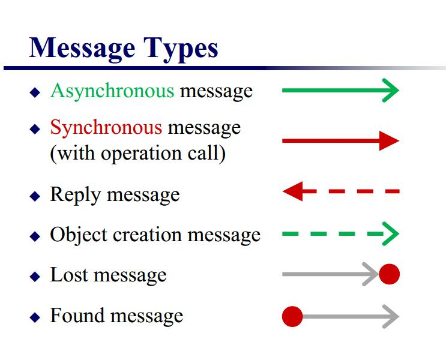

简单的消息一般分为**同步消息Synchronous Message**，**异步消息Asynchronous Message** 和**返回消息Return Message**.如下图所示

#### 同步消息=调用消息（Synchronous Message）
消息的发送者把控制传递给消息的接收者，然后**停止活动，等待消息的接收者放弃或者返回控制**。用来表示同步的意义。**箭头是实心的**。

#### 异步消息（Asynchronous Message）
消息发送者通过消息把信号传递给消息的接收者，然后继续自己的活动，不等待接受者返回消息或者控制。异步消息的接收者和发送者是并发工作的。**普通箭头**。

#### 返回消息（Return Message）
返回消息表示从过程调用返回。**箭头用虚线**。

#### 无触发对象和无接收对象的消息
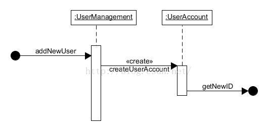

如上图

**无触发对象消息-Found Message**：用活动条开始断点上的**实心球箭头**来表示。（用在开始）

**无接收对象消息-lost message**：用**箭头加实心球表示**。（用在结束）

#### Object creation message
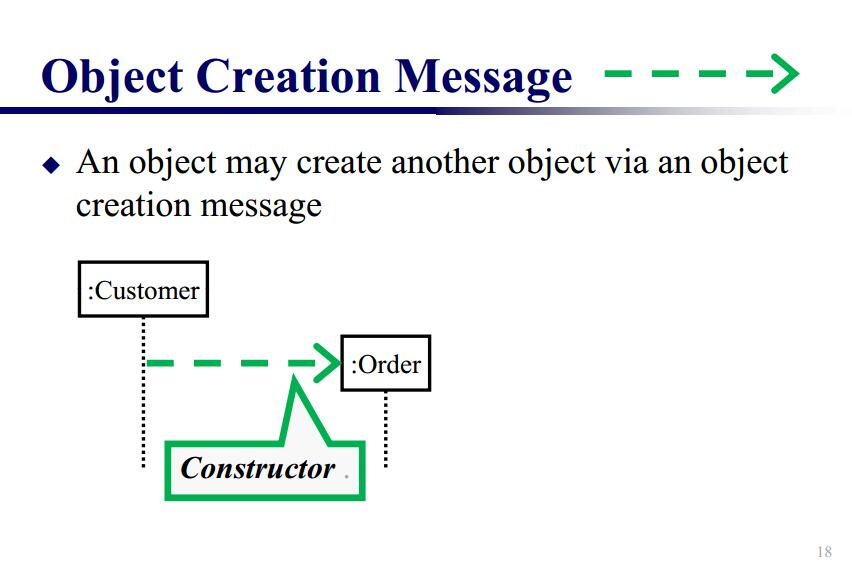

顾名思义，用来作为constructor创建一个对象。

### 复合片段(Combined Fragments)

复合片段用来进行流程控制。

#### Altemative fragment
(denoted “**alt**”)与 if…then…else对应

这种片段也简称alt。用来做if else条件判断

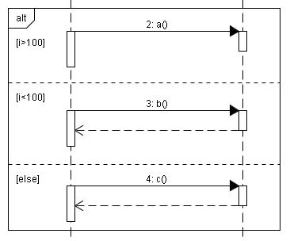

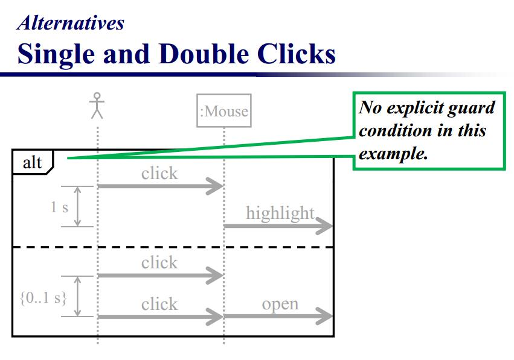

#### Option fragment
denoted “opt”与Switch对应

这种片段也简称opt，他是一种特殊的条件判断，没有else或者else if。

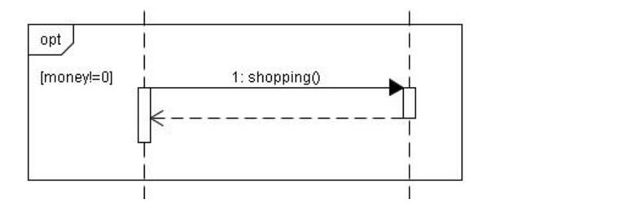

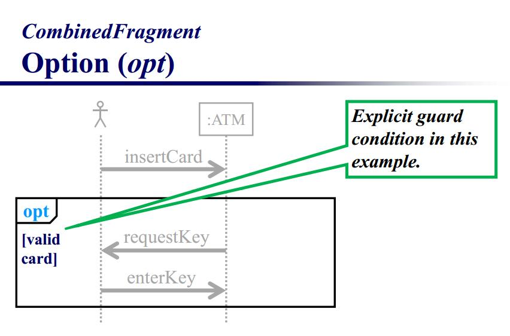

#### Parallel fragment
(denoted “**par**”)表示同时发生

同步，用于描述多线程

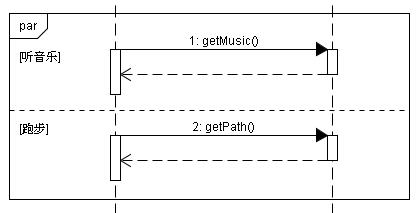

#### Loop fragment

(denoted “**loop**”)与for或foreach对应

也就是循环

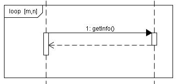

上图即是最少循环m次，最多循环n次。

#### Critical Region
表示在此片段中的訊息**不得與其他訊息交錯**。

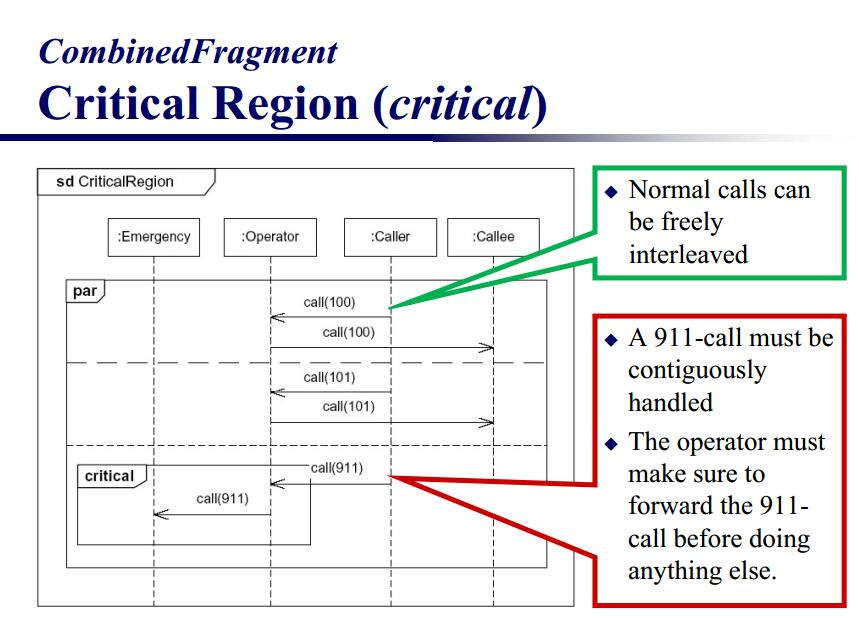

#### Reference
表示參考另一個互動循序圖，屬於Interaction Use範疇。

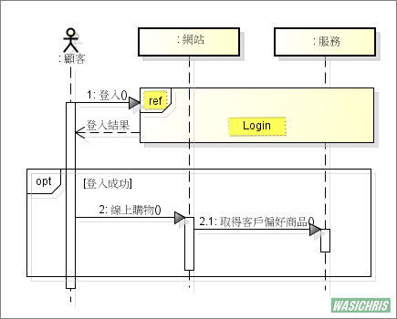

以下是被參考到的Login互動循序圖，所有登入細節統一由此進行細節說明。

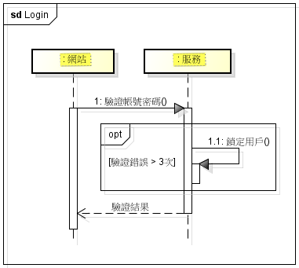
