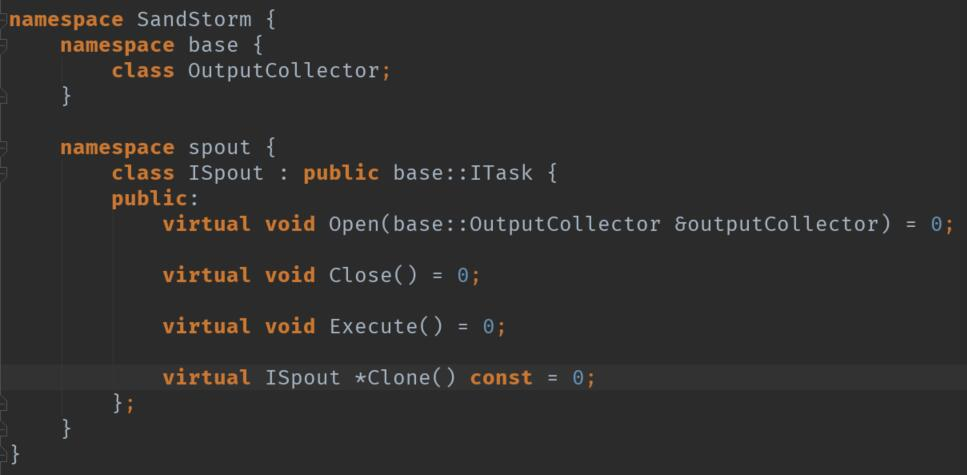
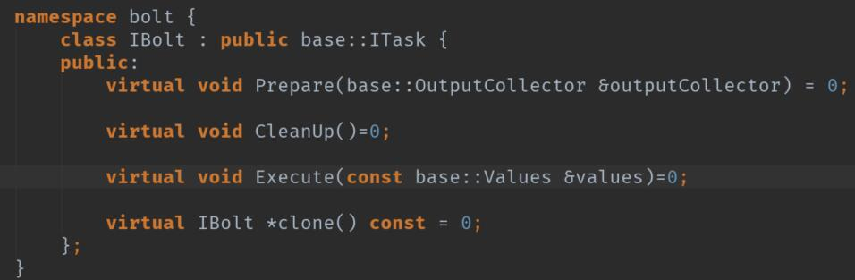

## 接口设计
接口文件都位于目录 include/main/SandStorm下
### 任务接口ITask
位于include/.../base下

简单的接口，内部只有一个虚析构函数和一个DeclareFields方法，该方法会返回一个Fields变量，Fields实际上是`typedef std::vector<std::string> Fields`,一个字符串容器的别名，这个方法用来声明任务的字段名。

### 消息源接口ISpout设计
消息源的作用是产生消息，将元祖发送到拓扑结构中。建立计算拓扑中的流。每个消息源都会创建出一个自己的流。



一个消息源是一个ITask的实例，是一个具体的任务，消息源定义在spout命名空间当中。

 - Open方法用来打开一个消息源，并将一个数据处收集器OutputCollector传递给该方法，数据收集器负责收集数据并将数据传到其他Bolt节点。

 - Close函数用来关闭消息源，拓扑结构停止时会被调用。

 - Execute方法很重要，任务执行器会不断执行此任务，并通过该任务不断向拓扑结构中输入数据。 **所以消息源是拓扑结构中数据流的起点**

 - Clone方法用于在堆上产生对象自身的一份副本，并将复制后的指针返回。用于复制生成任务。

### IBolt消息处理单元接口
IBolt用于接收上一个任务发来的消息，并将对象进行处理加工，然后发送给下一个处理器。



 - Prepare方法用于初始化任务，在任务的生命周期中只会被调用一次。
 - CleanUp在任务停止时对任务进行资源清理。整个任务声明周期只会被调用一次。
 - Execute方法，会被不断执行，和ISpout消息源主动不断执行不同的是，这里的Execute方法是被动执行。有数据流来了才执行，否则被阻塞。
 - Clone函数则用于复制拷贝任务。

### OutputCollector数据收集器接口设计
定义在SandStorm::base命名空间之下，为SandStorm的基础类。

内部定义了一个Strategy结构体,包含一个名为Values的枚举类型，其中的三个字段为发送策略:Global,Random,Group:

1. 第一种策略Global,全局发送策略，在数据收集器初始化的时候就固定向一个bolt发送数据，并且整个拓扑运行中不会改变。
2. 第二种策略是Random,随机发送，这种策略会在每次发送的时候都从合法的下一批节点中随机选择一个并发送到该数据处理单元。但是由于每一次都要和中心节点通信来获得下一个消息处理单元的位置，所以 **效率相对于第一种策略Global较低**。
3. 第三种策略是Group,分组发送策略，这种策略会预先指定一个字段，在发送数据时每次都会将与字段相同的数据发送到某个固定的数据处理单元中。这种策略在第一次发送数据的时候回向集群中央节点请求获取发送目标的位置，确定后不再请求，对性能影响不大。

#### 构造函数
OutputCollector的构造函数有两个参数，第一个参数scr是一个字符串，代表来源任务的名称，即可能是一个Spout的名称或Bolt的名称。第二个参数是一个int代表所选策略。

#### Emit函数
作用是发送一个元组Values，具体实现会根据数据收集器的发送策略来发送。

#### setCommander函数
作用是设置一个 **命令执行器**，命令执行器的作用是与网络上其他节点进行通信。

#### setTaskIndex函数
是该数据处理器发送元组数据时目的地的编号，由于一个Manager会管理多个任务，而Commander只关联到某个Manager节点，并不知道数据会分发给哪个任务，所以必须通过TaskIndex来定位。**Manager和taskIndex就像是主机名和端口号，来决定发送的目标任务**。

#### setGroupField函数
给分组策略使用，分组策略根据这个整数将数据发送到某个固定的数据处理单元。GroupField是任务定义中的字段，这个字段编号结合字段列表就可以确定是哪一个字段。

#### GetGroupField函数
获取分组编号。

#### RandomDestination函数
纯虚函数，在随机策略中实现随机选择目的消息处理单元的功能，如何实现交给数据收集器的子类来决定。

#### GroupDestination函数
纯虚函数，用来根据字段选择元组的目标消息处理单元Bolt。

#### 成员变量
 - \_src发送源的名称
 - \_strategy策略编号
 - \_taskIndex目标任务编号
 - \_commander 命令发送器，默认为空指针
 - \_groupField 用在分组策略中，指定了分组使用的字段编号。

### 元组接口设计
元组是有序数据集合，在节点之间传递，该如何表示呢？


参见Values代码。

#### TypeMismatchException类
我们定义了一个异常类继承exception类，在我们数据类型不匹配的时候将会抛出这个异常。这个类重写了what方法用来返回消息。

#### Value接口
我们先定义了一个Value接口，Value代表一个单一数据。显然这个单一数据可以为任意数据类型，我们决定采用Union联合来表示数据的值。创建了一个Type枚举类的变量，来指示该value的类型。

Type枚举类定义了9个类型：
 - Boolean
 - Character
 - Int8
 - Int16
 - Int32
 - Float
 - Double
 - String

联合体InnerValue类型包含了以上类型的成员。string被单独移出来，因为string是复杂对象，不利于Union的省空间构建，更具备可移植性。

#### Values类
values就是元组，本质上就是一堆value的集合，表示出来就是vector<Value>,也就是说元组是一组Value的容器(向量类)。Values类继承了vector<Value>.

其中有一个默认构造函数，接收一个initialize_list变长初始化列表来进行初始化。使用初始化列表以后，我们可以用语法糖一样的形式定义Values变量。

``` c++
auto values = {10,'hello',1.35};
```


重载了索引操作符\[\]，使其跟vector的操作一致。
