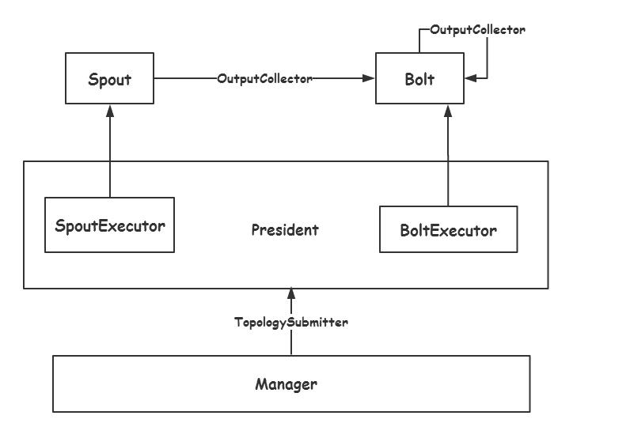
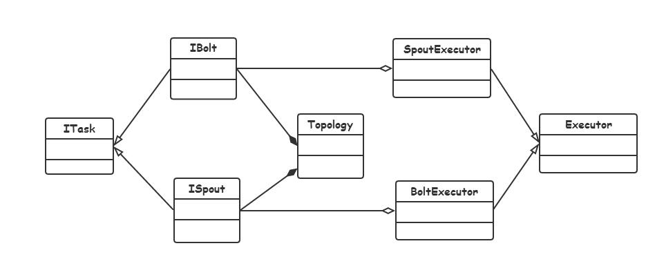

## 总体架构(简)

总体架构如图所示

 - Spout是消息源，拓扑结构中所有的数据都来自消息源，**其也是Topology(拓扑结构中)消息流的源头。**

 - Bolt是消息处理单元，负责接收来自消息源或者数据处理单元的数据流，并对数据进行逻辑处理，然后转发到下一个消息处理单元，基本 **封装了所有数据处理逻辑**。

 - SpoutExecutor是个线程，是所有消息源的执行者，每一个执行者负责执行一个消息源。

 - BoltExecutor也是一个线程，消息处理单元的执行者，负责执行一个消息处理单元。

 - SpoutExecutor会永不停息的运行，而BoltExecutor则会等到数据到来才启动。

 - Manager是单个节点任务的管理者，负责创建执行器对象，与中心节点通信，接收其他节点的数据并分发到Bolt当中。

 - President是整个集群的中心节点，负责收集用户的请求，并将用户定义的拓扑结果发送给正在运行的其他各Manager，同时也通过向各Manager收集信息，了解各节点的执行情况，同时为每个Executor分配对应的任务。

### 类图设计

基本的类图设计如图：

ITask是抽象任务接口，IBolt和ISpout是分布式消息处理单元和消息源。Topology是整体，由多个Bolt和Spout组成。右侧是执行器Executor。

整个系统的核心在于如何构建任务，并将任务分配到多个节点上同时运行
