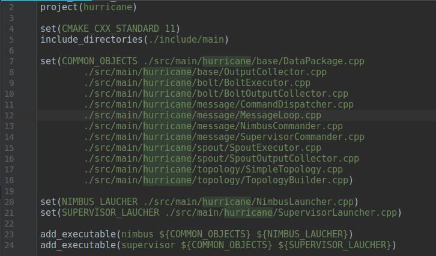

## 项目编译
项目结构参考hurricane，而hurricane是使用make进行编译的。我们希望用clion来完成SandStorm项目，而Clion使用cmake，所以我们需要书写相应的cmake。

根据hurricane的makefile规则，我们知道make默认伪命令all，指示生成两个可执行文件nimbus和supervisor。接下来也会有相应的指令来编译nimbus和supervisor。

nimbus和supervisor都依赖一系列目标文件，就是make中定义COMMON_OBJECTS变量对应的目标文件，另外nimbus和supervisor自身也有对应的cpp文件。

显然make文件的编译其实不好完成，因为要逐个编译每个目标文件，并且还要手动指定编译这个目标文件需要的头文件位置。

假如转写成cmake的话，就简洁多了。

make和cmake的对比可见相关笔记，如上图，改写的是hurricane的项目文件。我们这里用include_directories来设置头文件目录，这样在编译的时候如果需要头文件，那就会自动去这个目录里找头文件。

然后设置变量COMMON_OBJECTS,这里跟make设置类似，手动把需要编译成目标文件的cpp文件列出来并赋予变量COMMON_OBJECTS

最后再设置NIMBUS_LAUCHER 和 SUPERVISOR_LAUCHER,变量对应源文件。

最后add_executable就是设定最后编译连接后的可执行文件，分别有两个，一个是nimbus,需要的源文件是COMMON OBJECT和NIMBUS_LAUCHER.其次是supervisor。

这样一来，Clion用cmake编译以后，在cmake-build-debug中则会有nimbus和supervisor两个可执行文件。
