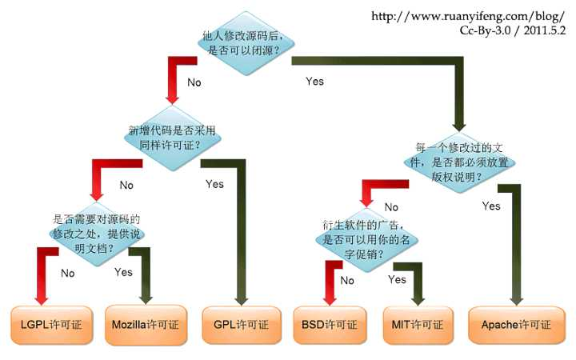

## 开源许可
授权协议就是授予你使用或修改软件等权利，由于软件受到著作权保护，未经授权使用即是侵犯著作权，属于违法行为，所以同意或签署软件授权协议是你使用或修改软件的前提条件。

开源协议当然分权利和义务。

**开源软件的授权协议必须包含的权利是软件源代码的修改、演绎权，否则不是开源软件。** 所以各大协议主要是在义务上各有区别，譬如说GPL协议要求，基于该软件开发的任何软件，都必须以GPL协议发布，这也就是 **开源感染**。**也就是说你要用这个开源软件，就必须把你自己的软件变成开源的**。

开源协议的大致区别如下图

#### Apache License
Apache License（Apache许可证），是 **Apache软件基金会发布的一个自由软件许可证。**

义务：

 - 需要给代码的用户一份Apache Licence。
 - **如果修改了代码，需要再被修改的文件中说明。**
 - **在衍生的代码中（修改和有源代码衍生的代码中）需要带有原来代码中的协议，商标，专利声明和其他原来作者规定需要包含的说明。**
 - 如果再发布的产品中包含一个Notice文件，则在Notice文件中需要带有Apache Licence。你可以再Notice中增加自己的许可，但是不可以表现为对Apache Licence构成更改。
 - Apache Licence也是对商业应用又好的许可。使用者也可以再需要的时候修改代码来满足并作为开源或商业产品发布/销售。

### BSD
BSD是"Berkeley Software Distribution"的缩写，意思是"伯克利软件发行版"。

义务：

1. 如果再发布的产品中包含源代码，则在源代码中必须带有原来代码中的BSD协议。
2. 如果再发布的只是二进制类库/软件，**则需要在类库/软件的文档和版权声明中包含原来代码中的BSD协议**。
3. 不可以用开源代码的作者/机构名字和原来产品的名字做市场推广。

很多的公司企业在选用开源产品的时候都首选BSD协议，因为可以完全控制这些第三方的代码，在必要的时候可以修改或者二次开发。

### GPL
GPL （GNU General Public License） ：GNU通用公共许可协议。

**Linux 采用了 GPL。**

GPL的出发点是代码的开源/免费使用和引用/修改/衍生代码的开源/免费使用，但 **不允许修改后和衍生的代码做为闭源的商业软件发布和销售**。这也就是为什么我们能用免费的各种linux，包括商业公司的linux和linux上各种各样的由个人，组织，以及商业软件公司开发的免费软件了。

### LGPL
LGPL允许商业软件通过类库引用(link)方式使用LGPL类库而不需要开源商业软件的代码。这使得采用LGPL协议的开源代码可以被商业软件作为类库引用并发布和销售。

但是如果修改LGPL协议的代码或者衍生，则所有修改的代码，涉及修改部分的额外代码和衍生的代码都必须采用LGPL协议。因此LGPL协议的开源代码很适合作为第三方类库被商业软件引用，但不适合希望以LGPL协议代码为基础，通过修改和衍生的方式做二次开发的商业软件采用。

### MIT
MIT是和BSD一样宽范的许可协议,源自麻省理工学院（Massachusetts Institute of Technology, MIT），又称X11协议。

MIT与BSD类似，但是比BSD协议更加宽松，是目前最少限制的协议。这个协议唯一的条件就是在修改后的代码或者发行包包含原作者的许可信息。适用商业软件。使用MIT的软件项目有：**jquery、Node.js**。
