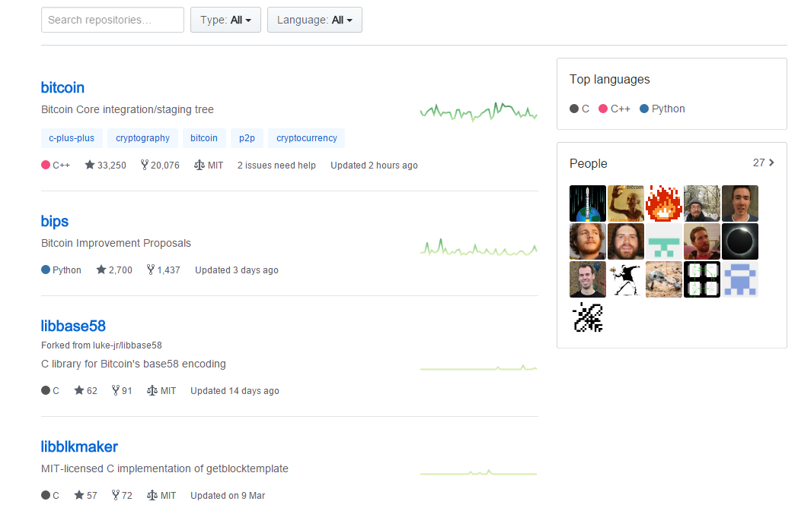
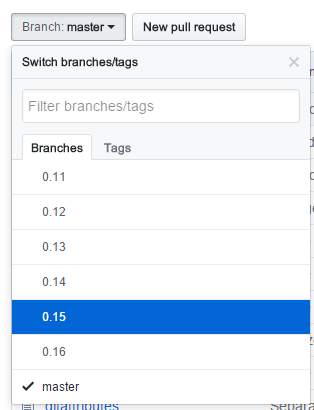
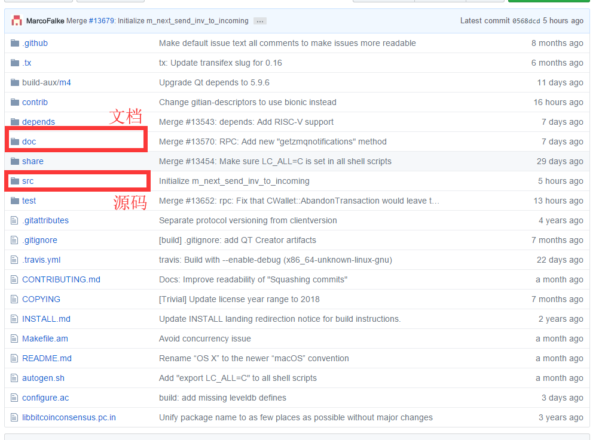
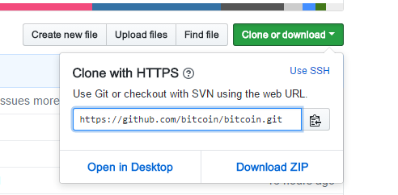
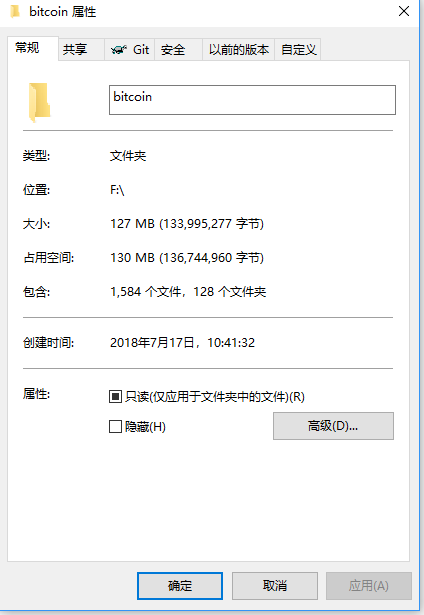
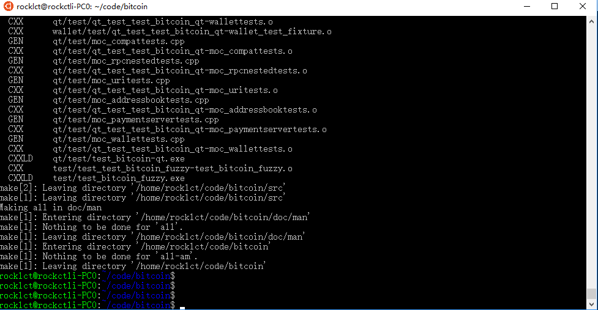
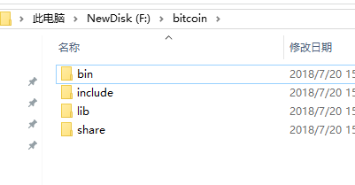
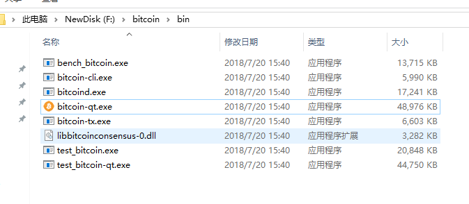
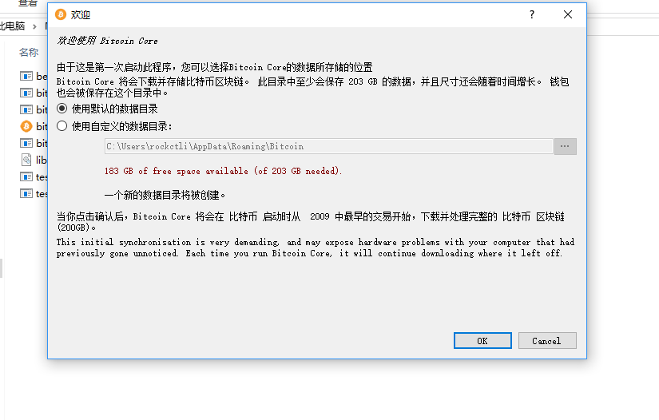

## 初探bitcoin项目
开始学习比特币，当然离不开这本书：[精通比特币第二版](http://book.8btc.com/books/6/masterbitcoin2cn/_book/second_edition_changes.html).

接下来，我们将从github上的源码入手，来尝试理解清楚比特币的结构。


首先在github上的bitcoin目录里:[bitcoin目录](https://github.com/bitcoin)



可以看到有四个项目：

 - bitcoin 比特币核心源代码 C++
 - bips 有关比特币改进建议的相关文档
 - libbase58 比特币base58编解码库 C
 - libblkmaker 比特币区块模板库 C

我们重点需要关注的当然是比特币核心源码bitcoin

关注代码，可以快速关注下几个关键部分：
#### branch
一个是分支branch，这里可以看到项目的分支版本。目前已经到0.16了



#### 目录结构


重点可以关注doc目录文档，src目录源码。

我们想要运行编译bitcoin项目，必然要从doc目录入手，一步一个脚印开始bitcoin之旅。

### 开始动手
对于比特币项目，我们第一件要做的事情，就是编译源代码！只有build了源代码，我们才有可执行文件来运行看效果。

所以第一件事，我们先要从git把代码拉下来。



把bitcoin项目clone下来。

克隆下来后看到截止到现在20180717，比特币源码目录大小为130MB左右



#### WSL上编译代码
打开doc下的build-windows.md文档，我们跟着教程来走。

一点需要注意的是，在build-windows文档下，**wsl的版本是ubuntu1804**，所以安装的时候千万不要搞错装成了16，否则可能有问题。

在wsl下完成以下操作

First, install the general dependencies:

```
sudo apt update
sudo apt upgrade
sudo apt install build-essential libtool autotools-dev automake pkg-config bsdmainutils curl git

sudo apt install g++-mingw-w64-x86-64
sudo update-alternatives --config x86_64-w64-mingw32-g++ # Set the default mingw32 g++ compiler option to posix.
```

执行完上面流程后，我们必须把代码放到bash的目录下，比如说，不能是/mnt/f这样的地方，一定要是unix的目录级别。这意味着，我们不能用软连接去连接win文件系统的东西了，我们要重新git一份比较好。

然后进入代码目录，执行下面操作：

```
PATH=$(echo "$PATH" | sed -e 's/:\/mnt.*//g') # strip out problematic Windows %PATH% imported var
cd depends
make HOST=x86_64-w64-mingw32
cd ..
./autogen.sh # not required when building from tarball
CONFIG_SITE=$PWD/depends/x86_64-w64-mingw32/share/config.site ./configure --prefix=/
make
```

我们按照步骤，进入到depends目录执行make HOST=x86_64-w64-mingw32,这里会消耗很长一段时间，而且容易出错，要注意，记得确保WSL Ubuntu版本在1804。

依赖都安装完以后，按顺序执行命令，最后make，等待一段时间以后就make好啦！



接下来我们可以用make install来安装

```
make install DESTDIR=/mnt/f/bitcoin
```

接着我们就可以看到比特币编译后的可执行文件被安装到对应目录



### 可执行文件
编译完以后，可以在bin目录里，看到几个可执行文件。



#### bitcoin-qt



bitcoin-qt是比特币的图形界面客户端，第一次启动会要让你同步节点，可以看到现在已经要大约200+G了。

#### bitcoind
源码分析的重点，是bitcoin的简洁命令行版。

#### bitcoin-cli
Bitcoind的一个功能完备的RPC客户端，可以通过它在命令行查询某个区块信息，交易信息等

#### bitcoin-tx
/src/bitcoind 比特币交易处理模块，可以进行交易的查询和创建

### 参考
[比特币源码研读](https://juejin.im/post/5ae0722e6fb9a07aa047ad88)
