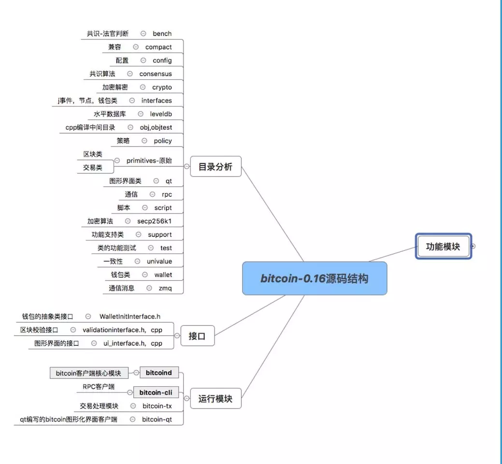
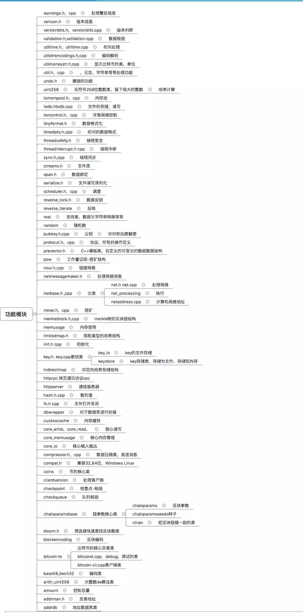
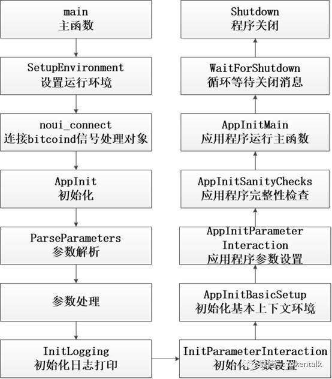
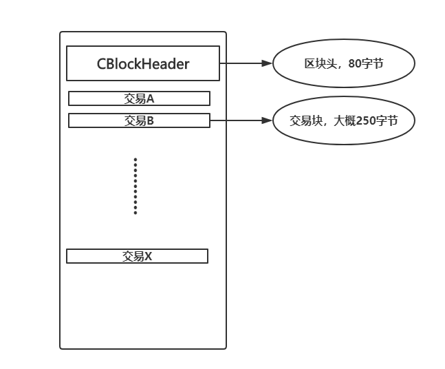
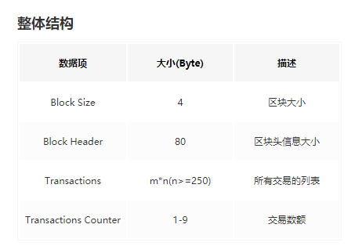
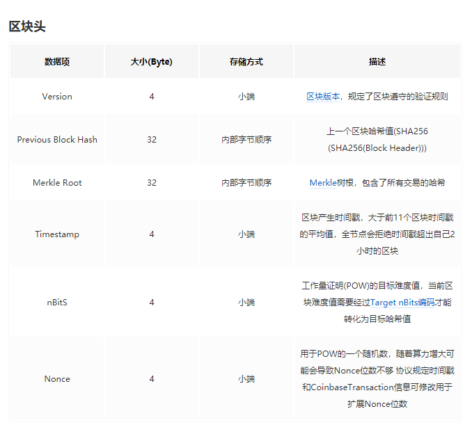
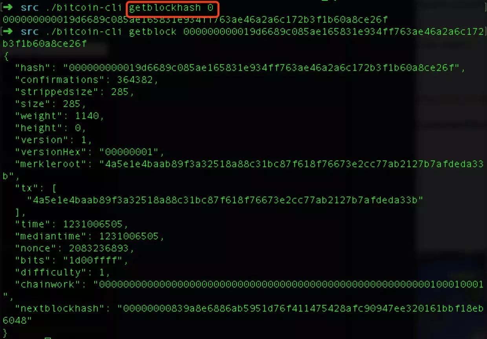
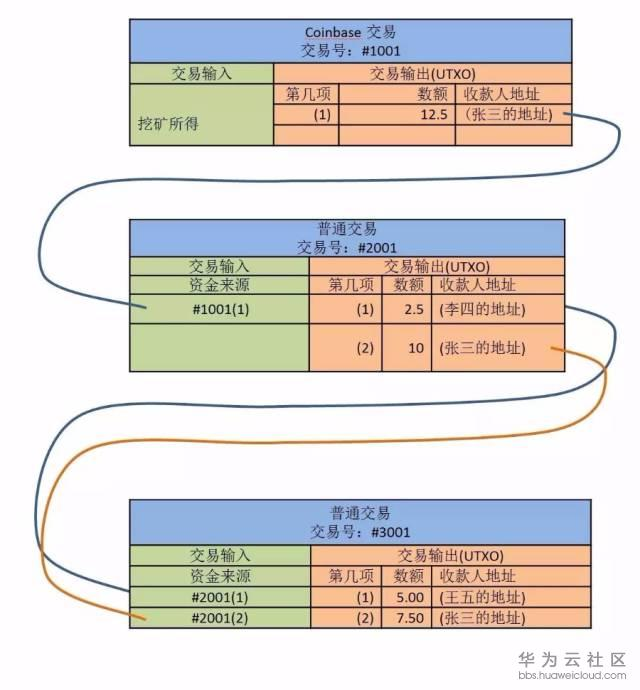

## 比特币源码阅读
进入比特币的src目录，进行源码阅读。

网络上已经将bitcoin源码的各个模块都划分好了：







main函数在bitcoind.cpp文件中。main函数的运行流程大致如下：



### 区块Block部分
区块链，当然Block就是一个重要的数据结构。可以从这个角度先入手，全局搜索Block.h的话，可以找到Block数据结构的代码位置。或者根据上面的模块图也能清晰的看到，Block位于primitives 原始目录下。

#### CBlockHeader
位于block.h下

```
/** Nodes collect new transactions into a block, hash them into a hash tree,
 * and scan through nonce values to make the block's hash satisfy proof-of-work
 * requirements.  When they solve the proof-of-work, they broadcast the block
 * to everyone and the block is added to the block chain.  The first transaction
 * in the block is a special one that creates a new coin owned by the creator
 * of the block.
 *
 **网络中的节点不断收集新的交易打包到区块中，所有的交易会通过两两哈希的方式形成一个Merkle树
 * 打包的过程就是要完成工作量证明的要求，当节点解出了当前的随机数时，
 * 它就把当前的区块广播到其他所有节点，并且加到区块链上。
 * 区块中的第一笔交易称之为CoinBase交易，是产生的新币，奖励给区块的产生者  
 *
 * add by chaors 20180419
 */

class CBlockHeader
{
public:
    // header
    int32_t nVersion;       //版本
    uint256 hashPrevBlock;  //上一个区块的hash
    uint256 hashMerkleRoot; //包含交易信息的Merkle树根
    uint32_t nTime;         //时间戳
    uint32_t nBits;         //工作量证明(POW)的难度
    uint32_t nNonce;        //要找的符合POW的随机数

    CBlockHeader()          //构造函数初始化成员变量
    {
        SetNull();          
    }

    ADD_SERIALIZE_METHODS;  //通过封装的模板实现类的序列化

    template <typename Stream, typename Operation>
    inline void SerializationOp(Stream& s, Operation ser_action) {
        READWRITE(this->nVersion);
        READWRITE(hashPrevBlock);
        READWRITE(hashMerkleRoot);
        READWRITE(nTime);
        READWRITE(nBits);
        READWRITE(nNonce);
    }

    void SetNull()          //初始化成员变量
    {
        nVersion = 0;
        hashPrevBlock.SetNull();
        hashMerkleRoot.SetNull();
        nTime = 0;
        nBits = 0;
        nNonce = 0;
    }

    bool IsNull() const
    {
        return (nBits == 0);     //难度为0说明区块还未创建，区块头为空
    }

    uint256 GetHash() const;     //获取哈希

    int64_t GetBlockTime() const //获取区块时间
    {
        return (int64_t)nTime;
    }
}
```

有关区块，在区块链的笔记中都有提到了，上面的注释也写的比较清楚了。首先我们会收集很多交易，然后打包到区块中，打包的过程是利用了交易进行hash运算，构造一个Merkle树。任何一个交易的改变都可能引起Merkle树的变化。然后我们枚举随机数 计算 `hash = f(newBlock||prevHash||number)`.当符合一定要求了，那么我们就完成了工作量证明。然后此时我们就会广播这个区块给其他节点，附加到区块链上。

**区块中第一笔交易称为CoinBase交易，是产生的新币，奖励给区块的生产者。所以当区块最终能成功入链，生产者就会得到奖励，这就是挖矿。**

这就是Block的header类。接下来看看CBlock本体类

#### CBlock
CBlock直接继承了CBlockHeader

```
class CBlock : public CBlockHeader         //继承自CBlockHeader，拥有其所有成员变量
{
public:
    // network and disk
    std::vector<CTransactionRef> vtx;      //所有交易的容器

    // memory only
    mutable bool fChecked;                 //交易是否验证

    CBlock()
    {
        SetNull();
    }

    CBlock(const CBlockHeader &header)
    {
        SetNull();
        *((CBlockHeader*)this) = header;
    }

    ADD_SERIALIZE_METHODS;

    template <typename Stream, typename Operation>
    inline void SerializationOp(Stream& s, Operation ser_action) {
        READWRITE(*(CBlockHeader*)this);
        READWRITE(vtx);
    }

    void SetNull()
    {
        CBlockHeader::SetNull();
        vtx.clear();
        fChecked = false;
    }

    CBlockHeader GetBlockHeader() const
    {
        CBlockHeader block;
        block.nVersion       = nVersion;
        block.hashPrevBlock  = hashPrevBlock;
        block.hashMerkleRoot = hashMerkleRoot;
        block.nTime          = nTime;
        block.nBits          = nBits;
        block.nNonce         = nNonce;
        return block;
    }

    std::string ToString() const;
};
```

#### CBlockLocator

```
/** Describes a place in the block chain to another node such that if the
 * other node doesn't have the same branch, it can find a recent common trunk.
 * The further back it is, the further before the fork it may be.
 *
 **描述区块链中在其他节点的一个位置，
 *如果其他节点没有相同的分支，它可以找到一个最近的中继(最近的相同块)。
 *更进一步地讲，它可能是分叉前的一个位置
 */
struct CBlockLocator
{
    std::vector<uint256> vHave;

    CBlockLocator() {}

    explicit CBlockLocator(const std::vector<uint256>& vHaveIn) : vHave(vHaveIn) {}

    ADD_SERIALIZE_METHODS;

    template <typename Stream, typename Operation>
    inline void SerializationOp(Stream& s, Operation ser_action) {
        int nVersion = s.GetVersion();
        if (!(s.GetType() & SER_GETHASH))
            READWRITE(nVersion);
        READWRITE(vHave);
    }

    void SetNull()
    {
        vHave.clear();
    }

    bool IsNull() const
    {
        return vHave.empty();
    }
};
```

按照注释的说法，就是确认本节点的区块链，在其他某个节点中大概是个什么位置状态。找到最近的相同块，比如两节点可能从某个block开始出现了分叉，那么就能找到这个分叉。

#### cpp实现

```
uint256 CBlockHeader::GetHash() const
{
    return SerializeHash(*this);        //生成256位的哈希值
}

std::string CBlock::ToString() const    //区块对象格式化字符串输出
{
    std::stringstream s;
    s << strprintf("CBlock(hash=%s, ver=0x%08x, hashPrevBlock=%s, hashMerkleRoot=%s, nTime=%u, nBits=%08x, nNonce=%u, vtx=%u)\n",
        GetHash().ToString(),
        nVersion,
        hashPrevBlock.ToString(),
        hashMerkleRoot.ToString(),
        nTime, nBits, nNonce,
        vtx.size());
    for (const auto& tx : vtx) {
        s << "  " << tx->ToString() << "\n";
    }
    return s.str();
}
```

#### 区块结构分析



以前的笔记也有点到过区块的结构，本质上无非就是区块头和各个交易数据块的封装。交易数据块的验证又是根据Merkle树来进行。区块头就是CBlockHeader，80字节左右，而一个交易数据块却要250字节左右，具体到bitcoin，交易数据就是UTXO的转移。





#### 区块标识符
 - BlockHash 区块哈希值，是通过SHA256算法对区块头信息进行哈希得到的，这个值必须满足POW的DifficultyTarget，该区块才被认为有效。同时，也是**区块的唯一标识符**，**可以通过通过bitcoin-cli根据BlockHash查询区块信息(文章开头我们就使用过)**


 - BlockHeight 区块高度，是用来标示区块在区块链中的位置。**创世区块高度为0，每一个加在后面的区块，区块高度递增1**。**可以通过bitcoin-cli根据高度查询区块哈希值(文章开头我们就使用过)**

#### 创世区块
区块链上第一个区块被称为创世区块，它是所有区块的共同祖先。我们可以查看下比特币的创世区块：


利用bitcoin-cli可以查看到相应的结果。



这里需要说一下的就是，在交易Transaction的数据结构中，有个coinbase字段，这个字段可以填下交易人员想写的信息。而在这个创世区块中，中本聪也在一个交易块中，留下了他的coinbase留言：“The Times 03/Jan/2009 Chancellor on brink of second bailout forbanks.”这句话是泰晤士报当天的头版文章标题

### 交易Transaction部分
数据结构主要位于transaction.h头文件当中，依旧处在primitives目录下。

看具体代码前，先回顾一下有关交易UTXO的知识：



如上图所示，交易数据结构一个一个连接起来了。一个交易的输入，来源是前一个交易的输出。

有一种特殊的交易，称为Coinbase交易，即矿工挖出的比特币，该交易没有输入，只有输出。之前讲区块结构的时候，就讲了第一笔交易是奖励，就是coinbase，是挖矿所得的。

#### COutPoint

``` c++
/** An outpoint - a combination of a transaction hash and an index n into its vout.
* COutPoint主要用在交易的输入CTxIn中，用来确定当前输出的来源，
* 包括前一笔交易的hash，以及对应前一笔交易中的第几个输出的序列号。
*/
class COutPoint
{
public:
    uint256 hash; // 交易的哈希
    uint32_t n;  // 对应的序列号

    COutPoint() { SetNull(); }
    COutPoint(uint256 hashIn, uint32_t nIn) { hash = hashIn; n = nIn; }

    ADD_SERIALIZE_METHODS;  // 用来序列化数据结构，方便存储和传输

    template <typename Stream, typename Operation>
    inline void SerializationOp(Stream& s, Operation ser_action) {
        READWRITE(hash);
        READWRITE(n);
    }

    void SetNull() { hash.SetNull(); n = (uint32_t) -1; }
    bool IsNull() const { return (hash.IsNull() && n == (uint32_t) -1); }

    //重载小于号
    friend bool operator<(const COutPoint& a, const COutPoint& b)
    {
        int cmp = a.hash.Compare(b.hash);
        return cmp < 0 || (cmp == 0 && a.n < b.n);
    }

    friend bool operator==(const COutPoint& a, const COutPoint& b)
    {
        return (a.hash == b.hash && a.n == b.n);
    }

    friend bool operator!=(const COutPoint& a, const COutPoint& b)
    {
        return !(a == b);
    }

    std::string ToString() const;
};
```

COutPoint结构会被用在之后的CTxIn结构中，也就封装了两个变量，一个hash，一个n。hash代表当前交易的前一笔交易的Hash,以及对应前一笔交易中的第几个输出。

####  CTxIn

``` C++
/** An input of a transaction.  It contains the location of the previous
 * transaction's output that it claims and a signature that matches the
 * output's public key.
 * 交易的输入，包括当前输入对应前一笔交易的输出的位置，以及花费前一笔输出需要的签名脚本
 * CScriptWitness是用来支持隔离见证时使用的。
 */
class CTxIn
{
public:
    COutPoint prevout;  // 前一笔交易输出的位置
    CScript scriptSig;  // 解锁脚本
    uint32_t nSequence;  // 序列号
    CScriptWitness scriptWitness; //! Only serialized through CTransaction

    /* Setting nSequence to this value for every input in a transaction
     * disables nLockTime.
     * 规则1：如果一笔交易中所有的SEQUENCE_FINAL都被赋值了相应的nSequence，那么nLockTime就会被禁用*/
    static const uint32_t SEQUENCE_FINAL = 0xffffffff;

    /* Below flags apply in the context of BIP 68*/
    /* If this flag set, CTxIn::nSequence is NOT interpreted as a
     * relative lock-time.
     * 规则2：如果设置了这个变量，那么规则1就失效了*/
    static const uint32_t SEQUENCE_LOCKTIME_DISABLE_FLAG = (1 << 31);

    /* If CTxIn::nSequence encodes a relative lock-time and this flag
     * is set, the relative lock-time has units of 512 seconds,
     * otherwise it specifies blocks with a granularity of 1.
     * 规则3：如果规则1有效并且设置了此变量，那么相对锁定时间就为512秒，否则锁定时间就为1个区块*/
    static const uint32_t SEQUENCE_LOCKTIME_TYPE_FLAG = (1 << 22);

    /* If CTxIn::nSequence encodes a relative lock-time, this mask is
     * applied to extract that lock-time from the sequence field.
     * 规则4：如果规则1有效，那么这个变量就用来从nSequence计算对应的锁定时间*/
    static const uint32_t SEQUENCE_LOCKTIME_MASK = 0x0000ffff;

    /* In order to use the same number of bits to encode roughly the
     * same wall-clock duration, and because blocks are naturally
     * limited to occur every 600s on average, the minimum granularity
     * for time-based relative lock-time is fixed at 512 seconds.
     * Converting from CTxIn::nSequence to seconds is performed by
     * multiplying by 512 = 2^9, or equivalently shifting up by
     * 9 bits. */
    static const int SEQUENCE_LOCKTIME_GRANULARITY = 9;

    CTxIn()
    {
        nSequence = SEQUENCE_FINAL;
    }

    // 禁用隐式转换，构造函数必须明确使用当前形式
    explicit CTxIn(COutPoint prevoutIn, CScript scriptSigIn=CScript(), uint32_t nSequenceIn=SEQUENCE_FINAL);
    CTxIn(uint256 hashPrevTx, uint32_t nOut, CScript scriptSigIn=CScript(), uint32_t nSequenceIn=SEQUENCE_FINAL);

    ADD_SERIALIZE_METHODS;

    template <typename Stream, typename Operation>
    inline void SerializationOp(Stream& s, Operation ser_action) {
        READWRITE(prevout);
        READWRITE(*(CScriptBase*)(&scriptSig));
        READWRITE(nSequence);
    }

    friend bool operator==(const CTxIn& a, const CTxIn& b)
    {
        return (a.prevout   == b.prevout &&
                a.scriptSig == b.scriptSig &&
                a.nSequence == b.nSequence);
    }

    friend bool operator!=(const CTxIn& a, const CTxIn& b)
    {
        return !(a == b);
    }

    std::string ToString() const;
};
```

CTxIn其实就是交易的输入的结构，我们知道一个交易，可能有很多个UTXO输入，也可能有很多个UTXO输出，那么一个输入就是CTxIn，里面封装了几个变量，一个CoutPoint可以找到此输入的来源(上一个输出的位置，根据CoutPoint里的hash和n)。还有一个解锁脚本，Cscript，用来证明拥有上一个输出的使用权。nSequence序列号。

#### CTxOut
CTxOut毫无疑问便是交易输出啦。

```
/** An output of a transaction.  It contains the public key that
the next input must be able to sign with to claim it.
 * 交易的输出，包含金额和锁定脚本
 */
class CTxOut
{
public:
    CAmount nValue;  // 输出金额
    CScript scriptPubKey;  // 锁定脚本

    CTxOut()
    {
        SetNull();
    }

    CTxOut(const CAmount& nValueIn, CScript scriptPubKeyIn);

    ADD_SERIALIZE_METHODS;

    template <typename Stream, typename Operation>
    inline void SerializationOp(Stream& s, Operation ser_action) {
        READWRITE(nValue);
        READWRITE(*(CScriptBase*)(&scriptPubKey));
    }

    void SetNull()
    {
        nValue = -1;
        scriptPubKey.clear();
    }

    bool IsNull() const
    {
        return (nValue == -1);
    }

    // 获取dust阈值，一笔交易如果交易费小于dust阈值，就会被认为是dust tx，
    // 此函数在最新版本中已转移到src/policy/policy.h中
    CAmount GetDustThreshold(const CFeeRate &minRelayTxFee) const
    {
        // "Dust" is defined in terms of CTransaction::minRelayTxFee,
        // which has units satoshis-per-kilobyte.
        // If you'd pay more than 1/3 in fees
        // to spend something, then we consider it dust.
        // A typical spendable non-segwit txout is 34 bytes big, and will
        // need a CTxIn of at least 148 bytes to spend:
        // so dust is a spendable txout less than
        // 546*minRelayTxFee/1000 (in satoshis).
        // A typical spendable segwit txout is 31 bytes big, and will
        // need a CTxIn of at least 67 bytes to spend:
        // so dust is a spendable txout less than
        // 294*minRelayTxFee/1000 (in satoshis).
        /**  "Dust"是根据CTransaction中的minRelayTxFee来定义的，单位是satoshis/千字节，
        * 如果在一笔交易中交易费占了1/3以上，那么我们就认为该交易是"Dust"交易。
        * 因此dust交易的金额小于 546*minRelayTxFee/1000;
        * 而在支持隔离见证的交易中，txout通常大小为31字节，CTxIn大小至少为67字节，
        * 此时dust交易的金额则一般小于 294*minRelayTxFee/1000.
        */
        if (scriptPubKey.IsUnspendable())  // 判断脚本格式是否正确
            return 0;

        size_t nSize = GetSerializeSize(*this, SER_DISK, 0);
        int witnessversion = 0;
        std::vector<unsigned char> witnessprogram;

        // 判断是否支持隔离见证
        if (scriptPubKey.IsWitnessProgram(witnessversion, witnessprogram)) {
            // sum the sizes of the parts of a transaction input
            // with 75% segwit discount applied to the script size.
            nSize += (32 + 4 + 1 + (107 / WITNESS_SCALE_FACTOR) + 4);
        } else {
            nSize += (32 + 4 + 1 + 107 + 4); // the 148 mentioned above
        }

        return 3 * minRelayTxFee.GetFee(nSize);
    }

    bool IsDust(const CFeeRate &minRelayTxFee) const
    {
        return (nValue < GetDustThreshold(minRelayTxFee));
    }

    friend bool operator==(const CTxOut& a, const CTxOut& b)
    {
        return (a.nValue       == b.nValue &&
                a.scriptPubKey == b.scriptPubKey);
    }

    friend bool operator!=(const CTxOut& a, const CTxOut& b)
    {
        return !(a == b);
    }

    std::string ToString() const;
};
```

#### CTransaction

```
/** The basic transaction that is broadcasted on the network and contained in blocks.  
 * A transaction can contain multiple inputs and outputs.
 * 下面就是在网络中广播然后被打包进区块的最基本的交易的结构，一个交易可能包含多个交易输入和输出。
 */
class CTransaction
{
public:
    // Default transaction version. 默认交易版本
    static const int32_t CURRENT_VERSION=2;

    // Changing the default transaction version requires a two step process: first
    // adapting relay policy by bumping MAX_STANDARD_VERSION, and then later date
    // bumping the default CURRENT_VERSION at which point both CURRENT_VERSION and
    // MAX_STANDARD_VERSION will be equal.
    static const int32_t MAX_STANDARD_VERSION=2;

    // The local variables are made const to prevent unintended modification
    // without updating the cached hash value. However, CTransaction is not
    // actually immutable; deserialization and assignment are implemented,
    // and bypass the constness. This is safe, as they update the entire
    // structure, including the hash.
    /** 下面这些变量都被定义为常量类型，从而避免无意识的修改了交易而没有更新缓存的hash值；
    * 但还是可以通过重新构造一个交易然后赋值给当前交易来进行修改，这样就更新了交易的所有内容
    */
    const int32_t nVersion;  // 版本
    const std::vector<CTxIn> vin; // 交易输入
    const std::vector<CTxOut> vout; // 交易输出
    const uint32_t nLockTime; // 锁定时间

private:
    /** Memory only. */
    const uint256 hash;

    uint256 ComputeHash() const;

public:
    /** Construct a CTransaction that qualifies as IsNull() */
    CTransaction();

    /** Convert a CMutableTransaction into a CTransaction. */
    CTransaction(const CMutableTransaction &tx);
    CTransaction(CMutableTransaction &&tx);

    template <typename Stream>
    inline void Serialize(Stream& s) const {
        SerializeTransaction(*this, s);
    }

    /** This deserializing constructor is provided instead of an Unserialize method.
     *  Unserialize is not possible, since it would require overwriting const fields. */
    template <typename Stream>
    CTransaction(deserialize_type, Stream& s) : CTransaction(CMutableTransaction(deserialize, s)) {}

    bool IsNull() const {
        return vin.empty() && vout.empty();
    }

    const uint256& GetHash() const {
        return hash;
    }

    // Compute a hash that includes both transaction and witness data
    uint256 GetWitnessHash() const;

    // Return sum of txouts.
    CAmount GetValueOut() const; // 返回交易输出金额之和
    // GetValueIn() is a method on CCoinsViewCache, because
    // inputs must be known to compute value in.

    /**
     * Get the total transaction size in bytes, including witness data.
     * "Total Size" defined in BIP141 and BIP144.
     * @return Total transaction size in bytes
     */
    unsigned int GetTotalSize() const; // 返回交易大小

    bool IsCoinBase() const  // 判断是否是coinbase交易
    {
        return (vin.size() == 1 && vin[0].prevout.IsNull());
    }

    friend bool operator==(const CTransaction& a, const CTransaction& b)
    {
        return a.hash == b.hash;
    }

    friend bool operator!=(const CTransaction& a, const CTransaction& b)
    {
        return a.hash != b.hash;
    }

    std::string ToString() const;

    bool HasWitness() const
    {
        for (size_t i = 0; i < vin.size(); i++) {
            if (!vin[i].scriptWitness.IsNull()) {
                return true;
            }
        }
        return false;
    }
};
```

交易的数据结构，可以见到封装了一系列的交易输入输出，还封装了一系列的交易输出。以及锁定时间nLockTime。

### 参考

[比特币源码研读(1)bitcoin源码结构](https://juejin.im/post/5ae072a06fb9a07a9b35a0ee)

[深入比特币原理（三）——交易的输入(input)与输出(output)](https://bbs.huaweicloud.com/blogs/3476292e184711e89fc57ca23e93a89f)

[比特币源码解析(5) - 数据结构 - 交易](https://blog.csdn.net/pure_lady/article/details/77771392)
