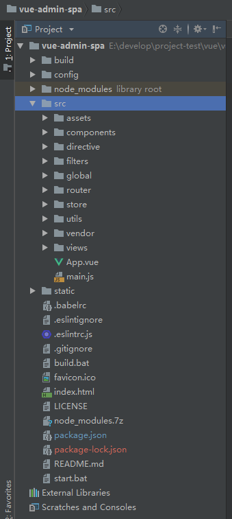

## vue-admin-spa
是一个基于vue + vue-resource + vue-router + vuex(spa必备) + element-ui + ES6 + webpack + npm的后台管理系统。

如上图是基本的项目结构

显然也是个典型的webpack目录，src根目录下有App.vue和main.js两个文件

app.vue是根组件，没什么特别的。

### index.js
根js文件，里面首先加载了vue，vue-router，vuex，ele-ui等官方配件。

除此之外还有一些其他的开源组件，比如nprogress，一个加载进度条。

还引入了自定义的过滤器filter，用来做一些文本格式化之类的操作。

此外比较重要的，还注册了一个守卫导航(详见文档),这个守卫导航就是每次路由更改的时候(路由跳转),都会触发的一个(函数)。代码中利用beforeEach注册，用来进行权限判断。如果登录了就可以进入哪些页面，如果在白名单内，就直接进入，如果不行，就跳转到错误页面，诸如此类的逻辑处理。

afterEach里关闭了进度条nprogress。

### router/index.js
接下来看一看router的部分。毫无疑问router里是vue跳转组件的逻辑。

依次加载了各种组件。

比如按照大组件来分，主要分成以下几个部分的组件：

 - layout组件
 - login相关组件
 - error page相关组件
 - personalInfo&Readme
 - example组件
 - 豆瓣电影相关组件
 - 系统管理相关组件
 - 学生管理相关组件

 main
