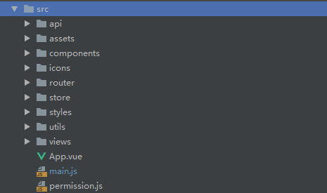

## vue-template-admin
之前的笔记提到，admin项目非常重量级，不适合做二次开发。所以应该用template作为模板进行开发，有需要的组件再自行去admin项目进行复制。

因此，我们虽然有了admin项目的前置知识，我们也要暂且再把模板项目的文件看一看。

其实熟悉完项目结构以后，就可以直接拿来开发了，根据admin的文档来二次开发，非常方便，比如更换icon，添加组件，设置行为等。

首先依旧是

结构比起admin就简单多了，从main.js入手

主要就是导入了一些主要组件，app大组件，router路由，store状态管理。

### permission.js
@/permission.js,里否装了router的权限管理部分代码，本质上其实就是封装了一个router的守卫导航。在路由跳转之前拦截判断是否有权限。

### store相关
页面中的许多内容都是经由vuex进行管理，那么核心代码就是在store目录中。

打开index.js，很清晰的可以看到module被分成app和user两块，getter部分也单独写出来称为一个文件。

#### app module

先看app.js这个module，state只定义了sidebar和device。device是使用设备，sidebar有两个状态，open变量，动画开启变量。

在mutation中，我们看到js-cookie这个库，我们还手动设置了一些cookies。

#### user module
接着我们看user这个module,这里有token,name,avatar,roles这几个state。

action则有login，getinfo，logout，fedlogout这几个动作。
