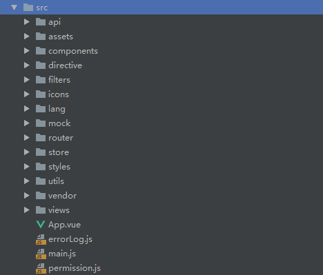

## vue-element-admin
因为有需求搭建一个后台系统，所以有必要研究一下网络上的后台框架。而vue搭建后台系统比较方便，所以特此研究此开源项目。

vue-element-admin是一个经过整合的后台系统，非常重量级，比较适合研究各种功能的实现，但是不适合作为开发模板。所以项目中有个子项目 **vueAdmin-template**，适合起手作为开发的模板。

那么我们来细细看一下这个后台集成方案的总体结构：



根js是main.js，阅读main.js,可以看到开头除了import一堆css之外，还import了App.vue，大组件，还有router(目录下的index),store

接着还读入了一系列filters过滤器。

main.js大致就是这些内容，接下来我们要从router下观察组件的装配。

### router/index.js
router目录下放置的就是路由了，路由相关的知识可以看vue-router相关的内容。

可以先重点研究下几个组件

首先是默认空路由path对应的组件Layout，及其默认的redirect子组件dashboard

#### Layout
Layout这个组件，作为整体的布局，在views目录下，layout目录中

进入layout.vue,可以清晰的看到：

``` html
<template>
  <div class="app-wrapper" :class="classObj">
    <div v-if="device==='mobile'&&sidebar.opened" class="drawer-bg" @click="handleClickOutside"></div>
    <sidebar class="sidebar-container"></sidebar>
    <div class="main-container">
      <navbar></navbar>
      <tags-view></tags-view>
      <app-main></app-main>
    </div>
  </div>
</template>
```

layout主要分成了sidebar(一个组件),一个div容器main-container,这个容器就是侧边栏右边的主干部分。main-container里有包含着三个组件，navbar(导航条),tags-view，app-main组件(主体内容)

一共四个组件，这四个组件都在view/layout/components文件夹中

看的到有个混入对象ResizeMixin,应该是作为自适应功能的对象被导入这个layout组件。

接着还有一些computed的方法，用来计算一些state里的属性。

我们暂且先看看其他子组件

#### sidebar
在layout子目录的component/sidebar目录下。作为导航栏

sidebar的template结构比较简单，，里面还有一个子组件，sidebar-item组件，我们继续深入进去看这个组件。
